# Java Web 基础

## 数据库

* 注释

  ```sql
  -- 单行注释
  #MySQL特有的单行注释
  /*多行注释
  */
  ```


### 数据库操作

1. 查询

   ```sql
   show databases;
   ```

2. 创建

   ```sql
   create database 数据库名称；  -- 创建数据库
   create database if not exists 数据库名称；  -- 如果不存在则创建
   ```

3. 删除

   ```sql
   drop database 数据库名称；  -- 删除数据库
   drop database if exists 数据库名称；  -- 如果存在则删除
   ```

4. 使用数据库

   ```sql
   select database();  -- 查看当前使用的数据库
   use 数据库名称； -- 使用数据库
   ```

#### 数据表操作

* 查询当前数据库下所有表的名称

  ```sql
  show tables;
  ```

* 查询表结构

  ```sql
  desc 表名称；
  ```

* 创建表

  ```sql
  create table 表名(
      字段1 数据类型1，
      字段2 数据类型2，
      ...
      字段n 数据类型n  -- 最后一行不能加逗号
  )；
  ```

#### 数据类型


* 创建student数据表

  ```sql
  create table student(
  	id int,
  	name varchar(10),
  	gender char(1),
  	birthday date,
  	score double(5,2),
  	email varchar(64),
  	tel varchar(15),
  	status tinyint
  );
  ```

* 删除表

  ```sql
  drop table 表名；-- 删除表
  drop table if exists 表名；
  ```

* 修改表

  * 修改表名

    ```sql
    alter table 表名 rename to 新的表名；
    ```

  * 添加一列

    ```sql
    alter table 表名 add 列名 数据类型；
    ```

  * 修改数据类型

    ```sql
    alter table 表名 modify 列名 新数据类型；
    ```

  * 修改列名和数据类型
  
    ```sql
    alter table 表名 change 列名 新列名 新数据类型；
    ```
  
  * 删除列
  
    ```sql
    alter table 表名 drop 列名；
    ```
  
* 添加数据
  
  * 给指定列添加数据
  
    ```sql
    insert into 表名（列名1，列名2，..... ） values（值1， 值2， ....）；
    ```
  
  * 给全部列添加数据
  
    ```sql
    insert into 表名 values （值1， 值2， .....）；
    ```
  
  * 批量添加数据
  
    ```sql
    insert into 表名（列名1， 列名2， .....）values (值1， 值2， .....), (值1， 值2， .....), (值1， 值2， .....), ...；
    insert into 表名 values (值1， 值2， ....), (值1， 值2， ....), (值1， 值2， ....),....;
    ```
  
* 修改数据

  ```sql
  update 表名 set 列名1 = 值1，列名2 = 值2，...[where 条件];
  ```

* 删除数据
  
  ```sql
  delete from 表名 [where 条件];
  ```
#### 查询语法

  ```sql
  select
  	字段列表
  from
  	表名列名
  where
  	条件列表
  group by
  	分组字段
  having
  	分组后条件
  order by
  	排序字段
  limit
  	分页限定
  ```

* 查询多个字段

  ```sql
  select 字段列表 from 表名;
  select * from 表名; -- 查询所有数据
  ```

* 去除重复记录

  ```sql
  select distinct 字段列表 from 表名;
  ```

* 起别名

  ```sql
  as: as也可以省略
  ```

* 条件查询

  ```sql
  select 字段列表 from 表名 where 条件列表;
  ```

  * 条件

    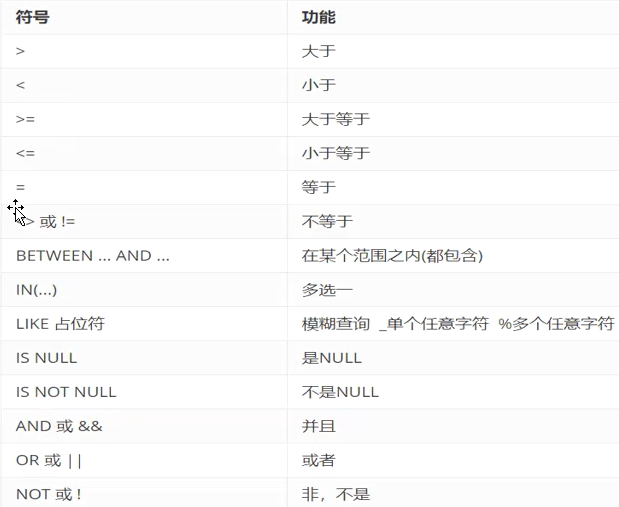

  * 排序查询

    ```sql
    select 字段列表 from 表名 order by 排序字段名1 [排序方式], 排序字段名2 [排序方式2], ...;
    ```

    * asc  升序排序
    * dscs   降序排序

  * 聚合函数

    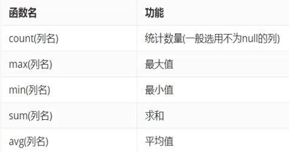

    ```sql
    select 聚合函数(列名) from 表;
    -- null值不参与所有聚合函数运算
    -- count统计非空的数据
    ```

  * 分组查询

    ```sql
    select 字段列表 from 表名 [where 分组前条件限定] group by 分组字段名 [having 分组后条件过滤];
    
    /*
    执行时机不一样：where是分组之前进行限定，不满足where条件，则不参与分组，而having是分组之后对结果进行过滤
    可判断的条件不一样： where不能对聚合函数进行判断，having可以
    分组之后，查询的字段为聚合函数和分组字段，查询其他字段无任何意义
    */
    ```

  * 分页查询

    ```sql
    select 字段列表 from 表名 limit 起始索引, 查询条目;
    计算公式： 起始索引 = [当前页码 - 1] * 每页显示的条数
    limit  用于MySQL
    rownumber 用于Oracle
    top  用于SQL Server
    ```

#### 约束

* 约束分类

  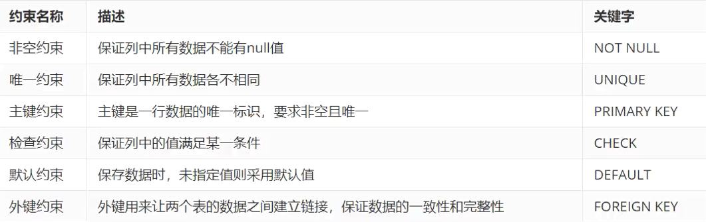

  * 语法

    ```sql
    -- 创建表时添加约束
    create table 表名(
    	列名 数据类型 NOT NULL,
        ....
    );
    -- 建完表后添加非空约束
    alter table 表名 modify 字段名 数据类型 NOT NULL;
    --删除约束
    alter table 表名 modify 字段名 数据类型;
    ```

* 外键约束

  * 语法

    ```sql
    -- 创建表时添加外键约束
    create table 表名(
    	列名 数据类型,
        ...
        [constraint] [外键名称] foreign key(外键列名) references 主表(主表列名)
    );
    
    -- 建完表后添加外键约束
    alter table 表名 add constraint 外键名称 foreign key (外键字段名称) references 主表名称(主表列名称);
    
    --删除约束
    alter table 表名 drop foreign key 外键名称;
    ```
### 数据库设计

需求分析 `->` 设计 `->` 编码 `->` 测试 `->` 安装部署

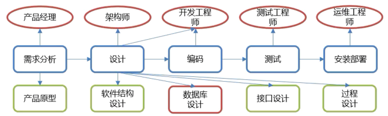

* 设计步骤
  * 需求分析
  * 逻辑分析
  * 物理分析
  * 维护设计
  
* 表关系
  * 一对多： 实现方式：在多的一方建立外键，指向一的一方的主键
  * 多对多： 实现方式： 简历第三张表，中间表至少包含两个外键，分别关联两方主键
  * 一对一： 实现方式： 在任意一方建立外键，关联对方主键，并设置外键唯一

* 多表查询

  * 连接查询

    * 内连接： 查找两个表的交集

      ```sql
      -- 隐式内连接
      select 字段列表 from 表1, 表2... where 条件;
      
      -- 显示内连接
      select 字段列表 from 表1 [inner] join 表2 on 条件;
      ```

    * 外连接：

      ```sql
      -- 左外连接
      select 字段列表 from 表1 left [outer] join 表2 on 条件;
      
      -- 右外连接
      select 字段列表 from 表1 right [outer] join 表2 on 条件;
      ```

      * 左外连接：相当于查询A表所有数据和交集部分数据
      * 右外连接：相当于查询B表所有数据和交集部分数据

  * 子查询

    * 查询中的嵌套查询

      * 单行单列：作为条件值，使用`= ! = > <`等进行条件判断

        ```sql
        select 字段列表 from 表 where 字段名 = (子查询);
        ```
        
      * 多行多列：作为条件值，使用in等关键字进行条件判断

        ```sql
        select 字段列表 from 表 where 字段名 in (子查询);
        ```

      * 多行多列：作为虚拟表

        ```sql
        select 字段列表 from (子查询) where 条件;
        ```

* 事务

  * 一个操作序列，包含了一组数据库操作命令

    * 开启事务

    * 回滚事务

    * 提交事务

      ```sql
      -- 开启事务
      start transaction;
      或者 begin;
      -- 提交事务
      commit;
      -- 回滚事务
      rollback;
      ```

* MySQL事务默认自动提交

  ```sql
  -- 查看事务的默认提交方式
  SELECT @@autocommit;
  -- 1 自动提交  0 手动提交
  -- 修改事务提交方式
  set @@autocommit = 0;
  ```

#### JDBC

* 用`java`语言操作关系型数据库的一套API

* (指定编码 `?characterEncoding=utf-8`,避免中文乱码)

  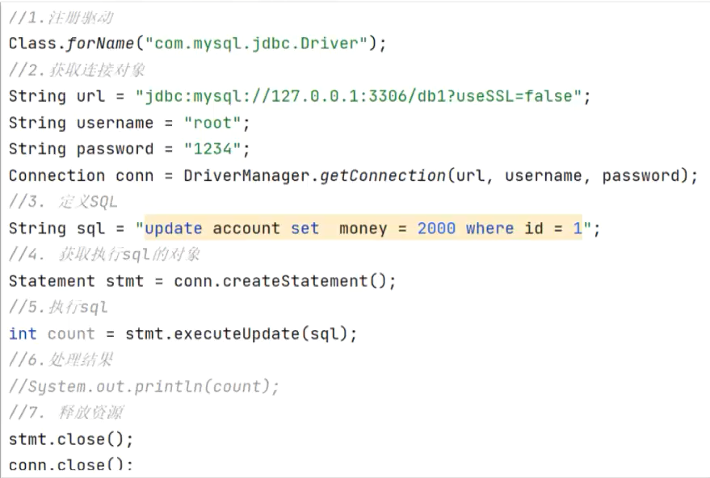

  ```java
  //注册驱动
  Class.forName("com.mysql.jdbc.Driver");
  //获取连接
  String url = "jdbc:mysql://127.0.0.1:3306/mydb2";
  String username = "root";
  String password = "123456";
  Connection connection = DriverManager.getConnection(url, username, password);
  //定义sql语句
  String sql = "UPDATE emp set salary = 12000 where id = 1001";
  //获取执行sql的对象
  Statement statement = connection.createStatement();
  //执行sql
  int count = statement.executeUpdate(sql);
  //处理结果
  System.out.println(count);
  //释放资源
  statement.close();
  connection.close();
  ```

* JDCB API

  * DriverManager

    ```java
    //获取连接
    Connection connection = DriverManager.getConnection(url, username, password);
    ```

    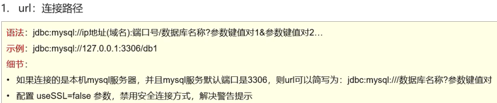

  * Connection

    

    ```java
    try {
        connection.setAutoCommit(false);
        //........
        connection.commit();
    } catch (SQLException throwables) {
        connection.rollback();
        throwables.printStackTrace();
    }
    ```

  * Statement

    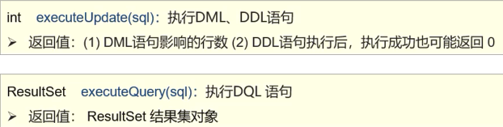

  * ResultSet

    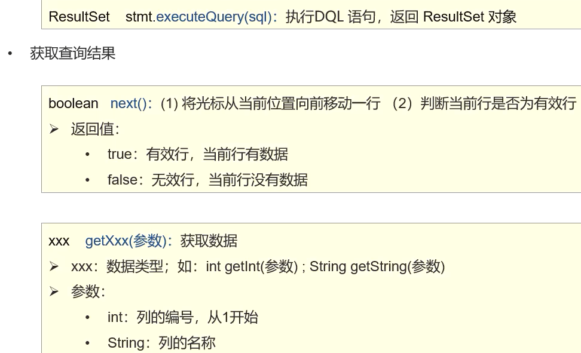

    ```java
    //循环判断游标是否是最后一行末尾
    while(rs.next()){
        //获得数据
        rs,getXXX(参数);
    }
    ```

    ```java
    String sql = "SELECT * from emp";
    //获取执行sql的对象
    Statement statement = connection.createStatement();
    //执行sql
    ResultSet rs = statement.executeQuery(sql);
    //处理结果
    
    while(rs.next()){
        int id = rs.getInt("id");
        String name = rs.getString(2);
        Date date = rs.getDate(5);
        double salary = rs.getDouble(6);
    
        System.out.println(id +"\t\t"+ name +"\t\t"+ date +"\t\t"+ salary);
    }
    
    //释放资源
    rs.close();
    statement.close();
    connection.close();
    ```

  * PreparedStatement

    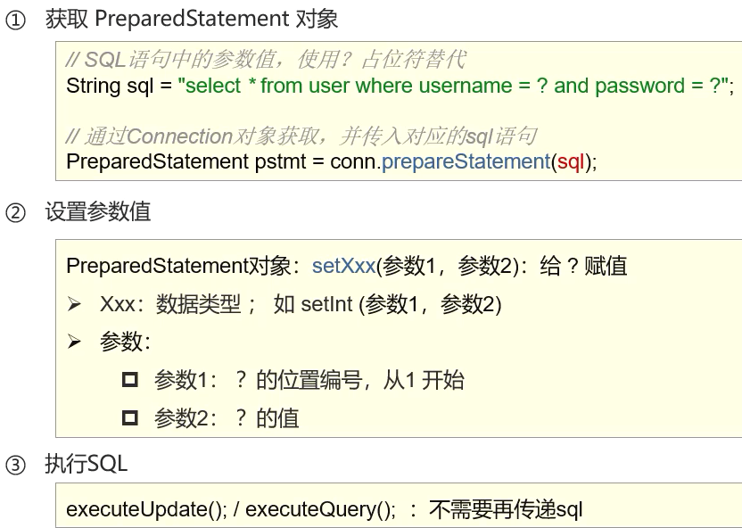

    ```java
    String sql = "SELECT * from emp where username = ? and password = ?";
    //获取执行sql的对象
    PreparedStatement statement = connection.prepareStatement(sql);
    statement.setString(1,username);
    statement.setString(2,password);
    //执行sql
    ResultSet rs = statement.executeQuery();
    ```

    ```java
    @Test
    public void Test() throws Exception{
        //useServerPrepStmts=true开启进行预编译
        String url = "jdbc:mysql://127.0.0.1:3306/mydb2?useSSL=false&useServerPrepStmts=true";
        String username = "root";
        String password = "123456";
        Connection connection = DriverManager.getConnection(url, username, password);
    
        int id = 1001;
    
        String sql ="select * from emp  where id = ?";
    
        PreparedStatement pstmt = connection.prepareStatement(sql);
    
        pstmt.setInt(1, id);
    
        ResultSet rs = pstmt.executeQuery();
    
        if (rs.next()){
            System.out.println("登录成功");
        }else {
            System.out.println("登录失败");
        }
    
        rs.close();
        pstmt.close();
        connection.close();
    }
    ```

* 数据库连接池

  * Druid数据连接池

    ```java
    Properties prop = new Properties();
    prop.load(new FileInputStream("D:\\00_Big_Data_learn\\01HeiMa\\2_JavaWeb\\Code\\javaweblearn\\JDBC-app\\src\\druid.properties"));
    DataSource dataSource = DruidDataSourceFactory.createDataSource(prop);
    
    Connection connection = dataSource.getConnection();
    System.out.println(connection);
    ```

  * 向数据库添加数据

    ```java
    @Test
    public void addSelectAll() throws Exception{
    
        String brandName = "香飘飘";
        String companyName= "香飘飘";
        int ordered = 1;
        String description = "绕地球一圈";
        int status = 1;
    
    
        Properties prop = new Properties();
        prop.load(new FileInputStream("D:\\\\00_Big_Data_learn\\\\01HeiMa\\\\2_JavaWeb\\\\Code\\\\javaweblearn\\\\JDBC-app\\\\src\\\\druid.properties"));
    
        DataSource dataSource = DruidDataSourceFactory.createDataSource(prop);
        Connection connection = dataSource.getConnection();
    
        String sql = "insert into tb_brand(brand_name, company_name, ordered, description, status) values (?, ?, ?, ?, ?)";
    
        PreparedStatement pstmt = connection.prepareStatement(sql);
    
    
        pstmt.setString(1,brandName);
        pstmt.setString(2,companyName);
        pstmt.setInt(3,ordered);
        pstmt.setString(4,description);
        pstmt.setInt(5,status);
    
        int count = pstmt.executeUpdate();
        System.out.println(count > 0);
        pstmt.close();
        connection.close();
    }
    ```

#### Maven

* 用于管理和构建Java项目的工具

* 安装

  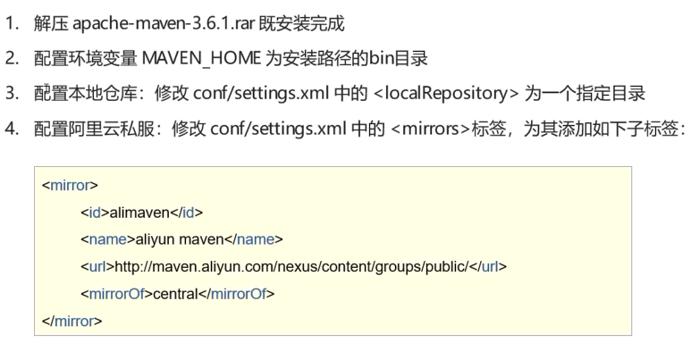

* Maven常用命令

  * `complie`  编译
  * `clean`  清理
  * `test`  测试
  * `package`  打包
  * `install` 安装

* 依赖范围

  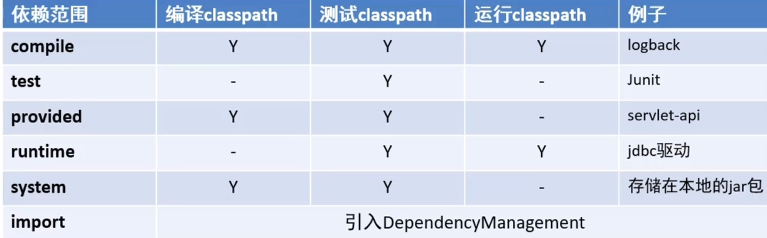
  
  ```xml
  <build>
     <finalName>brand-case</finalName> <!--对打包后的文件重命名-->
      <plugins>
        <plugin>
          <groupId>org.apache.tomcat.maven</groupId>
          <artifactId>tomcat7-maven-plugin</artifactId>
          <version>2.2</version>
        </plugin>
      </plugins>
  </build>
  ```
  
  

#### MyBatis

* 是一款优秀的持久层框架，用于简化JDBC开发

  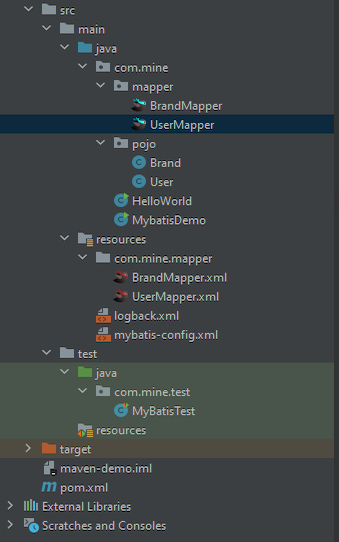

  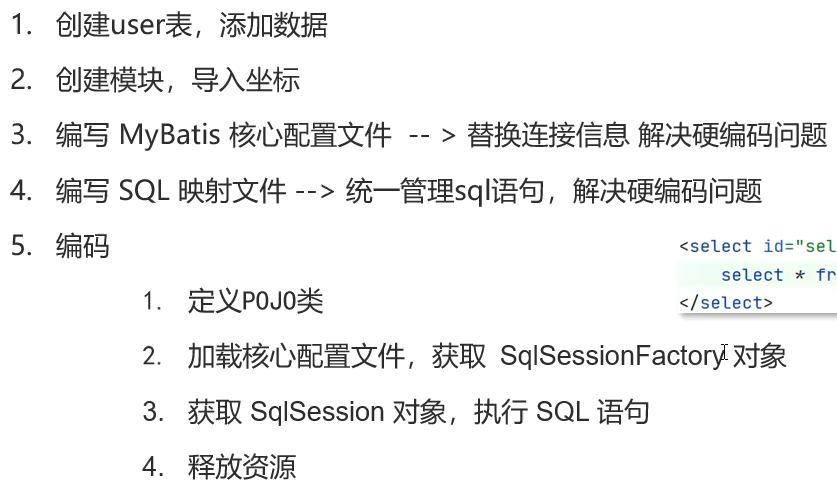

  

  ```java
  String resource = "mybatis-config.xml";
  InputStream inputStream = Resources.getResourceAsStream(resource);
  SqlSessionFactory sqlSessionFactory = new SqlSessionFactoryBuilder().build(inputStream);

  //获取SqlSession对象
  SqlSession sqlSession = sqlSessionFactory.openSession();
  //执行sql
  List<User> users = sqlSession.selectList("test.selectAll");
  System.out.println(users);

  sqlSession.close();
  ```

* Mapper代理

  ```xml
  <!--
      id:唯一标识
      type: 映射的类型，支持别名
  
      id: 完成主键字段的映射
          column: 表的列名
          property: 实体类的属性
      result: 完成一般字段的映射
          column: 表的列名
          property: 实体类的属性
  -->
  <!--SQl中名称如果与java实体属性名不同 通过一下方法设置-->
  <resultMap id="brandResultMap" type="brand">
      <result column="brand_name" property="brandName"/>
      <result column="company_name" property="companyName"/>
  </resultMap>
  
  <select id="selectAll" resultMap="brandResultMap">
      select
      *
      from tb_brand;
  </select>
  ```

* Mybatis

  ```java
  //加载mybatis 的核心配置文件
  String resource = "mybatis-config.xml";
  InputStream inputStream = Resources.getResourceAsStream(resource);
  SqlSessionFactory sqlSessionFactory = new SqlSessionFactoryBuilder().build(inputStream);
  
  //获取SqlSession对象
  SqlSession sqlSession = sqlSessionFactory.openSession();
  //执行sql
  //List<User> users = sqlSession.selectList("test.selectAll");
  
  UserMapper userMapper = sqlSession.getMapper(UserMapper.class);
  
  List<User> users = userMapper.selectAll();
  System.out.println(users);
  
  sqlSession.close();
  ```
  * 占位符

    ```xml
    
    <!--
        * 参数占位符
            1. #{}:会将其替换为?,为了防止sql注入
            2. ${}:字符串拼sql,会存在sql注入问题
    
    		参数传递的时候：#{}
    		表名或者类名不固定的情况下：${}    会存在sql注入问题
    	* 特殊字符处理：
    		1.转义字符
    		2.CDATA
    
    		select
            *
            from tb_brand where id <![CDATA[ 
                              < 
                                ]]> #{id};
    -->
    
    <select id="selectById" resultMap="brandResultMap">
        select *
        from tb_brand where id = #{id};
    </select>
    ```

    

MyBatis多条件查询

```xml
BrandMapper.xml

<select id="selectByCondition" resultMap="brandResultMap">
    select *
    from tb_brand
    where status = #{status}
        and company_name like #{companyName}
        and brand_name like #{brandName}
</select>
```

```java
/**
 * 参数接收
 *       1.散装参数:如果方法中有多个参数,需要使用@Param("SQL参数占位符名称)
 *       2.对象参数:对象的属性名称要和参数占位符名称一致
 *       3.map集合参数
 * @param status
 * @param companyName
 * @param brandName
 * @return
 */
//List<Brand> selectByCondition(@Param("status")int status, @Param("companyName")String companyName, @Param("brandName")String brandName);

//List<Brand> selectByCondition(Brand brand);

List<Brand> selectByCondition(Map map);
```

```java
@Test
public void testSelectByCondition() throws IOException {
    int status = 1;
    String companyName = "华为";
    String brandName = "华为";
    //处理参数
    companyName = "%" + companyName+ "%";
    brandName = "%" + brandName+ "%";

    //封装对象
    /*Brand brand = new Brand();
    brand.setStatus(status);
    brand.setCompanyName(companyName);
    brand.setBrandName(brandName);*/

    Map map = new HashMap();
    map.put("status", status);
    map.put("companyName", companyName);
    map.put("brandName",brandName);

    //加载mybatis 的核心配置文件
    String resource = "mybatis-config.xml";
    InputStream inputStream = Resources.getResourceAsStream(resource);
    SqlSessionFactory sqlSessionFactory = new SqlSessionFactoryBuilder().build(inputStream);
    //获取sqlSession对象
    SqlSession sqlSession = sqlSessionFactory.openSession();

    // 获取Mapper 接口代理
    BrandMapper brandMapper = sqlSession.getMapper(BrandMapper.class);
    // 执行方法
    //List<Brand> brands = brandMapper.selectByCondition(status, companyName, brandName);
    //List<Brand> brands = brandMapper.selectByCondition(brand);
    List<Brand> brands = brandMapper.selectByCondition(map);
    System.out.println(brands);
    //释放资源
    sqlSession.close();

}
```

* 动态SQL动态条件查询

  * 动态条件查询

    ```xml
    <!--
            动态条件查询
            * if 条件判断
                * test 逻辑表达式
    		* 问题
    			* 1 = 1
    			* 使用where
        -->
    <select id="selectByCondition" resultMap="brandResultMap">
        select *
        from tb_brand
        where 1 = 1 
            <if test="status != null">
                and status = #{status}
            </if>
            <if test="companyName != null and companyName != ''">
              and company_name like #{companyName}
            </if>
            <if test="brandName != null and brandName != ''">
              and brand_name like #{brandName}
            </if>
    </select>
    <!--使用where 标签-->
    <select id="selectByCondition" resultMap="brandResultMap">
            select *
            from tb_brand
            <where>
                <if test="status != null">
                  and status = #{status}
                </if>
                <if test="companyName != null and companyName != ''">
                  and company_name like #{companyName}
                </if>
                <if test="brandName != null and brandName != ''">
                  and brand_name like #{brandName}
                </if>
            </where>
        </select>
    ```

* 单条件动态查询

  ```xml
  <select id="selectByConditionSingle" resultMap="brandResultMap">
      select *
      from tb_brand
      where
      <choose>
          <when test="status != null">
              status = #{status}
          </when>
  
          <when test="companyName != null and companyName != ''">
              company_name like #{companyName}
          </when>
  
          <when test="brandName != null and brandName != ''">
              brand_name like #{brandName}
          </when>
  
          <otherwise>
              1 = 1
          </otherwise>
      </choose>
  </select>
  
  
  <select id="selectByConditionSingle" resultMap="brandResultMap">
          select *
          from tb_brand
          <where>
              <choose>
                  <when test="status != null">
                      status = #{status}
                  </when>
  
                  <when test="companyName != null and companyName != ''">
                      company_name like #{companyName}
                  </when>
  
                  <when test="brandName != null and brandName != ''">
                      brand_name like #{brandName}
                  </when>
              </choose>
          </where>
      </select>
  ```

* 添加

  ```xml
  <insert id="add">
      insert into tb_brand (brand_name, company_name, ordered, description, status)
      VALUES (#{brandName}, #{companyName}, #{ordered}, #{description}, #{status})
  </insert>
  ```

  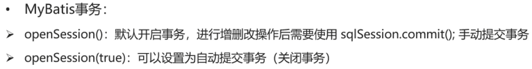
  * 主键返回

    ```xml
    <insert id="add" useGeneratedKeys="true" keyProperty="id">
        insert into tb_brand (brand_name, company_name, ordered, description, status)
        VALUES (#{brandName}, #{companyName}, #{ordered}, #{description}, #{status})
    </insert>
    ```

* 修改

  ```xml
  <update id="update">
      update tb_brand
      <set>
          <if test="brandName != null and brandName != ''">
              brand_name = #{brandName},
          </if>
          <if test="companyName != null and companyName != ''">
              company_name = #{companyName},
          </if>
          <if test="ordered != null">
              ordered = #{ordered},
          </if>
          <if test="description != null and description != ''">
              description = #{description},
          </if>
          <if test="status != null">
              status = #{status}
          </if>
      </set>
      where
          id = #{id};
  </update>
  ```

* 删除一个

  ```xml
  <delete id="deleteById">
      delete from tb_brand where id = #{id}
  </delete>
  ```

* 批量删除

  ```xml
  <!--mybatis会将数组参数,封装为一个Map集合,
      * 默认:array = 数组
      * 使用@Param注解改变map集合的默认key的名称
   -->
  <delete id="deleteByIds">
      delete from tb_brand where id
      in (
          <foreach collection="ids" item="id" separator=",">
              #{id}
          </foreach>
                                     );
  </delete>
  ```

* 参数传递

  * 单个参数

    * POJO类型（自定义类型）

    * Map集合

    * `Collection` 封装为`Map`集合
      ```java
      map.put("arg0","collection集合")
      map.put("collection","collection集合")
      ```

    * List
      ```java
      map.put("arg0","List集合")
      map.put("collection","List集合")
      map.put("List","List集合")
      ```

    * Array
      ```java
      map.put("arg0","数组")
      ​map.put("array","数组")
      ```
    * 其他类型

  * 多个参数： 封装为`Map`集合，可以使用`@Param`注解，替换`Map`集合中默认的`arg`键名

* 注解完成增删改查

  ```java
  @Select("select * from tb_user where id = #{id}")
  User selectById(int id);
  ``` 

## HTML

### 标签

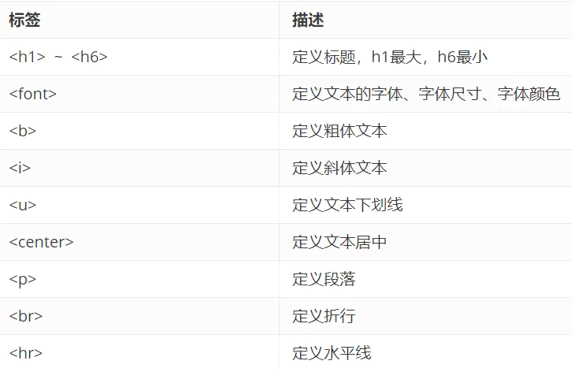

* 转译字符

  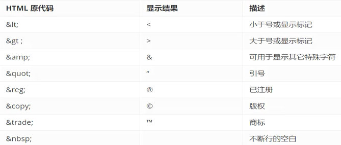

* 图片、音频、视频标签

  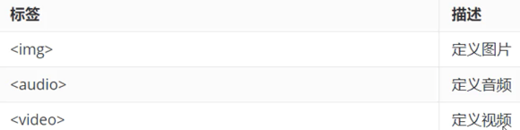

* 超链接

  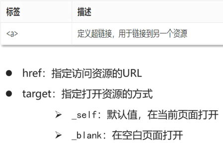

* 列表标签

  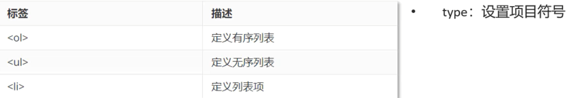

* 表格标签

  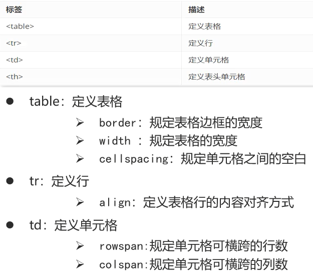

* 布局标签

  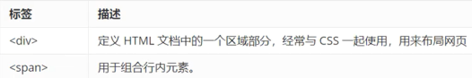

* 表单标签

  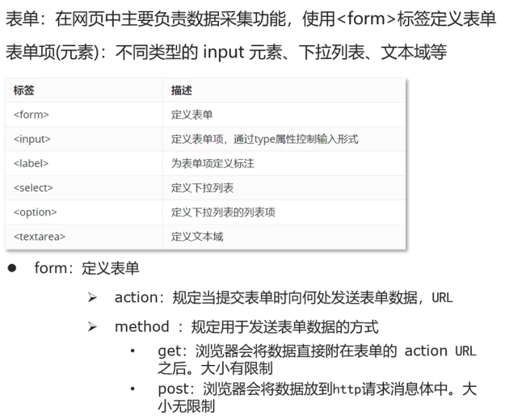

## CSS

* 导入方式

  * 内联样式

    ```html
    <div style="color: red"> Hello </div>
    ```

  * 内部样式

    ```html
    <style>
        div{
            color: red;
        }
    </style>
    ```

  * 外部样式

    ```html
    <link rel="stylesheet" href="demo.css">
    ```

* CSS选择器

  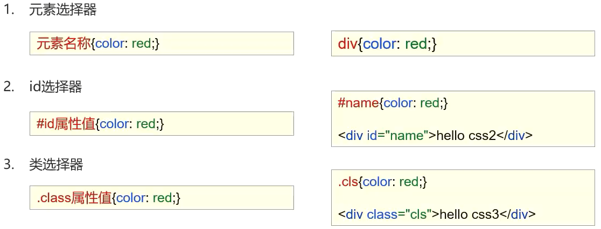

## JavaScript

### 引入方式


* 内部脚本

* 外部脚本

  ```
  <script src="../js/demo.js"></script>
  ```

### 语法

* 变量（声明变量的关键字`var`）(`let`仅用于代码块内)（`const`用于声明常量）

  ```javascript
  var test = 20;
  test = "zhang";
  ```

* 数据类型

  * 原始类型
    * `number`
    * `string`
    * `boolean`
    * `null`
    * `undefined`

* 运算符

  `===`比较之前不会进行类型转换

* 数字与`NaN`之和为`NaN`

* 数组

  ```javascript
  var arr = new Array(1, 2, 3);
  var arr =[1, 2, 3];
  ```
  
* 字符串

  ```html
  <script>
      var str = new String("Hello");
      var str = "hello";
  </script>
  ```
  
* 自定义对象

  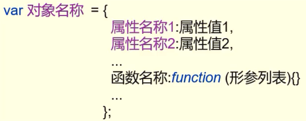
  
* BOM
  
  - `setTimeout(*function*, *milliseconds*)`
  
    在等待指定的毫秒数后执行函数。
  
  - `setInterval(*function*, *milliseconds*)`
  
    等同于 `setTimeout()`，但持续重复执行该函数。
  
  `setTimeout()` 和 `setInterval()` 都属于 `HTML` `DOM` `Window` 对象的方法。
  
* DOM
  
  ```javascript
  document.getElementsByTagName("p");
  document.getElementsByName("p");
  document.getElementById("main");
  document.getElementsByClassName("intro");
  ```
  
* 正则表达式

  1. 直接量

     ```javascript
     var reg = /^\w{6,12}$/;
     ```

  2. 创建RegExp对象

     ```javascript
     var reg = new RegExp("^\\w{6,12}$");
     ```

     

## HTTP

### 请求数据格式

* 请求行
* 请求头
* 请求体
* `GET`与`POST`请求区别
  * `GET`请求请求参数在请求行中，没有请求体。`POST`请求请求参数在请求体中
  * `GET`请求请求参数大小有限制，`POST`没有

### 响应数据格式

* 响应行
* 响应头
* 响应体


## Tomcat


## Servlet

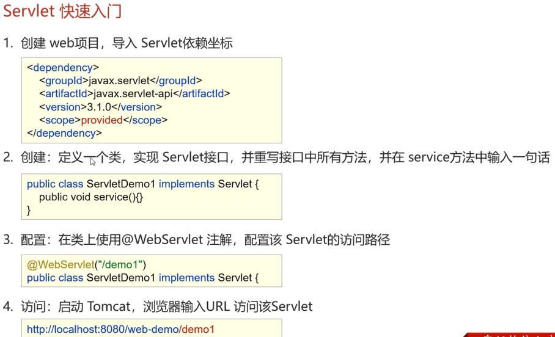

* Servlet声明周期

  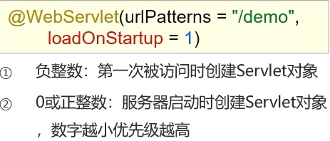

* Servlet方法介绍

  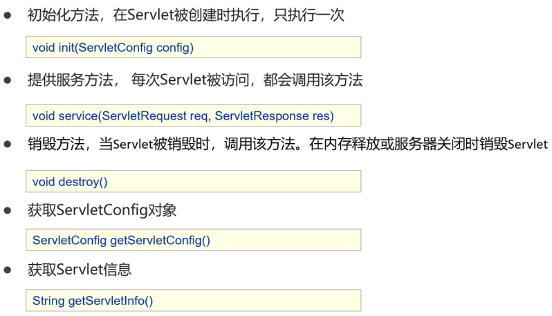

* urlPattern配置规则

  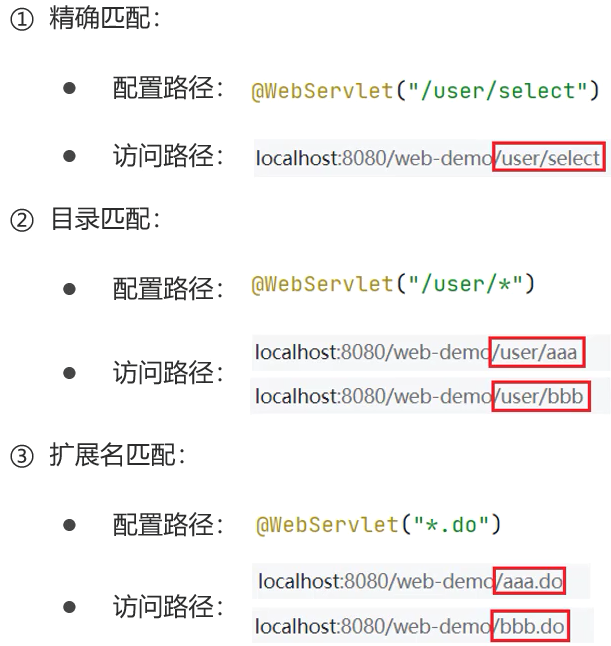

  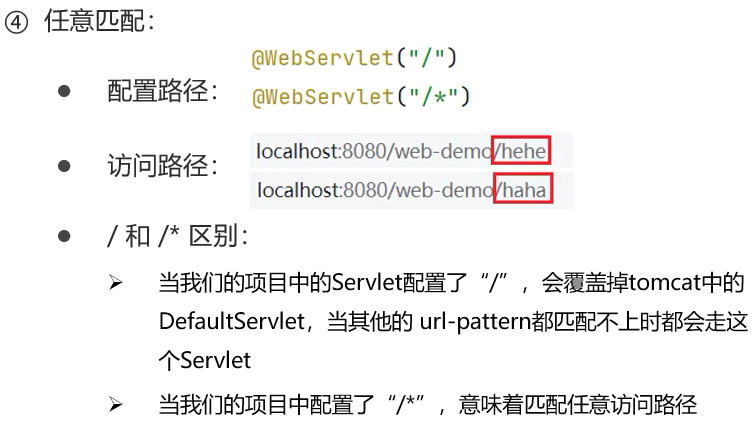

* XML配置Servlet

  ```xml
  <!--
      Servlet 全类名
  -->
  <servlet>
      <servlet-name>demo13</servlet-name>
      <servlet-class>com.mine.web.ServletDemo1</servlet-class>
  </servlet>
  
  <servlet-mapping>
      <servlet-name>demo13</servlet-name>
      <url-pattern>/demo13</url-pattern>
  </servlet-mapping>
  ```
### Request
* Request 通用方式获取请求参数

  ```java
  Map<String, String[]> map = req.getParameterMap();
  String username = req.getParameter("username");
  String[] hobby = req.getParameterValues("hobby");
  ```

* Post的Request请求参数中文乱码问题

  ```java
  req.setCharacterEncoding("UTF-8");
  ```

* Get 的Request请求参数中文乱码问题

  ```java
  byte[] bytes = username.getBytes(StandardCharsets.ISO_8859_1);
  username = new String(bytes,StandardCharsets.UTF_8);
  ```

* 请求转发

  ```java
  request.getRequestDispatcher("/demo1").forward(request,response);
  ```

### Response

* 重定向

  ```java
  response.setStatus(302);
  response.setHeader("Location", "/tomcat-demo2/resp2");
  //简化写法
  response.sendRedirect("/tomcat-demo2/resp2");
  //可以重定向道任意资源
  response.sendRedirect("https://www.baidu.com/");
  
  //动态获取虚拟目录的方式
  String contextPath = request.getContextPath();
  response.setHeader("Location", contextPath +"/resp2");
  ```

* Response响应字符数据

  ```java
  响应数据格式及中文字符问题
  response.setContentType("text/html;charset=utf-8");
  
  PrintWriter writer = response.getWriter();
  //response.setHeader("content-type", "text/html");
  writer.write("您好");
  writer.write("aasdas");
  writer.write("<h1>aaaa</h1>");
  ```

* Response响应字节数据

  ```java
  //读取文件
  FileInputStream file = new FileInputStream("");
  //获取response字节输出流
  ServletOutputStream os = response.getOutputStream();
  //完成copy
  byte[] buffer = new byte[1024];
  int len = 0;
  while ((len = file.read(buffer)) != -1){
      os.write(buffer,0,len);
  }
  file.close();
  ```
  * IOUtils工具类

    ```xml
    <dependency>
        <groupId>commons-io</groupId>
        <artifactId>commons-io</artifactId>
        <version>2.6</version>
    </dependency>
    ```

    ```java
    //读取文件
    FileInputStream file = new FileInputStream("");
    //获取response字节输出流
    ServletOutputStream os = response.getOutputStream();
    //完成copy
    IOUtils.copy(file,os);
    file.close();
    ```

## JSP

（Java Server Pages）

* JSP脚本分类
  * `<%......%>`   内容会直接放到`_jspService()`方法中
  * `<%=....%>`   内容会放到`out.print()`中，作为`out.print()`的参数
  * `<%!.....%>`   内容会放到`_jspService()`方法之外，被类直接包含

### EL表达式

* 主要功能：获取数据

* 语法： `${expression}`

* el表达式获取数据  依次从4个域中寻找

  page  `->`   request  `->`   session   `->`   application

  ```html
  <%@ page contentType="text/html;charset=UTF-8" language="java" isELIgnored="false" %>
  <html>
  <head>
      <title>Title</title>
  </head>
  <body>
      ${brands}
  </body>
  </html>
  ```

### JSTL标签

* if逻辑判断

```html
<%@ taglib prefix="c" uri="http://java.sun.com/jsp/jstl/core" %>
<body>
<%--
c:if   完成逻辑判断
--%>
    <c:if test="${status == 1}">
        <h1>启用</h1>
    </c:if>

    <c:if test="${status == 0}">
        <h1>禁用</h1>
    </c:if>
</body>
```

* for循环

```html
<%@ taglib prefix="c" uri="http://java.sun.com/jsp/jstl/core" %>
    
  <c:forEach items="${brands}" var="brand" varStatus="no">
    <tr align="center">
      <%--<td>${brand.id}</td>--%>
      <td>${no.count}</td>
      <td>${brand.brandName}</td>
      <td>${brand.companyName}</td>
      <td>${brand.ordered}</td>
      <td>${brand.description}</td>
      <c:if test="${brand.status ==1}">
        <td>启用</td>
      </c:if>
      <c:if test="${brand.status !=1}">
        <td>禁用</td>
      </c:if>
      <td><a href="#">修改</a> <a href="#">删除</a></td>
    </tr>
  </c:forEach>


<%--第2中for循环--%>
<hr>
<c:forEach begin="0" end="10" step="1" var="i">
  <a href="/jsp-demo/hello.jsp">${i}</a>
</c:forEach>
```

## 会话跟踪技术

### Cookie

数据存储在客户端

发送Cookie

```java
Cookie cookie = new Cookie("username", "zhangsan");

//设置cookie的存活时间
cookie.setMaxAge(60*60*24*7);

response.addCookie(cookie);
```

获取Cookie

```java
Cookie[] cookies = request.getCookies();

for (Cookie cookie : cookies) {
    String name = cookie.getName();
    if ("username".equals(name)){
        String value = cookie.getValue();
        System.out.println(name + ": " + value);
        break;
    }
}
```

Cookie中文字符问题

```java
//发送Cookie时对中文编码
String value = "张三";
value = URLEncoder.encode(value, "UTF-8");
Cookie cookie = new Cookie("username", value);

//获取Cookie时对中文解码
value = URLDecoder.decode(value, "UTF-8");
```

### Session

数据存储在服务端

```java
HttpSession session = request.getSession();
session.setAttribute("username", "zs");
```


```java
HttpSession session = request.getSession();
Object username = session.getAttribute("username");
```

* 销毁session

  ```java
  //销毁session
  request.getSession().invalidate();
  ```

  

## Filter

* 对资源的请求拦截下来，从而实现一些特殊的功能

  ```java
  HttpServletRequest req = (HttpServletRequest) request;
  //判断访问资源是否登录注册相关
  
  String[] urls={"/index.html", "/imgs/", "/css/", "loginServlet", "register.jsp", "/login.jsp", "/registerServlet", "/checkCodeServlet"};
  //获取当前访问的资源路径
  String url = req.getRequestURL().toString();
  for (String u : urls) {
      if (url.contains(u)){
          //放行
          chain.doFilter(request, response);
          return;
      }
  }
  
  
  //判断session中是否有User
  
  HttpSession session = req.getSession();
  
  Object user = session.getAttribute("user");
  
  //判断user是否为null
  
  if (user != null){
      chain.doFilter(request, response);
  }else {
      req.setAttribute("login_msg", "您尚未登录!");
      req.getRequestDispatcher("/login.jsp").forward(req, response);
  }
  ```

## Listener

* 监听器

  ```java
  @WebListener
  public class ContextLoaderListener implements ServletContextListener {
  
      @Override
      public void contextInitialized(ServletContextEvent servletContextEvent) {
          //加载资源
          System.out.println("ContextLoaderListener...........");
      }
  
      @Override
      public void contextDestroyed(ServletContextEvent servletContextEvent) {
          //释放资源
      }
  }
  ```

## AJAX

```java
//响应数据
response.getWriter().write("hello ajax");
```

```javascript
//创建核心对象
var xhttp;
if (window.XMLHttpRequest) {
  xhttp = new XMLHttpRequest();
} else {
  // code for IE6, IE5
  xhttp = new ActiveXObject("Microsoft.XMLHTTP");
}

//发送请求
xhttp.open("GET", "http://localhost:8080/jsp-demo/ajaxServlet");
xhttp.send();

//获取响应
xhttp.onreadystatechange = function() {
  if (this.readyState == 4 && this.status == 200) {
            alert(this.responseText);
  }
};
```

## Axios

* 引入axios的js文件

* [axios文件下载](https://unpkg.com/browse/axios@0.18.0/dist/)

  ```html
  <script src="js/axios-0.18.0.js"></script>
  ```

* 使用axios发送请求并获取响应

  ```html
  <script>
      /*axios({
          method:"get",
          url:"http://localhost:8080/jsp-demo/axiosServlet?username=zhangsan"
      }).then(function (resp) {
  
          alert(resp.data);
      })*/
  
      axios({
          method:"post",
          url:"http://localhost:8080/jsp-demo/axiosServlet",
          data:"username=zhangsan"
      }).then(function (resp) {
  
          alert(resp.data);
      })
  </script>
  ```

* Axios请求方式别名

  ```html
  <script>
  axios.get("http://localhost:8080/jsp-demo/axiosServlet?username=zhangsan").then(function (resp) {
      alert(resp.data);
  });
  
  axios.post("http://localhost:8080/jsp-demo/axiosServlet", "username=zhangsan").then(function (resp) {
      alert(resp.data);
  });
  </script>
  ```

## JSON

* 定义

  ```json
  var 变量名 = {"key1":value1,
             "key2":value2,
             ....
            }；
  ```

* value的数据类型

  * 数字（整数或浮点数）
  * 字符串（在双引号中）
  * 逻辑值（ true或false）
  * 数组（在方括号中）
  * 对象（在花括号中）
  * null

* 获取数据

  变量名.key

### Fastjson库

* 导入依赖

  ```xml
  <dependency>
    <groupId>com.alibaba</groupId>
    <artifactId>fastjson</artifactId>
    <version>1.2.62</version>
  </dependency>
  ```

* Java对象与JSON字符串转换

  ```java
  //将Java对象转为JSON字符串
  User user = new User();
  user.setId(1);
  user.setUsername("zhangsan");
  user.setPassword("123");
  
  String jsonString = JSON.toJSONString(user);
  System.out.println(jsonString);
  
  //将JSON字符串转成Java对象
  User u = JSON.parseObject("{\"id\":1,\"password\":\"123\",\"username\":\"zhangsan\"}", User.class);
  System.out.println(u);
  ```


## Vue

* 一套前端框架

* 引入Vue.js文件

  ```javascript
  <div id="app">
      <input v-model="username">
      {{username}}
  </div>
  
  <script src="js/vue.js"></script>
  <script>
      new Vue({
          el:"#app",
          data(){
              return {
                  username: ""
              }
          }
      });
  </script>
  ```

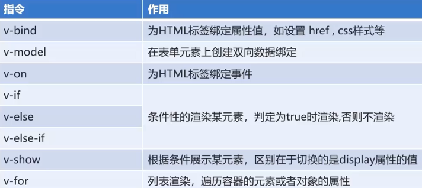

## Element

* 饿了么开发的

  [组件 | Element](https://element.eleme.io/2.15/#/zh-CN/component/installation)

## Bootstrap

* 一个前端的开发框架

```html
<!doctype html>
<html lang="zh-CN">
<head>
    <meta charset="utf-8">
    <meta http-equiv="X-UA-Compatible" content="IE=edge">
    <meta name="viewport" content="width=device-width, initial-scale=1">
    <!-- 上述3个meta标签*必须*放在最前面，任何其他内容都*必须*跟随其后！ -->
    <title>Bootstrap HelloWorld</title>

    <!-- Bootstrap -->
    <link rel="stylesheet" href="css/bootstrap.min.css">
    <!-- jQuery (Bootstrap 的所有 JavaScript 插件都依赖 jQuery，所以必须放在前边) -->
    <script src="js/jquery.min.js"></script>
    <!-- 加载 Bootstrap 的所有 JavaScript 插件。你也可以根据需要只加载单个插件。 -->
    <script src="js/bootstrap.min.js"></script>

</head>
<body>
<h1>你好，世界！</h1>

</body>
</html>
```

* 一行代码实现页面变灰

  ```html
  <style type="text/css">
      html {
          filter: grayscale(100%); 
          -webkit-filter: grayscale(100%); 
          -moz-filter: grayscale(100%); 
          -ms-filter: grayscale(100%); 
          -o-filter: grayscale(100%); 
          -webkit-filter: grayscale(1);
      }
  </style>
  ```

  

### 响应式布局

* 统一页面可以兼容不同分辨率的设备

* 依赖于栅格系统

  * 容器分类

    ```html
    container   两边留白
    container-fluid  100%宽度
      
    xs 超小屏幕 手机
    sm 小屏幕 平板
    md 中等屏幕
    lg 大屏幕
    ```

## JQuery

* JQuery是一个JavaScript框架，简化JS开发

* JQuery对象和JS对象区别与转换

  * `jq --> js     jq对象[索引]     或者     jq对象.get(索引)`
  * `js --> jq     $(js对象)`

* 选择器

  1. 基本选择器
      1. 标签选择器（元素选择器）
      * 语法： `$("html标签名")` 获得所有匹配标签名称的元素
      2. id选择器 
      * 语法： `$("#id的属性值")` 获得与指定id属性值匹配的元素
      3. 类选择器
      * 语法： `$(".class的属性值")` 获得与指定的class属性值匹配的元素
      4. 并集选择器：
      * 语法： `$("选择器1,选择器2....")` 获取多个选择器选中的所有元素
  2. 层级选择器
      1. 后代选择器
      * 语法： `$("A B ")` 选择A元素内部的所有B元素		
      2. 子选择器
      * 语法： `$("A > B")` 选择A元素内部的所有B子元素
  3. 属性选择器
      1. 属性名称选择器 
      * 语法： `$("A[属性名]")` 包含指定属性的选择器
      2. 属性选择器
      * 语法： `$("A[属性名='值']")` 包含指定属性等于指定值的选择器
      3. 复合属性选择器
      * 语法： `$("A[属性名='值'][]...")` 包含多个属性条件的选择器
  
  4. 过滤选择器
      1. 首元素选择器 
      * 语法： :first 获得选择的元素中的第一个元素
      2. 尾元素选择器 
      * 语法： :last 获得选择的元素中的最后一个元素
      3. 非元素选择器
      * 语法： :not(selector) 不包括指定内容的元素
      4. 偶数选择器
      * 语法： :even 偶数，从 0 开始计数
      5. 奇数选择器
      * 语法： :odd 奇数，从 0 开始计数
      6. 等于索引选择器
      * 语法： :eq(index) 指定索引元素
      7. 大于索引选择器 
      * 语法： :gt(index) 大于指定索引元素
      8. 小于索引选择器 
      * 语法： :lt(index) 小于指定索引元素
      9. 标题选择器
      * 语法： :header 获得标题（h1~h6）元素，固定写法
     
  5. 表单过滤选择器
  
       1. 可用元素选择器 
  
       * 语法： :enabled 获得可用元素
  
       2. 不可用元素选择器 
  
       * 语法： :disabled 获得不可用元素
  
       3. 选中选择器 
  
       * 语法： :checked 获得单选/复选框选中的元素
  
       4. 选中选择器 
  
       * 语法： :selected 获得下拉框选中的元素

* DOM操作

  * 内容操作

    * html()   ： 获取/设置元素的标签体内容
    * text()    ：获取/设置元素的标签体纯文本内容
    * val()      ：获取/设置元素的value属性值

  * 属性操作

    * 通用属性操作

      * attr()    ：获取/设置元素的属性

      * removeAttr()   ：删除属性

      * porp()   ：获取/设置元素的属性

      * removeProp()   ：删除属性

        > 操作固有属性使用prop
        >
        > 操作自定义属性使用attr

    * 对class属性操作

      * addClass()    ：添加属性值
      * removeClass()    ：删除属性值
      * toggleClass()     ：切换属性值【没有则添加，有则删除】
      * css();

    * CRUD操作

      * append()：父元素将子元素追加到末尾

        > 对象1.append(对象2)  ：将对象2添加到对象1元素内部，并且在末尾

      * prepend()：父元素将子元素追加到开头

        > 对象1.append(对象2)  ：将对象2添加到对象1元素内部，并且在开头

      * appendTo()：

        > 对象1.append(对象2)  ：将对象1添加到对象2元素内部，并且在末尾

      * prependTo()：

        > 对象1.prependTo(对象2)  ：将对象1添加到对象2元素内部，并且在开头

      * after()：添加元素到元素后边

        > 对象1.after(对象2)：将对象2添加到对象1后边。对象1和对象2是兄弟关系

      * before()：添加元素到元素前边

        > 对象1.before(对象2)：将对象2添加到对象1前边。对象1和对象2是兄弟关系

      * insertAfter()：

        > 对象1.insertAfter(对象2)：将对象2添加到对象1后边。对象1和对象2是兄弟关系

      * insertBefore()：

        > 对象1.before(对象2)：将对象2添加到对象1前边。对象1和对象2是兄弟关系

      * remove()：移除元素

        > 对象.remove()：将对象删除

      * empty()：清空元素的所有后代元素

        > 对象.empty()：将对象的后代元素全部清空，但是保留当前对象以及其属性节点

* 动画

  1. 动画
	* 三种方式显示和隐藏元素
        1. 默认显示和隐藏方式
            1. show([speed,[easing],[fn]])
            1. 参数：
                1. speed：动画的速度。三个预定义的值("slow","normal", "fast")或表示动画时长的毫秒数值(如：1000)
                2. easing：用来指定切换效果，默认是"swing"，可用参数"linear"
                * swing：动画执行时效果是 先慢，中间快，最后又慢
                * linear：动画执行时速度是匀速的
                3. fn：在动画完成时执行的函数，每个元素执行一次。
            2. hide([speed,[easing],[fn]])
            3. toggle([speed],[easing],[fn])
    
    2. 滑动显示和隐藏方式
        1. slideDown([speed],[easing],[fn])
        2. slideUp([speed,[easing],[fn]])
        3. slideToggle([speed],[easing],[fn])
    
    3. 淡入淡出显示和隐藏方式
        1. fadeIn([speed],[easing],[fn])
        2. fadeOut([speed],[easing],[fn])
        3. fadeToggle([speed,[easing],[fn]])

* 遍历

  1. js的遍历方式
		* for(初始化值;循环结束条件;步长)
  2. jq的遍历方式
		1. jq对象.each(callback)
			1. 语法：
				jquery对象.each(function(index,element){});
				 * index:就是元素在集合中的索引
				* element：就是集合中的每一个元素对象
				* this：集合中的每一个元素对象
			2. 回调函数返回值：
				* true:如果当前function返回为false，则结束循环(break)。
				* false:如果当前function返回为true，则结束本次循环，继续下次循环(continue)
		2. $.each(object, [callback])
		3. for..of: jquery **3.0 版本**之后提供的方式
			for(元素对象 of 容器对象)

* 事件绑定

  1. jquery标准的绑定方式
		* jq对象.事件方法(回调函数)；
		* 注：如果调用事件方法，不传递回调函数，则会触发浏览器默认行为。
			* 表单对象.submit();//让表单提交
	2. on绑定事件/off解除绑定
		* jq对象.on("事件名称",回调函数)
		* jq对象.off("事件名称")
			* 如果off方法不传递任何参数，则将组件上的所有事件全部解绑
	3. 事件切换：toggle
		* jq对象.toggle(fn1,fn2...)
			* 当单击jq对象对应的组件后，会执行fn1.第二次点击会执行fn2.....
			
		* 注意：1.9版本 .toggle() 方法删除,jQuery Migrate（迁移）插件可以恢复此功能。

* 插件

  1. 实现方式：
		1. $.fn.extend(object) 
			* 增强通过Jquery获取的对象的功能  $("#id")
			* 通过Jquery对象调用
		2. $.extend(object)
			* 增强JQeury对象自身的功能  $/jQuery
			* 通过Jquery调用

## Redis

* redis 是一款高性能的NoSql系列的非关系型数据库
  * 数据之间没有关联关系
  * 数据存储在内存中
  * 缓存一些不经常发生变化的数据
  * 一般会将数据存储在关系型数据库中，在Nosql数据库中备份存储关系型数据库的数据
  
* 安装

  * win安装服务

    `redis-server.exe --service-install redis.windows.conf --service-name Redis --port 6379`

  * win卸载服务

    `redis-server.exe --service-uninstall --service-name Redis`

* 命令操作

  * redis存储的是key, value 格式的数据，其中key 都是字符串， value 有种不同的数据类型

    * value 的数据类型：
      * String: 字符串
      * Hash: 散列
      * List: 列表
      * Set: 集合
      * Sorted Set: 有序集合

    
    1. 字符串类型 string
        1. 存储： `set key value`
        ```bash
        127.0.0.1:6379> set username zhangsan
        OK
        ```
        2. 获取： `get key`
        ```sh
        127.0.0.1:6379> get username
        "zhangsan"
        ```
        3. 删除： `del key`
        ```sh
        127.0.0.1:6379> del age
        (integer) 1
        ```
    2. 哈希类型 hash
        1. 存储： `hset key field value`
        ```sh
        127.0.0.1:6379> hset myhash username lisi
        (integer) 1
        127.0.0.1:6379> hset myhash password 123
        (integer) 1
        ```
        2. 获取： 
        * hget key field: 获取指定的field对应的值
        ```sh
        127.0.0.1:6379> hget myhash username
        "lisi"
        ```
        * `hgetall key`：获取所有的field和value
        ```sh
        127.0.0.1:6379> hgetall myhash
        1) "username"
        2) "lisi"
        3) "password"
        4) "123"
        ```
        3. 删除： `hdel key field`
        ```sh
        127.0.0.1:6379> hdel myhash username
        (integer) 1
        ```

    3. 列表类型 list:可以添加一个元素到列表的头部（左边）或者尾部（右边）
        1. 添加：
        1. `lpush key value`: 将元素加入列表左表

        2. `rpush key value`：将元素加入列表右边
        ```sh
        127.0.0.1:6379> lpush myList a
        (integer) 1
        127.0.0.1:6379> lpush myList b
        (integer) 2
        127.0.0.1:6379> rpush myList c
        (integer) 3
        ```
        2. 获取：
        * lrange key start end ：范围获取
        ```sh
        127.0.0.1:6379> lrange myList 0 -1
        1) "b"
        2) "a"
        3) "c"
        ```
        3. 删除：
        * lpop key： 删除列表最左边的元素，并将元素返回
        * rpop key： 删除列表最右边的元素，并将元素返回
    4. 集合类型 set ： 不允许重复元素
        1. 存储：sadd key value
        ```sh
        127.0.0.1:6379> sadd myset a
        (integer) 1
        127.0.0.1:6379> sadd myset a
        (integer) 0
        ```
        2. 获取：smembers key:获取set集合中所有元素
        ```sh
        127.0.0.1:6379> smembers myset
        1) "a"
        ```
        3. 删除：srem key value:删除set集合中的某个元素	
        ```sh
        127.0.0.1:6379> srem myset a
        (integer) 1
        ```
    5. 有序集合类型 sortedset：不允许重复元素，且元素有顺序.每个元素都会关联一个double类型的分数。redis正是通过分数来为集合中的成员进行从小到大的排序。
        1. 存储：`zadd key score value`
        ```sh
        127.0.0.1:6379> zadd mysort 60 zhangsan
        (integer) 1
        127.0.0.1:6379> zadd mysort 50 lisi
        (integer) 1
        127.0.0.1:6379> zadd mysort 80 wangwu
        (integer) 1
        ```
        2. 获取：`zrange key start end [withscores]`
        ```sh
        127.0.0.1:6379> zrange mysort 0 -1
        1) "lisi"
        2) "zhangsan"
        3) "wangwu"
        127.0.0.1:6379> zrange mysort 0 -1 withscores
        1) "zhangsan"
        2) "60"
        3) "wangwu"
        4) "80"
        5) "lisi"
        6) "500"
        ```
        3. 删除：`zrem key value`
        ```sh
        127.0.0.1:6379> zrem mysort lisi
        (integer) 1
        ```
    7. 通用命令
        1. `keys *` : 查询所有的键
        2. `type key` ： 获取键对应的value的类型
        3. `del key`：删除指定的key value

* 持久化

  * redis是一个内存数据库，当服务器、电脑重启数据会丢失

  * redis持久化机制“

    * RDB：默认方式

      * 在一定的时间间隔中，检测key的变化情况，然后持久化数据

      * 重新启动redis服务器，并指定配置文件名称

        ```bash
        # 修改redis.windows.conf文件中
        # after 900 sec (15 min) if at least 1 key changed
        save 900 1
        #   after 300 sec (5 min) if at least 10 keys changed
        save 300 10
        #   after 60 sec if at least 10000 keys changed
        save 60 10000
        ```

        

    * AOF：日志记录的方式，可以记录每一次命令的操作

      * appendonly no（关闭aof）     appendonly  yes （开启aof）

        ```sh
        # appendfsync always
        appendfsync everysec
        # appendfsync no
        ```

## Jedis

* 一款Java操作redis数据库的工具
* 字符串类型

  ```java
  @Test
  public void Test1(){
      Jedis jedis = new Jedis("localhost", 6379);
      jedis.set("username", "wangwu");
      
      //将activecode：checkcode键值对存入redis，并且20秒后自动删除该键值对
      jedis.setex("activecode" , 20, "checkcode");
      jedis.close();
  }
  ```

* 哈希类型

  ```java
  @Test
  public void Test2(){
      Jedis jedis = new Jedis("localhost", 6379);
  
      jedis.hset("user", "username", "wangwu");
      jedis.hset("user", "age", "wangwu");
      jedis.hset("user", "gender", "wangwu");
  
      String name = jedis.hget("user", "username");
      System.out.println(name);
  
      Map<String, String> user = jedis.hgetAll("user");
      Set<String> keySet = user.keySet();
      for (String key : keySet) {
          String value = user.get(key);
          System.out.println(key + " : " + value);
      }
      jedis.close();
  }
  ```

* jedis 连接池

  * 创建JedisPool连接池对象

  * 调用方法getResource()方法获取jedis连接

    ```java
    @Test
    public void Test3(){
        //创建一个配置对象
        JedisPoolConfig config = new JedisPoolConfig();
        config.setMaxTotal(50);
        config.setMaxIdle(10);
        //创建连接池对象
        JedisPool jedisPool = new JedisPool(config, "localhost", 6379);
        //获取连接
        Jedis jedis = jedisPool.getResource();
        //使用
        jedis.set("hehe", "haha");
        //归还到连接池
        jedis.close();
    }
    ```
    * 配置说明
    
    ```tex
    #最大活动对象数     
    redis.pool.maxTotal=1000    
    #最大能够保持idel状态的对象数      
    redis.pool.maxIdle=100  
    #最小能够保持idel状态的对象数   
    redis.pool.minIdle=50    
    #当池内没有返回对象时，最大等待时间    
    redis.pool.maxWaitMillis=10000    
    #当调用borrow Object方法时，是否进行有效性检查    
    redis.pool.testOnBorrow=true    
    #当调用return Object方法时，是否进行有效性检查    
    redis.pool.testOnReturn=true  
    #“空闲链接”检测线程，检测的周期，毫秒数。如果为负值，表示不运行“检测线程”。默认为-1.  
    redis.pool.timeBetweenEvictionRunsMillis=30000  
    #向调用者输出“链接”对象时，是否检测它的空闲超时；  
    redis.pool.testWhileIdle=true  
    # 对于“空闲链接”检测线程而言，每次检测的链接资源的个数。默认为3.  
    redis.pool.numTestsPerEvictionRun=50  
    #redis服务器的IP    
    redis.ip=xxxxxx  
    #redis服务器的Port    
    redis1.port=6379
    ```
    
    * 连接池工具类
    
      ```java
      /**
       * JedisPool工具类
       * 加载配置文件,配置连接池的参数
       * 提供获取连接的方法
       */
      public class JedisPoolUtils {
          public static JedisPool jedisPool;
          static {
              //读取配置文件
              InputStream is = JedisPoolUtils.class.getClassLoader().getResourceAsStream("jedis.properties");
              //创建Properties对象
              Properties pro = new Properties();
              //关联文件
              try{
                  pro.load(is);
              }catch (IOException e){
                  e.printStackTrace();
              }
              //获取数据,设置到JedisPoolConfig中
              JedisPoolConfig config = new JedisPoolConfig();
              config.setMaxTotal(Integer.parseInt(pro.getProperty("maxTotal")));
              config.setMaxIdle(Integer.parseInt(pro.getProperty("maxIdle")));
              //初始化JedisPool
              jedisPool = new JedisPool(config, pro.getProperty("host"), Integer.parseInt(pro.getProperty("port")));
          }
      
          public static Jedis getJedis(){
              return jedisPool.getResource();
          }
      }
      ```
    
      * 工具类调用
    
        ```java
        @Test
        public void Test4(){
            //通过连接池工具类获取
            Jedis jedis = JedisPoolUtils.getJedis();
            //使用
            jedis.set("hehe", "haha");
            //归还到连接池
           
        ```

## Linux

* 目录结构

  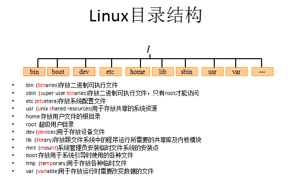

查看文件：

* cat 

* more 

* less 

* tail： 查看文件末尾
* touch 创建一个空文件

* tar

  * 常用参数：

    `-c`：创建一个新tar文件

    `-v`：显示运行过程的信息

    `-f`：指定文件名

    `-z`：调用gzip压缩命令进行压缩

    `-t`：查看压缩文件的内容

    `-x`：解开tar文件

    ```bash
    #打包：
    tar –cvf xxx.tar ./*
    #打包并且压缩：
    tar –zcvf xxx.tar.gz ./* 
    #解压 
         tar –xvf xxx.tar
    	 tar -zxvf xxx.tar.gz -C /usr/aaa
    ```

* Vi / Vim
  * 切换到插入模式：按 i 、o、a键；
        i 在当前位置前插入
        I 在当前行首插入
        a 在当前位置后插入
        A 在当前行尾插入
        o 在当前行之后插入一行
        O 在当前行之前插入一行

* 重定向输出

  * 重定向输出，覆盖原有内容；>> 重定向输出，又追加功能；示例：

    `cat /etc/passwd > a.txt` 将输出定向到a.txt中

    `cat /etc/passwd >> a.txt` 输出并且追加

* 系统管理命令

  * ps 正在运行的某个进程的状态

    `ps –ef` 查看所有进程

    `ps –ef | grep ssh` 查找某一进程

    `kill 2868` 杀掉2868编号的进程

    `kill -9 2868` 强制杀死进程

* 管道

  * 管道是Linux命令中重要的一个概念，其作用是将一个命令的输出用作另一个命令的输入。示例

    `ls --help | more` 分页查询帮助信息

    `ps –ef | grep java` 查询名称中包含java的进程

    `ifconfig | more`

    `cat index.html | more`

    `ps –ef | grep aio`

* 权限

  * 普通文件（-）目录（d）符号链接（l）

  * chmod 变更文件或目录的权限。

    `chmod 755 a.txt` 

    `chmod u=rwx,g=rx,o=rx a.txt`

* 网络服务管理

  `service network status` 查看指定服务的状态

  `service network stop` 停止指定服务

  `service network start` 启动指定服务

  `service network restart` 重启指定服务

  `service --status–all` 查看系统中所有后台服务

  `netstat –nltp` 查看系统中网络进程的端口监听情况

   

  防火墙设置

  防火墙根据配置文件/etc/sysconfig/iptables来控制本机的”出”、”入”网络访问行为。

  `service iptables status` 查看防火墙状态

  `service iptables stop` 关闭防火墙

  `service iptables start` 启动防火墙

  `chkconfig iptables off` 禁止防火墙自启

* 软件安装

  1. 二进制发布包

     软件已经针对具体平台编译打包发布，只要解压，修改配置即可

  2. RPM包

     软件已经按照redhat的包管理工具规范RPM进行打包发布，需要获取到相应的软件RPM发布包，然后用RPM命令进行安装

  3. Yum在线安装

     软件已经以RPM规范打包，但发布在了网络上的一些服务器上，可用yum在线安装服务器上的rpm软件，并且会自动解决软件安装过程中的库依赖问题

  4. 源码编译安装

     软件以源码工程的形式发布，需要获取到源码工程后用相应开发工具进行编译打包部署。

* 文件上传下载
  * FileZilla
  * lrzsz
  * SecureCRT
  * SFTP

* Redis安装
  * redis是C语言开发，安装redis需要先将官网下载的源码进行编译，编译依赖gcc环境
  * 输入命令：`yum install gcc-c++`
  *  wegt   下载redis
  * tar -xzvf 解压
  * 切换到程序目录 使用make进行编译
  * 执行安装命令  make PREFIX=/安装路径 install

## Nginx

* http服务器

* 启动 ./nginx

* 停止 ./nginx -s stop            ./nginx -s quit

* 重新加载配置文件 ./nginx -s reload

* 反向代理

  ```txt
  upstream tomcat-travel{
  	server 144.34.155.202:8080;
  	#如果配置权重
  	server 144.34.155.202:8080 weight=2;
  }
  
  server{
  	listen 80;   #默认端口号
  	server_name www.XXXXX.com;   #域名或ip
  	
  	location / {
  		#root index;    #默认访问资源的目录
  		proxy_pass http://tomcat-travel;
  		index index.html;    #默认访问资源的名称
  	}
  	
  }
  ```

  

## 重要

web.xml中不要加入metadata-complete="true" 


