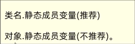
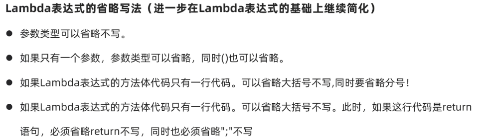

# Java基础


## Java概述及基础语法

### Windows 盘符切换命令

| 常用命令 | 作用                      |
| :--------: | ------------------------- |
| 盘符：   | 切换到某盘下：'D:' , 'C:' |
| dir | 查看当前路径 |
| cd | 进入单级目录：cd java  <br/>进入多级目录：cd D:\java\JavaSe  <br/>回退到上一级目录：cd ..   <br/>回退到盘符根目录：cd \ |
| cls | 清屏 |

### 第一个Java程序

```java
public class HelloWorld{
	public static void main(String[] args){
		System.out.println("HelloWorld");
	}
}
```

* 文件名与类名一致
* 步骤：编写 -> 编译 -> 运行

**注：**JDK11 支持 java 直接运行Java源程序

#### 配置环境变量


### IDEA 使用

#### IDEA结构

* project（项目、工程）   包含多个模块
* module（模块）    包含多个包
* package（包）    包含多个类
* class（类）

#### 快捷键


### Java语言

#### 注释

* 单行注释

```java
//单行注释
```


* 多行注释

```java
/*
多行注释
多行注释
*/
```

* 文档注释

```java
/**
用在方法和类上的注释
*/
```

* 注释快捷键


#### 字面量


#### 变量

存储数据，可以改变存储的数据

`数据类型 变量名称 = 初始值`

* 变量的有效范围在{    }之内，同一个{     }内不能定义重名变量

* 变量定义时可以不赋值，但是变量必须在使用之前或使用时赋初始值

#### 数据存储形式

二进制

1B = 8b

#### 数据类型


* 整数默认为int类型，如果使用long类型需要在末尾加L/l

* 小数默认为double类型，如果使用float类型在末尾加F/f

#### ASCII编码

ASCII (American Standard Code for Infromation Interchange)

美国信息交换标准编码

#### 关键字 标识符


* 标识符

不能数字开头，不能是关键字

* 命名规则
  * 变量名（首字母小写）
  * 类名（首字母大写）

#### 类型转换

* **类型范围小**的变量可以直接赋值给**类型范围大**的变量

* 自动类型转换

  byte -> short -> int -> long -> float -> double

  char - > int 

* 表达式自动类型转换

  byte / short / char -> int -> long -> float -> double 

  * 表达式的最终结果类型由表达式中的**最高类型**决定
  * 表达式中的byte / short / char 是**直接转换**成 int 类型参与运算的。

* 强制类型转换

  * 可能造成数据丢失

#### 运算符

* 算数运算符

  

**两个整数做除法**结果为整数

* `+`做连接符，能算则算，不能算连接

  ```java
  int a = 5;
  System.out.println(a + 'a'); //102
  System.out.println(a + "" + 'a'); //5a
  ```

* 自增自减运算符

  

  非单独使用：在变量前，先进性变量自增/自减，再使用变量

  非单独使用：在变量后，先使用变量，再进行变量自增/自减

  ```java
  int c = 10;
  int d = 5;
  int rs3 = c++ + ++c - --d - ++d + 1 + c--;
  //10 + 12 - 4 - 5 + 1 + 12 = 26
  ```
  
* 赋值运算符`=`

  

* 关系运算符

  

* 逻辑运算符

  

  * 短路逻辑运算符

    

    **注意：**逻辑与`&`、逻辑或`|`：无论左边是false还是true，右边都要执行。
  
* 三元运算符

  **格式：**`条件表达式? 值1 : 值2;`

* 运算符优先级

  

#### 键盘录入

* 下载API文档

  [Java API文档](http://www.oracle.com/technetwork/java/javase/downloads/index.html)
  
* 命令行输入

  ```jave
  import java.util.Random;
  Scanner sc = new Scanner(System.in);
  int number =  sc.nextInt();
  ```

  

#### 程序流程控制

* 分支结构

  * if

    

  * switch

    

    * 表达式类型只能支持**byte、short、int、char**，不支持double、float、long，JDK5开始支持枚举，JDK7开始支持String。

* 循环结构

    * for

    

    * while

      

    * do-while

      

    * 死循环

      

    * 循环嵌套

      ```java
      public class ForForDemo2 {
          public static void main(String[] args) {
              for (int i = 0; i < 4; i++) {
                  for (int j = 0; j < 5; j++) {
                      System.out.print("*");
                  }
                  System.out.println();
              }
          }
      }
      //输出
      //*****
      //*****
      //*****
      //*****
      ```

    * 跳转控制语句（都只能用于循环中）

      * break          ：跳出并结束当前所在循环的执行
      * continue    ：用于跳出当前循环执行的当此执行，进入下一次循环（只能在循环中使用）

    * 随机数

      ```java
      import java.util.Random;    //导包
      Random r = new Random();    //实例化对象
      int data = r.nextInt(10);   //生成随机数
      ```

      

#### 数组

##### 数组定义

* 格式

  * 静态数组

  

  * 动态数组

    

* 求最大值

```java
int[] faceScores = {15,9000,10000,20000,9500,-5};

int max = faceScores[0];
for (int i = 1; i < faceScores.length; i++) {
	if(faceScores[i] > max){
		max = faceScores[i];
	}
}
System.out.println(max);
```

* 数组遍历

  ```java
  for (int i = 0; i < arr.length; i++) {
  	System.out.print(arr[i] + "\t");
  }
  ```

#### 方法

* 定义

  

  

* 引用类型
  
* 数组
  
* 方法重载

  * 同一个类中，出现多个方法名相同，但是形参列表是不同的，那么这些方法就是重载方法

  * 调用重载方法时，会通过参数的不同来区分调用的是哪个方法。

    **注：**同一个类中，方法名相同，形参的个数、类型、顺序不同

* return 关键字
  
  * `return;`可以立即跳出并结束当前方法的执行


#### 对象 

* 得到类的对象

  

* 构造器
  * 无参构造器(**必须有**)
  * 有参数构造器
* this 关键字
  * 当前对象的地址
  * 访问当前对象的成员变量

* 封装
  * 合理隐藏、 合理暴露
  * 加强程序代码的安全性
  * getter
  * setter
  * 成员变量私有private
* javabean
  * 成员变量使用private修饰
  * 提供每一个成员变量对应的setter() getter()
  * 必须提供一个无参构造器

* 局部变量使用之前给初始值

#### String

* String 概述

  * 字符串类型，定义字符串类型指向字符串
  * String每次修改都是产生并指向新的字符串
  * 原来的字符串对象都是没有改变的，所以称为不可变字符串
  * **注：**相同字符串对象只在内存中存一份

* 字符串比较

  * equals

    

  * String 常用API

    

#### 集合

> （元素个数不确定，且进行增删减）

* ArrayList

  

  
  * 泛型

    约定集合对象只能操作某种类型的数据

    ```jave
    //字符串集合
    ArrayList<String> list = new ArrayList<String>();
    //整数集合
    ArrayList<Integer> list1 = new ArrayList();
    ```

  * 常用API

    

  * 遍历并删除

    * 从前往后删

    ```java
    for (int i = 0; i < scores.size(); ) {
    	int score = scores.get(i);
    	if (score < 80){
    		scores.remove(i);
    	}else {
    		i++;
     	}
    }
    ```

    * 从后往前删

#### 类

* 类的5大成分： 成员变量、构造器、成员方法、代码块、内部类

  

  [内部类](#innerClass)
  
  [代码块](#codeBlock)

* 类的成分示例

  

## Java 进阶

### 面向对象

#### static 关键字

* 可以修饰成员变量，表示该成员变量在内存中只存储一份，可以被  **共享**  访问、修改。

  * 有static修饰，属于类，加载一次，可以被共享访问【共享】

  

  * 无static修饰，属于对象，只能被对象访问【每个对象的信息不同时】

    

* 修饰方法

  * 静态成员方法（有static修饰，属于类），建议用类名访问，也可以用对象访问【通用功能方法】
  * 实例成员变量（无static修饰，属于对象），只能对象触发访问【对象自己的行为】

* 工具类

  * 对于应用中多次使用的功能，可以将这些功能封装成静态方法放在一个类中

* 注意事项

  * 静态方法可以访问静态成员
  * 实例方法可以访问实例成员也可以访问静态成员

* <span id="codeBlock">代码块</span>

  * 静态代码块（与  **类** 一起加载，自动触发一次，优先执行）

    ```java
    static{
        
    }
    //对静态数据初始化操作
    //程序加载时进行静态数据的初始化操作
    ```
  
  * 构造代码块（与  **对象** 一起加载，自动触发一次，优先执行）
  
    ```java
    {
        
    }
    //每次创建对象，调用构造器执行时，都会执行该代码块中的代码，并且在构造器执行前执行
    ```
  
    

#### 单例

* 一个类永远只能创建一个对象

* 饿汉单例设计模式（在用类获取对象时，对象已经提前为你创建好）

  

  ```java
  public class SingleInstance {
  
      static SingleInstance instance = new SingleInstance();
  
      private SingleInstance(){}；
  
  }
  ```
  
  
  
  * 定义一个类把构造器私有
  * 定义一个静态变量存储一个对象
  
* 懒汉单例设计模式（需要对象时才去创建一个 对象）

  

  ```java
  public class SingleInstance2 {
  
      private static SingleInstance2 instance2;
      private  SingleInstance2(){}
      //定义一个方法
      public  static SingleInstance2 getInstance2(){
          if (instance2 == null){
              instance2 = new SingleInstance2()
          }
          return instance2;
      }
  }
  ```

  

  * 定义一个类把构造器私有
  * 定义一个静态变量存储一个对象


  

#### 继承

* 类与类之间的关系

  ```java
  public class Student extends People{
      
  }
  ```

  * 子类们相同的特性（共性属性、共性方法）放在父类中定义
  * 子类独有的属性和行为应该放在子类自己里面

* 在子类方法中中访问成员（成员变量、成员方法）满足：就近原则

* 如果自父类中出现了重名的成员，会优先使用子类的

  * 可以通过super 关键字，指定访问父类的成员

    
    
  * 子类中访问父类方法（定义一个**中转方法**）
  
* 子类方法重写

  * @Override注解代码安全优雅
  * 重写方法的名称、形参列表必须与被重写方法的名称与参数列表一致
  * 私有方法不能被重写
  * 子类不能重写父类的静态方法

* 子类继承父类后构造器的特点

  * 子类中所有的构造器默认都会先访问**父类**中无参的构造器，再执行自己

* this、supper

  

  * this() 和 super()
    * this() 和 super() 都只能放在构造器的第一行，所以二者不能共存再同一个构造器中
    
#### 包

  * 相同包下的类可以直接访问
  * 不同包下的类必须导包才可以使用

#### 权限修饰符

  

  * 成员变量一般私有
  * 方法一般公开
  * 如果该成员只希望本类访问，使用private修饰
  * 如果该成员只希望本类，同一个包下的其他类和子类访问，使用protected修饰

#### final 作用

  * final关键字是最终的意思，可以修饰（方法、变量、类）
    * 修饰方法：表明该方法是最终方法，不能被重写
    * 修饰变量：表示该变量第一次赋值后，不能再次被赋值（有且仅能被赋值一次）
    * 修饰类：表明该类是最终类，不能被继承
    * 修饰引用数据类型的变量，变量中存储的地址不能被改变，但是地址指向的对象内容可以改变。

#### 常量

  * 常量使用public static final 修饰的成员变量
  * 常量命名规范：英文单词全部大写，多个单词下划线连接起来
  * 信息标识分类

#### 枚举

  

  ```bat
  javap *.class
  # 进行class文件反编译
  ```

  * 枚举做信息标志和分类
    * 代码可读性好，入参约束严谨，代码优雅，是最好的信息分类技术

#### 抽象类

* 使用abstract 修饰

  

* 抽象方法

  

  * 抽象类中定义的子类必须完成的功能的基本要求
  * 没有方法体、只有方法签名，必须abstract修饰

* 抽象类是用来被继承的，抽象方法是交给子类重写实现的
* 一个类如果继承了抽象类，那么这个类必须重写抽象类的**全部抽象方法**，否则这个类也必须定义成抽象类

**注：**

* 抽象类不能创建方法

* abstract只能修饰类和方法

* final和abstract的关系

  > abstract定义的抽象类作为模板让子类继承，final定义的类不能被继承
  >
  > abstract方法定义通用功能让子类重写，final定义的方法不能重写
  >
  > abstract 与 final 不能同时使用
  >
  > 模板要用final修饰

#### 接口

* 接口定义方法

  
  
  * JDK8之前只能是抽象方法和常量
  * 接口不能**实例化**
  * 接口中的成员都是public 修饰的
  
* 接口的用法

  

* 接口与接口的关系

  > 类与类的关系：单继承（extends）
  >
  > 类与接口的关系：多实现（inplements）
  >
  > 接口与接口的关系：多继承，一个接口可以同时继承多个接口（extends）

* JDK8之后

  * 默认方法

    * 类似普通实例方法：必须用default修饰

    * 默认public修饰。需要用接口的**实现类的对象**来调用

      

  * 静态方法

    * 默认public修饰，必须static修饰

    * 接口的静态方法必须用本身的接口名来调用

      

  * 私有方法

    * 使用private修饰，从**JDK1.9**才开始有的
    * 只能在**本类中**被其他的默认方法或私有方法访问

    

* 注意事项

  > 接口不能创建对象
  >
  > 一个类实现多个静态方法，多个接口中有同样的静态方法不冲突（接口名调用）
  >
  > 一个类继承了父类，同时又实现了接口，父类中和接口中有同名方法，默认使用**父类的**。
  >
  > 一个类实现了多个接口，多个接口中存在同名的默认方法，不冲突，这个类重写该方法即可
  >
  > 一个接口继承多个接口，是没有问题的，如果多个接口中存在规范冲突则不能多继承

#### 多态

* 同类的对象，执行同一行为，会表现出不同的行为特征

  * 方法调用：编译看左边，运行看右边
  * 变量调用：编译看左边，运行也看**左边**

  * 优势

    * 在多态形式下，右边对象可以实现解耦合，便于扩展和维护
    * 定义方法的时候，使用父类作为参数，该方法就可以接收这父类的一切对象，体现出多态的扩展性和便利

  * 问题

    * 多态下不能使用子类的独有功能

      * 可以使用强制类型转换

        ```java
        Animal animal = new Dog();
            animal.run();
            Dog a = (Dog) animal;
            a.lookDoor();
        ```

        **注意：**如果转型后的类型和对象真实类型不是同一种类型，那么在转换的时候就会出现ClassCastException

        **Java建议强制转换前使用instanceof判断当前对象的真实类型，再进行强制转换**

        

        ```java
        if (animal instanceof Dog){
        	Dog a = (Dog) animal;
        	a.lookDoor();
        }else if (animal instanceof Tortoise){
        	Tortoise t = (Tortoise) animal;
        	t.layEggs();
        }
        ```

        

#### <span id="innerClass">内部类</span>

* 静态内部类

  * 有static修饰，属于外部类本身

    

  * 静态内部类创建对象的格式

    

    * 静态内部类中可以直接访问外部类的静态成员
    * 静态内部类中不可以直接访问外部类的实列成员

* 成员内部类

  * 无static修饰，属于外部类的对象

  * 成员内部类中不能定义静态成员，JDK16开始也可以定义静态成员了

    

  * 成员内部类创建对象的格式

    

    * 成员内部类中可以直接访问外部类的静态成员
    * 成员内部类的实例方法中可以直接访问外部类的实例成员
    * 特点
      * 无static修饰，属于外部类的对象
      * 可以直接访问外部类的静态成员，实例方法中可以直接访问外部类的实例成员
    * 如何访问对象
      * 外部类名.内部类名 对象名 = new 外部类构造器().new 内部类构造器();

  * **注意：**在成员内部类中访问所在外部类对象，格式：外部类名.this.变量名/方法名

* 局部内部类

  * 局部内部类放在方法、代码块、构造器中
  * 局部内部类的类文件名：外部类$N内部类.class

* 匿名内部类

  * 本质上是一个没有名字的局部内部类，定义在方法中、代码块中等

    

    

    

  * 特点：

    * 匿名内部类是一个没有名字的内部类
    * 匿名内部类写出来就会产生一个匿名内部类的对象
    * 匿名内部类的对象类型相当于是当前new的那个类型的子类型

  * 使用语法

    ```java
    public class Test {
    
        public static void main(String[] args) {
            Swimming s = new Student();
            go(s);
        }
    
        public static void go(Swimming s){
            System.out.println("开始");
            s.swim();
            System.out.println("结束");
        }
    }
    
    class Student implements Swimming{
        @Override
        public void swim() {
            System.out.println("快乐的学游泳");
        }
    }
    
    interface Swimming{
        void swim();
    }
    ```

    ​                                                                     ->

    ```java
    public class Test {
    
        public static void main(String[] args) {
            Swimming s = new Swimming(){
                @Override
                public void swim() {
                    System.out.println("快乐的学游泳");
                }
            };
            go(s);
        }
    
        public static void go(Swimming s){
            System.out.println("开始");
            s.swim();
            System.out.println("结束");
        }
    }
    
    /*class Student implements Swimming{
        @Override
        public void swim() {
            System.out.println("快乐的学游泳");
        }
    }*/
    
    interface Swimming{
        void swim();
    }
    
    ```

    * 匿名内部类可以作为方法的实际参数进行传输

#### API

* Object类
  * toString
    * toString默认返回对象地址
    * 子类重写，返回子类对象
  * equals
    * 比较对象地址是否相同
* Objects
  * Objects.equals()
    * 用于对象比较
  * Objects.isNull()

* StringBuilder

  

  * StringBuilder 效率比较高
  * 用完StringBuilder 调用toString转换为String

* Math类

  

* System 类

  

* BigDecimal

  * 解决浮点数精度运算失真问题

  ```java
  public static BigDecimal valueOf(double val):
  //包装浮点数成为BigDecimal对象
  ```

  

  ```java
  double a = 0.1;
  double b = 0.2;
  BigDecimal a1 = BigDecimal.valueOf(a);
  BigDecimal b1 = BigDecimal.valueOf(b);
  BigDecimal c1 = a1.add(b1);
  System.out.println(c1.doubleValue());//转为double值
  BigDecimal c2 = a1.divide(b1,2, RoundingMode.HALF_UP);//非精度运算的精度运算
  ```

* Date 类

  ```java
  //创建日期对象获取毫秒时间
  Date date = new Date();
  long time = date.getTime();
  //毫秒时间恢复为日期对象
  Date d = new Date(time);
  d.setTime(time);
  ```

  * SimpleDateFormat
  
    *  parse() //字符串时间解析为时间格式
  
  *  Calendar
  
     
  
     ```java
     //实例化日期对象
     Calendar cal = Calendar.getInstance();
     //返回日期字段
     cal.get(Calendar.YEAR)
     ```
  
  *  LocalDate
  
  *  LocalTime
  
  *  LocalDateTime
  
  *  Instant
  
  *  DateTimeFormatter
  
  *  Period（日期间隔） / Duration（时间间隔）
  
  *  ChronoUnit （计算相差的时间）
  

#### 包装类


#### 正则表达式

* API文档中搜 Pattern

  

* 在字符串中使用

  

```java
Pattern p = Pattern.compile("a*b");
Matcher m = p.matcher("aaaaab");
boolean b = m.matches();//进行匹配，匹配为true不匹配为false
String rs = m.group()//返回匹配字符串
```

#### Arrays


#### 排序

* 选择排序
* 二叉查找

#### Lambda

* 简化匿名内部类的代码写法


* 简化接口中只有一个抽象方法的匿名内部类形式



#### 集合


**集合中存储的是元素对象的地址**

* Java 中存储对象数据的一种容器
  * Collection（单列）
    * List（有序、可重复、有索引）
      * ArrayList
      * LinkedList
    * Set（无序、不重复、无索引）
      * HashSet
        * LinkedHashSet（有序）
      * TreeSet（默认升序）
  * Map（双列）

* 常用API
  * 用法，先实例化对象`Collection<String> list = new ArrayList<>();`
  * 添加元素`list.add()`
  * 清空集合元素`list.clear()`
  * 集合是否为空`list.isEmpty()`
  * 集合大小`list.size()`
  * 集合中是否包含某元素`list.contains("***")`
  * 删除某个元素，如果有多个重复元素，删除第一个`list.remove()`
  * 集合转换为数组`list.toArray()`
  * 集合c2的元素全部加入集合c1 `c1.addAll(c2)`

* 迭代器

  * 遍历集合元素

    ```java
    Iterator<String> it = list.iterator();
    
    while(it.hasNext()){//会判断是否有下一个元素
        String ele = it.nest();
    //超过集合长度会报越界异常错误
    }  
    ```

  * 增强for

    * 可以遍历集合也可以遍历数组

    * 实现Iterable接口的类才可以使用迭代器和增强for
  
      ```java
      for(元素数据类型 变量名 : 数组或者Collection集合){
          //在此处使用变量即可，该变量就是元素
      }
      ```

  * Lambda表达式遍历

    
  
    ```java
    Collection<String>lists = new ArrayList<>();
    ...
    lists.forEach(new Consumer<String>() {
        @Override
        public void accept(String s) {
            System.out.println(s);
        }
    });
    ```
    
    简化为Lambda形式：
    
    ```java
    Collection<String>lists = new ArrayList<>();
    lists.forEach( s -> System.out.println(s) );
    lists.forEach( System.out::println );//这样也可以遍历
    ```

##### 常见数据结构

* 栈
* 队列
* 数组（查询快、增删慢）
* 链表（查询慢、增删快，首尾操作极快）
* 二叉树
* 二叉查找树
* 平衡二叉树（左左、左右、右右、右左）
* 红黑树
  * 每一个节点是红或者黑，根节点必须是黑
  * 如果一个节点没有子节点或者父节点，则该节点相应的指针属性为Nil，这些Nil视为叶节点，叶节点是黑色的
  * **不能出现两个红色节点相连的情况**
  * 对于每一个节点，从该节点到其所有后代节点的简单路径上，均包含**相同数量的黑色节点**
  * 添加节点默认为红效率更高

##### List系列集合

（有序、可重复、有索引）


* List 集合遍历方式
  * 迭代器
  * 增强for循环
  * Lambda表达式
  * for循环（List集合独有的）

* ArrayList（基于数组）

```java
List<String> list = new ArrayList<>();
```

* LinekdList（基于双链表）

  

  * 遍历删除
    * 迭代器
    
      ```java
      Iterator<String> it = lists.iterator();
      while ( it.hasNext() ){
          String ele = it.next();
          if ( "****".equals(ele) ){
              it.remove();   //使用迭代器自己的删除方法
          }
      }
      ```
    
    * foreach遍历删除（会出现bug）
    
    * Lambda表达式（会出现bug）
    
    * for循环
    
      * （倒着删）
    
      ```java
      for (int i = lists.size() - 1; i >= 0; i--) {
          String ele = lists.get(i);
          if ("****".equals(ele)){
              lists.remove("****");
          }
      }
      ```
    
      * (正着删)
    
      ```java
      for (int i = 0; i < lists.size(); i++) {
          String ele = lists.get(i);
          if ("****".equals(ele)){
              lists.remove("****");
              i--;
          }
      }
      ```
  

##### 泛型

* 自定义泛型类

  泛型类的格式：`修饰符 class 类名<泛型变量>{  }`

  ```java
  public class MyArrayList<T>{ }
  //泛型变量T可以随便写为任意标识，常见的如E、T、K、V等 
  ```
  例如：
  ```java
  public class MyArrayList<E>{
      public void add(E e){
          
      }
      public void remove(E e){
  
      }
  }
  ```

* 自定义泛型方法

  泛型方法的格式：`修饰符<泛型变量> 方法返回值 方法名称(形参列表){ }`

  ```java
  public<T> void show(T t){
      
  }
  ```
  把出现泛型变量的地方全部替换成传输的真实数据类型
  
* 自定义泛型接口

  泛型接口的格式：`修饰符 Interface 接口名<泛型变量>{ }`

  ```java
  public interface Data<E>{}
  ```

  泛型接口可以让**实现类**选择当前功能需要操作的数据类型

  ```java
  public class TeacherData implements Data<Teacher>{
      
  }
  ```

* 泛型的通配符（?）

* 泛型的上下限

  * ? extends Car  ：？必须是Car或其子类  泛型上限

  * ? super Car  ：？ 必须是Car或其父类  泛型下限

    ```java
    public static void go(ArrayList<? extends Car> cars){
        
    }
    ```

##### Set系列集合

（无序、不重复、无索引）【有序、无序是说在集合中的顺序与元素加入的顺序是否一致】


* HashSet（无序、不重复、无索引）【底层采用哈希表存储数据】单链表

  ```java
  Set<String> sets = new HashSet<>();
  ```


    * 哈希值

  `public int hashCode()`返回对象的哈希值

  * 希望Set集合认为2个内容相同的对象是重复的
    * 重写对象的hashCode和equals方法


* LinkedHashSet（**有序**、不重复、无索引）【有序是说存储和取出的元素顺序一致】双链表

* TreeSet（**排序**、不重复、无索引）红黑树

    * 排序规则

      * 排序顺序默认由小到大（数值类型）

      * 首字符编号升序（字符串类型）

      * 制定排序规则（自定义类型）

        * 方法一：让自定义的**类实现Comparable接口**重写里面的compareTo方法来定制比较规则

          ```java
          public class Apple implements Comparable<Apple> {
          	//...
          	@Override
          	public int compareTo(Apple o) {
              	return this.weight - o.weight;
          	}
          }
          ```

        * 方法二：TreeSet集合有参数构造器，可以**设置Comparator接口对应的比较器**对象，来定制比较规则

          ```java
          Set<Apple> apples = new TreeSet<>(new Comparator<Apple>() {
               @Override
               public int compare(Apple o1, Apple o2) {
                   return o1.getWeight() - o2.getWeight();
                   //Double.compare(o1.getWeight(), o2.getWeight());
                   //Set<Apple> apples = new TreeSet<>((o1, o2) -> Double.compare(o1.getWeight(), o2.getWeight()));
                   //浮点型数据使用Double.compare比较
               }
           });
          ```

* 使用
  * ArrayList【重复、有索引、索引查询】（基于数组）
  * LinkedList【重复、有索引、增删首尾】（基于链表）
  * HashSet【增删改查快、元素不重复、无序、无索引】（基于哈希表）
  * LinkedHashSet【增删改查快、不重复、有序、无索引】（哈希表和双链表）
  * TreeSet【对象排序】（基于红黑树）

##### 可变参数

* 形参中可以接收多个参数

* 可变参数格式： 数据类型...参数名称

  * 对外是参数，对内是数组

    ```java
    public static void sum(int...nums){
        System.out.println(nums.length);    //返回数组长度
        System.out.println(Arrays.toString(nums));    //打印数组为字符串
    }
    ```

* 注意事项

  * 一个形参列表中可变参数只能有一个

  * 可变参数必须放在形参列表的**最后面**

##### Collections集合工具类

* 操作集合的工具类

* 常用API

  
  * 排序方式1（不可以直接对自定义类型的List集合排序，除非自定义类型实现了比较规则Comparable接口）

    

    ```java
    public class Apple implements Comparable<Apple>{
    @Override
    public int 
        compareTo(Apple o){
        return this.weight - o.weight;
    	}
    }
    ```
  
    
  
  * 排序方式2
  
    
  
    ```java
    Collections.sort(apple, new Comparator<Apple>(){
        @Override
        public int compare(Apple o1, Apple o2){
            return Double.compare(o1.getPrice(), o2.getPrice();)
        }
    });
    ```
    Lambda 形式
    ```java
    Collections.sort(apple, (o1, o2) -> Double.compare(o1.getPrice(), o2.getPrice()) );
    ```
  
    
  
  * 打乱集合顺序
  
    `Collections.shuffle(集合);`
  
  * 集合排序
  
    `Collections.sort(集合);`

##### Map集合

（键值对集合）

* Map集合的特点都是由键决定的

* Map集合的键是无序、不重复的，无索引的，值不做要求

* Map后面重复的键对应的值会覆盖前面重复键的值

* Map集合的键值对都可以为null

  ```java
  import java.util.Map;
  
  Map<String, Integer> maps = new HashMap<>();
  maps.put("****", 值)；  //加入元素
  ```

  

  * HashMap : 元素按照键是无序，不重复的、无索引的、值不做要求
  * LinkedHashMap : 元素按照键是**有序**，不重复、无索引、值不做要求
  * TreeMap : 元素按照键是**排序**，不重复、无索引、值不做要求

* API

  

  * Map的键集合 `Set<String> keys = maps.keySet();`

  * Map的**值**集合 `Collection<Integer> values = maps.values();`

  * Map 键值对遍历

    * 遍历方法一（键找值）：

      ```java
      Set<String>keys = maps.keySet();  //返回键的集合
      
      for (String key : keys) {
          int value = maps.get(key);
          System.out.println(key + "==>" + value);
      }
      ```

    * 遍历方法二（键值对）：

      ```java
      Set<Map.Entry<String, Integer>> entries = maps.entrySet();
      for (Map.Entry<String, Integer> entry : entries) {
          String key = entry.getKey();
          int value = entry.getValue();
          System.out.println(key + "==>" + value);
      }
      ```

    * 遍历方法三（Lambda表达式）：

      

      ```java
      maps.forEach(new BiConsumer<String, Integer>() {
          @Override
          public void accept(String key, Integer value) {
              System.out.println(key + "==>" + value);
          }
      });
      ```

      Lambda形式

      ```
      
      maps.forEach((key, value) -> System.out.println(key + "==>" + value));
      
      ```

* HashMap

  * 依赖 hashCode 和 equals 方法保证键的唯一

* LinkedHashMap

  * **有序**、不重复无索引

* TreeMap

  * 只能对键**排序**

    * 类实现Comparable接口，重写比较规则

    * 集合自定义Comparator比较器对象，重写比较规则

      ```java
      Map<Apple, String> maps = new TreeMap<>(new Comparator<Apple>() {
          @Override
          public int compare(Apple o1, Apple o2) {
              return Double.compare(o1.getWeight(), o2.getWeight());
          }
      });
      ```

* 集合的嵌套

  ```java
  //使用Map集合存储选择的结果
  Map<String, List<String>> data = new HashMap<>();
  //加入数据
  List<String> selects1 = new ArrayList<>();
  Collections.addAll(selects1, "A", "B");
  data.put("小明", selects1);
  //.....加入数据
  
  	//实例化一个Map集合存放统计信息
  	Map<String, Integer> infos = new HashMap<>();
      //提取每个人选择的值的集合
      Collection<List<String>> values = data.values();
  
      for (List<String> value : values) {
          for (String s : value) {
             if (infos.containsKey(s)){
                  infos.put(s, infos.get(s) + 1);    //统计信息
              }else {
                  infos.put(s, 1);    //第一出现,直接赋值
              }
          }
      }
  ```

##### 不可变集合

整个生命周期不可被修改的集合（不可修改、添加、删除）

* 在List、Set、Map接口中，都存在of方法，可以创建一个不可变集合

  

  ```java
  List<Double> lists = List.of(344.3, 433.3, 435.2, 43.4);
  Set<String> names = Set.of("", "", "");
  Map<String, Integer> maps = Map.of( , ,  , ,  , ,);
  ```

  

#### Stream流

用于简化集合和数组操作的API

```java
names.stream().filter(s -> s.startWith("张")).filter(s -> s.length() == 3).forEach(s -> System.out.println(s));
```

* Stream流的三类方法

  * 获取Stream流（把数据放到流水线上准备进行操作）

    * 集合获取Stream流

      

    ```java
    //Collection集合获取流
    Collection<String> list = new ArrayList<>();
    Stream<String> s =list.stream();
    
    //Map集合获取流
    Map<String, Integer> maps = new HashMap<>();
    
    //键流
    Stream<String> keyStream = maps.keySet().stream();
    
    //值流
    Stream<Integer> valueStream = maps.values().stream();
    
    //键值流
    Stream<Map.Entry<String,Integer>> keyAndValueStream = maps.entrySet().stream();
    ```

    * 数组获取Stream流

      

      ```
      String[] names = {};
      Stream<String> nameStream = Arrays.stream(names);	//方法一
      Stream<String> nameStream2 = Stream.of(names);	//方法二
      ```

  * 中间方法（流水线上进行操作）

    * 常用API

      

      ```java
      List<String> list = new ArrayList<>();
      
              list.add("乔峰");
              list.add("段誉");
              list.add("虚竹");
              list.add("阿朱");
              list.add("阿碧");
              list.add("语嫣");
      
              /*list.stream().filter(new Predicate<String>() {
                  @Override
                  public boolean test(String s) {
                      return s.startsWith("阿");
                  }
              });
      */
      
              //输出以"阿"开头的名字
              list.stream().filter(s -> s.startsWith("阿")).forEach((s -> System.out.println(s)));
      
              //统计两个字名字的数量
              long count = list.stream().filter(s -> s.length() == 2).count();
              System.out.println(count);
      
              //只要前两个
              //list.stream().filter(s -> s.startsWith("阿")).limit(2).forEach(s -> System.out.println(s));
              list.stream().filter(s -> s.startsWith("阿")).limit(2).forEach(System.out::println);
      
              //跳过前一个
              list.stream().filter(s -> s.startsWith("阿")).skip(1).forEach(System.out::println);
      
              //Map加工方法
              list.stream().map(new Function<String, String>() {
                  @Override
                  public String apply(String s) {
                      return "天龙中的" + s;
                  }
              }).forEach(s -> System.out.println(s));
      
              //把所有的名字都加工成一个学生对象
              //list.stream().map(s -> new Student(s)).forEach(s -> System.out.println(s));
              list.stream().map(Student::new).forEach(System.out::println);
      
              //合并流
              Stream<String> s1 = list.stream().filter(s -> s.startsWith("阿"));
              Stream<String> s2 = Stream.of("Java1", "Java2");
              Stream<Object> s3 = Stream.concat(s1, s2);
              s3.forEach(s -> System.out.println(s));
      ```

  * 终结方法（只能有一个终结方法）

  * Stream流综合应用

    ```java
    List<Employee> one = new ArrayList<>();
    one.add(new Employee("猪八戒",'男',30000 , 25000, null));
    List<Employee> two = new ArrayList<>();
    two.add(new Employee("武松",'男',15000 , 9000, null));
    
    //开发一部最高工资员工
    //指定大小规则
    //Employee e = one.stream().max((e1, e2) -> Double.compare(e1.getSalary()+ e1.getBonus(),e2.getSalary()+ e2.getBonus())).get();
    //System.out.println(e);
    
    TopperFormer t =one.stream().max((e1, e2) -> Double.compare(e1.getSalary()+ e1.getBonus(),e2.getSalary()+ e2.getBonus())).map(e -> new TopperFormer(e.getName(),e.getSalary() + e.getBonus())).get();
    System.out.println(t);
    
    //统计平均工资,去掉最高工资和最低工资
    one.stream().sorted((e1, e2) -> Double.compare(e1.getSalary()+ e1.getBonus(),e2.getSalary()+ e2.getBonus())).skip(1).limit(one.size() - 2).forEach(e -> {
        allMoney += (e.getBonus()+ e.getSalary());
    });
    //求平均工资
    System.out.println(allMoney/(one.size()-2));
    
    //合并两个集合流
    Stream<Employee> s1 =one.stream();
    Stream<Employee> s2 =two.stream();
    Stream<Employee> s3 =Stream.concat(s1, s2);
    s3.sorted((e1, e2) -> Double.compare(e1.getSalary()+ e1.getBonus(),e2.getSalary()+ e2.getBonus())).skip(1).limit(one.size() + two.size() - 2).forEach(e -> {
        allMoney1 += (e.getBonus()+ e.getSalary());
    });
    
    BigDecimal a = BigDecimal.valueOf(allMoney1);
    BigDecimal b = BigDecimal.valueOf(one.size()+ two.size()-2);
    
    System.out.println(a.divide(b,2, RoundingMode.HALF_UP));
    ```

* 收集Stream流

  * 把Stream流操作后的结果数据转回到集合或者数组中去(**注意 :  流只能收集一次**)

  * API

    

    * Collectors 工具类提供了具体的收集方式

      

    * 收集Stream流应用

      ```java
      List<String> list = new ArrayList<>();
      
      list.add("乔峰");
      list.add("段誉");
      list.add("虚竹");
      list.add("阿朱");
      list.add("阿碧");
      list.add("语嫣");
      
      //收集成List集合
      Stream<String> s1 = list.stream().filter(s -> s.startsWith("阿"));
      List<String> list1 = s1.collect(Collectors.toList());
      System.out.println(list1);
      //注意:流只能收集一次
      //收集成Set集合
      Stream<String> s2 = list.stream().filter(s -> s.startsWith("阿"));
      Set<String> set1 = s2.collect(Collectors.toSet());
      System.out.println(set1);
      //把流收集到数组中去
      Stream<String> s3 = list.stream().filter(s -> s.startsWith("阿"));
      //Object[] arrs= s3.toArray();
      /*String[] arrs = s3.toArray(new IntFunction<String[]>() {
          @Override
          public String[] apply(int value) {
              return new String[value];
          }
      });
      */
      String[] arrs = s3.toArray(String[] :: new);
      System.out.println(Arrays.toString(arrs));
      ```

  * Stream流是操作集合和数组的手段，最终要将结果数据转回到集合或者数组中去

#### 异常处理

* 程序在编译或执行过程中出现的问题

* Exception： java.lang包下，称为异常类，它表示程序本身可以处理的问题

* RuntimeException 及其子类：运行时异常，编译阶段不会报错

  * 数组越界异常ArrayIndexOutOfBoundsException
  * 空指异常NullPointerException调用空指针的功能时出错
  * 类型转换异常ClassCastException
  * 数字操作异常ArithmeticException
  * 数字转换异常NumberFormatException

* 除RuntimeException之外的所有异常：编译时异常，编译器必须处理的，否则程序不能通过编译。

  * 日期格式化异常

* 异常处理的三种形式

  * 出现异常直接抛出去给调用者，调用者也继续抛出去

    

  * 出现异常自己捕获处理

    * 发生异常的方法自己独立完成异常的处理，程序可以继续往下执行

    * 格式

        

      

    * 出现异常直接抛出去给调用者，调用者捕获处理

      * 底层的异常抛出去给最外层，最外层集中捕获处理

* 自定义异常

  * 自定义编译时异常

    * 定义一个异常类继承Exception

    * 重写构造器

    * 再出现异常的地方用throw new自定义对象抛出

      ```java
      public class MyException extends Exception{
          public MyException(){
          }
          public MyException(String message){
              super(message);
          }
      }
      
             //方法调用中出现异常
      		try {
                  checkAge(-16);
              } catch (MyException e) {
                  e.printStackTrace();
              }
          
      //定义抛出异常的方法
          public static void checkAge(int age) throws MyException {
              if (age < 0 || age > 200){
                  //throw : 在方法内部直接创建一个异常对象,并从此点抛出
                  //throws: 用在方法申明上的,抛出方法内部的异常
                  throw new MyException(age + " is illegal!");
              }else {
                  System.out.println("年龄合法~~");
              }
          }
      
      ```

      

    * 

  * 自定义运行时异常

    * 定义一个异常类继承RuntimeException

    * 重写构造器

    * 再出现异常的地方用throw new自定义对象抛出

      ```java
      public class MyRunException extends RuntimeException{
          public MyRunException(){
          }
          public MyRunException(String message){
              super(message);
          }
      }
      
      		//调用方法
      		try {
                  checkAge2(-32);
              } catch (Exception e) {
                  e.printStackTrace();
              }
          
          //定义抛出异常的方法
          public static void checkAge2(int age) {
              if (age < 0 || age > 200){
                  //throw : 在方法内部直接创建一个异常对象,并从此点抛出
                  //throws: 用在方法申明上的,抛出方法内部的异常
                  throw new MyRunException(age + " is illegal!");
              }else {
                  System.out.println("年龄合法~~");
              }
          }
      
      ```

#### 日志框架

* LogBack（基于slf4j的日志规范实现的框架）
  * logback-core 为其它两个模块奠定基础
  * logback-classic 是log4j的一个改良版本，同时完整实现了slf4j API
  * logback-access 与Tomcat和Jetty等Servlet容器集成，以提供HTTP访问日志功能

* 入门

  

  ```java
  public static final Logger LOGGER = LoggerFactory.getLogger("Test.class");
  
  //d
  LOGGER.debug("main开始执行");
  LOGGER.info("第二行日志");
  ```

  

  * `<append>`标签可以设置输出位置和日志信息的详细格式

  * 通常设置2个输出位置：控制台、系统文件中

    * 输出控制台：

    ```html
    <appender name="CONSOLE" class="ch.qos.logback.core.ConsoleAppender">
    ```

    * 输出到系统文件

    ```html
    <appender name="FILE" class="ch.qos.logback.core.rolling.RollingFileAppender">
    ```

* 日志级别，默认级别是debug

  * `TRACE < DEBUG < INFO < WARN < ERROR`用于控制哪些日志级别是可以输出的，只输出级别**不低于设定级别**的日志信息`All \ OFF`分别打开全部日志信息，关闭全部日志信息

#### File

* 定位文件
  * File类可以定位文件：进行删除、获取文件信息等操作
  * 但是不能读写文件内容

* 读写文件数据

  * IO流技术可以对硬盘中的文件进行读写

* 常用API

  

  ```java
  File file = new File("C:\\Users\\Young\\Downloads\\2114.png");
  //File.separator//根据系统设置分隔符
  file.length()//显示文件字节大小
  ```

* 判断文件类型、获取文件信息

  

  ```java
  long time = file.lastModified();
  System.out.println(new SimpleDateFormat("yyyy-MM-dd HH:mm:ss").format(time));
  ```

* 创建文件

  

* 删除文件

  

  * delete方法直接删除不放入回收站，如果文件被占用也直接删除
  * delete方法默认只能删除**空文件夹**

* File文件遍历

  

  ```java
  File files = new File("C:\\Users\\Young\\Downloads");
      String[] names = files.list();
  	//遍历文件夹内文件名
      for (String name : names) {
          System.out.println(name);
      }
  //获取文件对象
  File files = new File("C:\\Users\\Young\\Downloads");
      File[] names = files.listFiles();
      for (File name : names) {
          System.out.println(name);
      }
  
  
  ```

  * listFiles（只能获取一级目录）方法注意事项
    * 当调用者不存在时，返回null
    * 当调用者是一个文件时，返回null
    * 当调用者是一个空文件夹时，返回一个长度为0的数组
    * 当调用者是一个有内容的文件夹时，将里面所有文件和文件夹的路径放在File数组中返回
    * 当调用者是一个有隐藏文件的文件夹时，将里面所有文件和文件的路径放在File数组中返回
    * 当调用者是一个需要权限才能进入的文件夹时，返回null

* 方法递归

  * 方法直接或间接自己调自己

    ```java
    public static int f(int n){
        if(n ==1){
            return 1;
        }else {
            return f(n-1) * n;
        }
    }
    ```

  * 递归查找文件

    ```java
    public static void searchFile(File dir, String fileName){
        if (dir != null && dir.isDirectory()){
            File[] files = dir.listFiles();
            
            if (files != null && files.length > 0){
                for (File file : files) {
                    if (file.isFile()){
                        if (file.getName().contains(fileName)){
                            System.out.println("找到了: " + file.getAbsolutePath());
                        }
                    }else {
                        searchFile(file, fileName);
                    }
                }
            }
        }else {
            System.out.println("你当前搜索的位置不是文件夹");
    
        }
    }
    ```

  * Java程序中启动软件

    ```java
    Runtime r = Runtime.getRuntime();
    try {
        r.exec(file.getAbsolutePath());
    } catch (IOException e) {
        e.printStackTrace();
    }
    ```

#### 字符集

* ASCII　数字、英文、符号
* GBK　中国的码表　两个字节
* Unicode　统一码
  
* UTF-8     三个字节表示一个中文
  
* String 编码

  

  * 

* String 解码

  

  ```
  //编码
  String str = "abc我爱你中国";
  byte[] bytes = str.getBytes("GBK");
  System.out.println(bytes.length);
  System.out.println(Arrays.toString(bytes));
  
  //解码
  String rs = new String(bytes,"GBK");
  System.out.println(rs);
  ```

#### IO 流

##### 字节流

###### 文件字节输入流

* InputStream（抽象类）

  * FileInputStream （实现类）

    

    * 每次读取一个字节数组

    ```java
    InputStream inputStream = new FileInputStream("D:\\00_Big_Data_learn\\01HeiMa\\1_JavaSe\\Code\\itheima-data.log");
    //字节数组
    //读取中文无法避免乱码
    byte[] buffer = new byte[3];
    
    int len;
    while((len= inputStream.read(buffer)) != -1){
        String rs = new String(buffer, 0, len);
        System.out.print(rs);
    }
    ```

  * 读完全部字节

    ```java
    File file = new File("D:\\00_Big_Data_learn\\01HeiMa\\1_JavaSe\\Code\\itheima-data.log");
    InputStream inputStream = new FileInputStream(file);
    //全部字节数组
    byte[] buffer = new byte[(int)file.length()];
    
    int len = inputStream.read(buffer);
    System.out.println(len);
    String rs = new String(buffer);
    System.out.println(rs);
    //JDK 9支持以下方式读取quan
    byte[] buffer = inputStream.readAllBytes();
    System.out.println(new String(buffer));
    ```

  * 

* OutputStream（抽象类）

  * FileOutputStream（实现类）
  
    
  
    
  
  * 写字节
  
    ```java
    OutputStream os = new FileOutputStream("D:\\00_Big_Data_learn\\01HeiMa\\1_JavaSe\\Code\\itheima-data.log",true);
    //true 是在原文件后添加内容
    
    os.write('a');
    //os.flush();//刷新了  可以继续写
    os.close();//写完了 要关闭，关闭之后不能写
    ```
  
  * 写字符串
  
    ```java
    OutputStream os = new FileOutputStream("D:\\00_Big_Data_learn\\01HeiMa\\1_JavaSe\\Code\\itheima-data.log",true);
    //true 是在原文件后添加内容
    
    byte[] buffer1 = "我是中国人\r\n".getBytes();
    os.write(buffer1);
    
    //os.flush();//刷新,写的数据生效
    os.close();//写完了 要关闭
    ```
  
  * 流的关闭与刷新
  
    
  
* 文件拷贝

  ```java
  try {
      //读入到内存
      InputStream is = new FileInputStream("D:\\00_Big_Data_learn\\01HeiMa\\1_JavaSe\\Code\\01、Java课程简介.mp4");
      //从内存写到文件
      OutputStream os = new FileOutputStream("D:\\00_Big_Data_learn\\01HeiMa\\1_JavaSe\\Code\\javase-pro\\new.mp4");
      //每1KB的读写
      byte[] buffer = new byte[1024];
      int len;//记录每次的字节数
      while ((len = is.read(buffer)) != -1){
          os.write(buffer, 0, len);
      }
      System.out.printf("复制完成");
      //关闭流
      os.close();
      is.close();
  } catch (Exception e) {
      e.printStackTrace();
  }
  ```

* 资源释放的方式

  * try-catch-finally

    * finally块来执行左右的清除操作，例如IO流中资源的释放操作

      ```java
      try {
          //....
      } catch {
          //....
      } finally {
          try {
              //关闭流
              if (os != null) os.close();
          } catch (IOException e) {
              e.printStackTrace();
          }
          try {
              if (is != null) is.close();
          } catch (IOException e) {
              e.printStackTrace();
          }
      }
      ```

    * 如果finally之前有return语句，finally执行完再执行return语句

    * 资源释放（try-catch-resource）【资源自动释放】

      

      * 资源都是实现了Closeable/AutoCloseable接口的类对象

        ```java
        //JDK 7之后支持
        try (
            is = new FileInputStream("D:\\00_Big_Data_learn\\01HeiMa\\1_JavaSe\\Code\\01、Java课程简介.mp4");
            //从内存写到文件
            os = new FileOutputStream("D:\\00_Big_Data_learn\\01HeiMa\\1_JavaSe\\Code\\javase-pro\\new.mp4");
        ){
            //....
        } catch {
            //....
        } 
        ```

  * 

##### 字符流

* Reader（抽象类）
  * FileReader（实现类）
  
    
  
    
  
  * 读字符
  
    ```java
    Reader fr = new FileReader("D:\\00_Big_Data_learn\\01HeiMa\\1_JavaSe\\Code\\itheima-data.log");
    
    int code;
    while((code = fr.read()) != -1){
        System.out.print((char) code);
    }
    ```
  
  * 读取字符数组
  
    ```java
    Reader fr = new FileReader("D:\\00_Big_Data_learn\\01HeiMa\\1_JavaSe\\Code\\itheima-data.log");
    char[] buffer = new char[128];
    int len;
    while ((len = fr.read(buffer)) != -1){
        String rs = new String(buffer,0,len);
        System.out.print(rs);
    }
    ```
  
* Writer（抽象类）
  * FileWriter（实现类）

    

    

  * 写字符/写字符数组

    ```java
    Writer fw = new FileWriter("D:\\00_Big_Data_learn\\01HeiMa\\1_JavaSe\\Code\\outout.txt",true);
    //写字符
    fw.write(98);
    fw.write('a');
    fw.write('徐');
    fw.write("\r\n");
    //写字符数组
    char[] chars = "abc我是".toCharArray();
    fw.write(chars);
    fw.write("\r\n");
    //写字符串
    fw.write("abc我是中国人",0,5);
    fw.write("\r\n");
    fw.write("abc我是中国人",3,5);
    
    fw,flush()//刷新
    fw.close();//关闭
    ```

* 缓冲流

  * 字节流【自带8 KB缓冲池】

    * BufferedInputStream

    * BufferedOutputStream

      ```java
      try (
              InputStream is = new FileInputStream("D:\\00_Big_Data_learn\\01HeiMa\\1_JavaSe\\Code\\itheima-data.log");
              InputStream bis = new BufferedInputStream(is);
              //从内存写到文件
              OutputStream os = new FileOutputStream("D:\\00_Big_Data_learn\\01HeiMa\\1_JavaSe\\Code\\itheima1-data.log");
              OutputStream bos = new BufferedOutputStream(os);
              ){
          //读入到内存
      
          //每1KB的读写
          byte[] buffer = new byte[1024];
          int len;//记录每次的字节数
          while ((len = bis.read(buffer)) != -1){
              bos.write(buffer, 0, len);
          }
          System.out.printf("复制完成");
      
      } catch (Exception e) {
          e.printStackTrace();
      }
      ```

  * 字符流

    * BufferedReader

    * BufferedWriter

      * 字符缓冲输入流

      ```java
      try(
      Reader fr = new FileReader("D:\\00_Big_Data_learn\\01HeiMa\\1_JavaSe\\Code\\itheima-data.log");
      
      BufferedReader br = new BufferedReader(fr);
      ){
          String line;
          while((line = br.readLine()) != null) {
              System.out.println(line);
          }
      }catch (Exception e){
          e.printStackTrace();
      }
      ```

      * 字符缓冲输出流

      ```java
      Writer fw = new FileWriter("******************",true);
      BufferedWriter bw = new BufferedWriter(fw);
      bw.write('c');
      bw.newLine();
      
      char[] chars = "anabub".toCharArray();
      bw.write(chars);
      ```

* 使用案例-处理乱序出师表

  ```java
  try (
          BufferedReader br = new BufferedReader(new FileReader("D:\\00_Big_Data_learn\\01HeiMa\\1_JavaSe\\Code\\javaseproplus\\file-io\\src\\com\\mine\\fileday\\csb.txt"));
          BufferedWriter bw = new BufferedWriter(new FileWriter("D:\\00_Big_Data_learn\\01HeiMa\\1_JavaSe\\Code\\javaseproplus\\file-io\\src\\com\\mine\\fileday\\csb1.txt"));
  ) {
      List<String> data = new ArrayList<>();
  
      String line;
      while ((line = br.readLine()) != null) {
          data.add(line);
      }
      System.out.println(data);
      List<String> sizes = new ArrayList<>();
      Collections.addAll(sizes, "一", "二", "三", "四", "五", "陆", "柒", "八", "九", "十", "十一");
      Collections.sort(data, new Comparator<String>() {
          @Override
          public int compare(String o1, String o2) {
              return sizes.indexOf(o1.substring(0, o1.indexOf("."))) - sizes.indexOf(o2.substring(0, o2.indexOf(".")));
          }
      });
      for (String s : data) {
          System.out.println(s);
          bw.write(s);
          bw.newLine();
      }
  } catch (Exception e) {
      e.printStackTrace();
  }
  ```

* 转换流  不同编码问题

  * InputStreamReader【字符输入转换流】

  * OutputStreamWrite【字符输出转换流】

    ```java
    //读取不同编码的字符流
    InputStream is = new FileInputStream("*********");
    
    Reader isr = new InputStreamReader(is, "GBK");  //解决编码问题
    
    BufferedReader br = new BufferedReader(isr);
    
    String line;
    while ((line = br.readLine()) != null){
        System.out.println(line);
    }
    //写出不同编码的字符流
    OutputStream os = new FileOutputStream("*************");
    
    Writer osw = new OutputStreamWriter(os,"UTF-8");
    
    BufferedWriter bw = new BufferedWriter(osw);
    
    bw.write("********");
    bw.close();
    ```

##### 对象序列化

* 把内存中的对象存储到磁盘文件中去，称为对象序列化

  * ObjectInputStream

  * ObjectOutputStream

    ```java
    //实例化对象
    Student s = new Student("禅",'男', 13, "123214323");
    ObjectOutputStream oos = new ObjectOutputStream(new FileOutputStream("D:\\00_Big_Data_learn\\01HeiMa\\1_JavaSe\\Code\\new.txt"));
    //对象数据存入文件
    oos.writeObject(s);
    oos.close();
    //文件中的对象数据恢复成对象
    //创建对象输入流管道
    ObjectInputStream ois = new ObjectInputStream(new FileInputStream("D:\\00_Big_Data_learn\\01HeiMa\\1_JavaSe\\Code\\new.txt"));
    Student student = (Student) ois.readObject();
    System.out.println(student);
    ois.close();
    
    //类
    class Student implements Serializable {
    //必须实现Serializable接口
        //申明序列化版本号
        //序列化的版本号必须与反序列化的版本号一致
        private static final long serialVersionUID = 1;
        private String name;
        private char sex;
        private int age;
        private transient String passWord; //transient修饰的成员不参加序列化
    
        public Student(String name, char sex, int age, String passWord) {
            this.name = name;
            this.sex = sex;
            this.age = age;
            this.passWord = passWord;
        }
    }
    ```

##### 打印流

* PrintStream

  

  * 

* PrintWriter

  

  ```java
  //PrintStream ps = new PrintStream("D:\\00_Big_Data_learn\\01HeiMa\\1_JavaSe\\Code\\ps.txt");
  PrintStream ps = new PrintStream(new FileOutputStream("D:\\00_Big_Data_learn\\01HeiMa\\1_JavaSe\\Code\\ps.txt", true));//在原文件内容后追加
  
  ps.println('a');
  ps.println("**********");
  ps.close();
  ```

* 输出语句的重定向

  ```java
  //改变语句输出的位置(重定向)
  PrintStream ps = new PrintStream("输出文件位置");
  System.setOut(ps);  //把系统打印流改我我指定路径的文件
  ```

* Properties

  * 是一个Map集合

  * Properties 代表的是一个属性文件，可以把自己对象中的键值对信息存入到一个属性文件中去

    

    ```java
    //把键值对信息存入到属性文件中
    Properties properties = new Properties();
    properties.setProperty("admin", "root");
    properties.setProperty("sex", "man");
    properties.setProperty("password", "341827yhuafh");
    properties.store((new FileWriter("D:\\00_Big_Data_learn\\01HeiMa\\1_JavaSe\\Code\\adminps.properties")), "注释");
    
    //从文件读取属性
    Properties p = new Properties();
    p.load(new FileReader("D:\\00_Big_Data_learn\\01HeiMa\\1_JavaSe\\Code\\adminps.properties"));
    
    System.out.println(p.getProperty("admin"));
    ```
##### IO 框架

* commons-io

  * FileUtils

    

  * IOUtils

    ```java
    //文件复制
    IOUtils.copy(new FileInputStream(""), new FileOutputStream(""));
    //文件复制到文件夹
    FileUtils.copyFileToDirectory(new File(""), new File(""));
    //文件夹复制到文件夹
    FileUtils.copyDirectoryToDirectory(new File(""), new File(""));
    //删除文件夹
    FileUtils.deleteDirectory(new File("*******"));
    //Java官方的11版本之后可用
    Files.copy(Path.of(" "), Path.of(""));
    ```

#### 多线程（thread）

* 继承Thread类【不能继承其他类、不能返回结果】

  ```java
  /**
   * 多线程的创建方式
   */
  public class ThreadDemo1 {
      public static void main(String[] args) {
          //3 \创建线程对象
          Thread t = new MyThread();
          //4 \调用start方法
          t.start();
          for (int i = 0; i < 10; i++) {
              System.out.println("主线程:" + i);
          }
      }
  }
  /**
   * 1 \定义一个线程继承类,继承Thread类,不能继承其他类，不利于功能扩展
   */
  class MyThread extends Thread{
      /**
       * 2 \重写run方法,定义线程任务
       */
      @Override
      public void run() {
          for (int i = 0; i < 10; i++) {
              System.out.println("线程输出:" + i);
          }
      }
  }
  ```

* 实现Runnable接口【不能返回结果】

  ```java
  public class ThreadDemo2 {
      public static void main(String[] args) {
          //3 \创建一个任务对象
          Runnable target = new MyRunnable();
          Thread t = new Thread(target);
          t.start();
          for (int i = 0; i < 10; i++) {
              System.out.println("主线程:" + i);
          }
      }
  }
  /**
   * 1 \定义一个线程任务类
   */
  class MyRunnable implements Runnable{
      /**
       * 2 \重写run方法,定义线程的执行任务
       */
      @Override
      public void run() {
          for (int i = 0; i < 10; i++) {
              System.out.println("子线程输出:" + i);
          }
      }
  }
  ```
  * 匿名内部类的写法【可以返回结果、可以继承其他类、代码复杂】

    ```java
    public class ThreadDemo2Other {
        public static void main(String[] args) {
            //3 \创建一个任务对象
            Runnable target = new Runnable() {
                @Override
                public void run() {
                    for (int i = 0; i < 10; i++) {
                        System.out.println("子线程1输出:" + i);
                    }
                }
            };
            Thread t = new Thread(target);
            t.start();
    
            new Thread(new Runnable() {
                @Override
                public void run() {
                    for (int i = 0; i < 10; i++) {
                        System.out.println("子线程2输出:" + i);
                    }
                }
            }).start();
    
            new Thread(() -> {
                for (int i = 0; i < 10; i++) {
                    System.out.println("子线程3输出:" + i);
                }
            }).start();
    
            for (int i = 0; i < 10; i++) {
                System.out.println("主线程:" + i);
            }
        }
    }
    ```

* 实现Callable\FutureTask接口

  ```java
  public static void main(String[] args) throws Exception {
          //3 \ 创建任务对象
          Callable<String> call = new MyCallable(100);
          //4 \把Callable任务对象交给FutureTask对象
          //FutureTask 对象的作用 是Runnable的对象,可以交给Thread
          //可以在线程执行完之后通过调用get 方法得到线程执行完的结果
          FutureTask<String> f1 = new FutureTask<>(call);
          //5 \交给线程处理
          Thread t = new Thread(f1);
          //6 \启动处理
          t.start();
  
          Callable<String> call2 = new MyCallable(200);
          FutureTask<String> f2 = new FutureTask<>(call2);
          Thread t2 = new Thread(f2);
          t2.start();
  
          try {
              //获得结果
              String rs1 = f1.get();
              System.out.println("第一个结果" + rs1);
          } catch (Exception e) {
              e.printStackTrace();
          }
  
          try {
              //获得结果
              String rs2 = f2.get();
              System.out.println("第二个结果" + rs2);
          } catch (Exception e) {
              e.printStackTrace();
          }
      }
  }
  /**
   * 1 \定义任务类 实现Callable接口,应该声明线程运行完毕后的结果数据类型
   */
  class MyCallable implements Callable<String>{
      private int n;
      public MyCallable(int n){
          this.n = n;
      }
      /**
       * 2 \重写call方法
       */
      @Override
      public String call() throws Exception {
          int sum = 0;
          for (int i = 0; i <= n; i++) {
              sum += i;
          }
          return "结果是:" + sum;
      }
  ```

* Thread的常用方法

  * getName()

  * setName()

  * currentThread()

  * sleep

    

    ```java
    public class ThreadDemo {
        public static void main(String[] args) {
            Thread t1 =new MyThread("1号");
            //t1.setName(" 1号 ");
            t1.start();
            
            Thread t2 = new MyThread("2号");
            //t2.setName("2");
            t2.start();
    
            Thread m = Thread.currentThread();
            System.out.println(m.getName());
            for (int i = 0; i < 5; i++) {
                System.out.println("主线程: " + i);
            }
        }
    }
    
    class MyThread extends Thread{
        public MyThread() {
        }
    
        public MyThread(String name) {
            super(name);
        }
    
        @Override
        public void run() {
            for (int i = 0; i < 5; i++) {
                System.out.println(Thread.currentThread().getName() + "子线程输出: " + i);
            }
        }
    }
    ```

* 线程安全问题

  * 同步代码块

    

    * 规范上：建议使用共享资源作为锁对象

    * 对于**实例方法**建议使用this作为锁对象

    * 对于**静态方法**建议使用字节码（**类名.class**）对象作为锁对象

      ```java
      synchronized (this) {
          //同步内容
      }
      ```

  * 同步方法

    

    * 如果方法是实例方法：同步方法默认用**this**作为锁对象

    * 如果方法是静态方法：同步方法默认用**类名.class**作为锁对象

      ```java
      public synchronized void drawMoney(double money) {
      	//方法内容
      }
      ```

  * Lock锁

    

    

    ```java
    private final Lock lock = new ReentrantLock();
    
    	lock.lock();
        try {
            	if(this.money > money){
                	System.out.println(name + "取钱:" + money);
    
    				this.money = this.money - money;
                	System.out.println(name + "取钱后账户剩余:" + this.money);
              	  }else {
                    	System.out.println(name + "取钱账户余额不够");
               	 }
            } finally {
                lock.unlock();
            }
    ```

* 线程池

  * 得到线程池对象

    * 使用ExecutorService的实现类ThreadPoolExecutor自创一个线程池对象

    * 使用Executors（线程池的工具类）调用方法返回不同特点的线程池对象

      

      

      

      

      * 线程池处理Runnable任务

      ```java
      public class ThreadPoolDemo {
          public static void main(String[] args) {
              /**
               * public ThreadPoolExecutor(int corePoolSize,
               *                               int maximumPoolSize,
               *                               long keepAliveTime,
               *                               TimeUnit unit,
               *                               BlockingQueue<Runnable> workQueue,
               *                               ThreadFactory threadFactory,
               *                               RejectedExecutionHandler handler) {
               */
              ExecutorService pool = new ThreadPoolExecutor(3, 5, 6,
                      TimeUnit.SECONDS, new ArrayBlockingQueue<>(5), Executors.defaultThreadFactory(), new ThreadPoolExecutor.AbortPolicy());
      
              //交任务给线程池
              Runnable target = new MyRunnable();
              pool.execute(target);
              pool.execute(target);
              pool.execute(target);
              
              pool.execute(target);
              pool.execute(target);
              pool.execute(target);
              pool.execute(target);
              pool.execute(target);
              //创建临时线程
              pool.execute(target);
              pool.execute(target);
              //不创建临时线程拒绝策略被触发
              pool.execute(target);
              //关闭线程池
              //pool.shutdownNow();
              //全部任务执行完才关闭
              //pool.shutdown();
          }
      }
      
      
      
      class MyRunnable implements Runnable{
          @Override
          public void run() {
              for (int i = 0; i < 5; i++) {
                  System.out.println(Thread.currentThread().getName() + "输出了" + i);
              }
              try {
                  System.out.println(Thread.currentThread().getName() + "休眠了~~~~~~~~~~~~~~~~~~");
                  Thread.sleep(10000000);
              } catch (InterruptedException e) {
                  e.printStackTrace();
              }
          }
      }
      ```

    * 线程池处理Callable任务

      

      ```java
      public class ThreadPoolDemo1 {
          public static void main(String[] args) throws Exception {
              /**
               * public ThreadPoolExecutor(int corePoolSize,
               *                               int maximumPoolSize,
               *                               long keepAliveTime,
               *                               TimeUnit unit,
               *                               BlockingQueue<Runnable> workQueue,
               *                               ThreadFactory threadFactory,
               *                               RejectedExecutionHandler handler) {
               */
              ExecutorService pool = new ThreadPoolExecutor(3, 5, 6,
                      TimeUnit.SECONDS, new ArrayBlockingQueue<>(5), Executors.defaultThreadFactory(), new ThreadPoolExecutor.AbortPolicy());
      
              //交任务给线程池
              Future<String> f1= pool.submit(new MyCallable(100));
              Future<String> f2= pool.submit(new MyCallable(200));
              Future<String> f3= pool.submit(new MyCallable(300));
              Future<String> f4= pool.submit(new MyCallable(400));
              Future<String> f5= pool.submit(new MyCallable(500));
      
              System.out.println(f1.get());
              System.out.println(f2.get());
              System.out.println(f3.get());
              System.out.println(f4.get());
              System.out.println(f5.get());
      }
      
      class MyCallable implements Callable<String> {
          private int n;
          public MyCallable(int n){
              this.n =n;
          }
      
          @Override
          public String call() throws Exception {
              int sum = 0;
              for (int i = 0; i <= n; i++) {
                  sum += i;
              }
              return Thread.currentThread().getName() + "  休眠      执行1到" + n + "的结果是:" + sum;
      
          }
      }
      ```

    * Executors得到线程池对象的常用方法

      

      ```java
      public class ThreadPoolDemo2 {
          public static void main(String[] args) {
              //固定使用线程数
              ExecutorService pool = Executors.newFixedThreadPool(3);
      
              pool.execute(new MyRunnable());
              pool.execute(new MyRunnable());
              pool.execute(new MyRunnable());
              pool.execute(new MyRunnable());//没有多余的线程数
          }
      }
      
      
      class MyRunnable implements Runnable{
          @Override
          public void run() {
              for (int i = 0; i < 5; i++) {
                  System.out.println(Thread.currentThread().getName() + "输出了" + i);
              }
              try {
                  System.out.println(Thread.currentThread().getName() + "休眠了~~~~~~~~~~~~~~~~~~");
                  Thread.sleep(10000000);
              } catch (InterruptedException e) {
                  e.printStackTrace();
              }
          }
      }
      ```

#### 定时器

* 实现方式

  * Timer

    

    

    ```java
    //创建Timer定时器
        Timer timer= new Timer();
        timer.schedule(new TimerTask() {
            @Override
            public void run() {
                System.out.println(Thread.currentThread().getName() + "执行");
            }
        }, 3000,3000);
    }
    ```

    * Timer是单线程，如果某个任务的异常使Timer线程死掉，从而影响后续任务的执行

  * ScheduledExecutorService

    

    ```java
    ScheduledExecutorService pool = Executors.newScheduledThreadPool(3);
    	//定时器1
        pool.scheduleAtFixedRate(new TimerTask() {
            @Override
            public void run() {
                System.out.println(Thread.currentThread().getName() + "执行输出");
            }
        }, 0, 2, TimeUnit.SECONDS);
    	//定时器2
        pool.scheduleAtFixedRate(new TimerTask() {
            @Override
            public void run() {
                System.out.println(Thread.currentThread().getName() + "执行输出");
                System.out.println(10 / 0);//一个定时器挂掉不会影响其他的定时器的执行
            }
        }, 0, 2, TimeUnit.SECONDS);
    }
    ```
    
  * 某个任务的执行情况不会影响其他定时任务的执行

### 网络编程

* 网络编程的三要素
  * IP地址
  * 端口号
  * 协议
  
* Ip地址操作类 (InetAddess)

  

  ```java
  //获得主机名、主机地址
  InetAddress ip = InetAddress.getLocalHost();
  System.out.println(ip.getHostName());
  System.out.println(ip.getHostAddress());
  //例子
  InetAddress ip1 = InetAddress.getByName("www.baidu.com");
  System.out.println(ip1.getHostName());
  System.out.println(ip1.getHostAddress());
  //网络是否可达
  System.out.println(ip1.isReachable(5000));
  ```

* 网络通信协议

  

* UDP 通信

  * DatagramPacket 

    

  * DatagramSocket

    

    ```java
    //服务端
    public class ServiceDemo1 {
        public static void main(String[] args) throws Exception{
            System.out.println("==========服务端===========");
            DatagramSocket socket = new DatagramSocket(8888);//注意服务端实例化时要传端口
    
            byte[] buffer = new byte[1026 * 64];
    
            DatagramPacket packet = new DatagramPacket(buffer, buffer.length);
    
            socket.receive(packet);
            System.out.println(new String(buffer,0, packet.getLength()));
            socket.close();
    
        }
    }
    
    //客户端
    public class ClientDemo1 {
        public static void main(String[] args) throws Exception{
            System.out.println("===========客户端===========");
            //创建发送端
            DatagramSocket socket = new DatagramSocket();
            //创建数据包
            /**
             * public DatagramPacket(byte buf[], int length,
             *                           InetAddress address, int port)
             */
            byte[] buffer = "谁知盘中餐,粒粒皆辛苦".getBytes();
            DatagramPacket packet = new DatagramPacket(buffer, buffer.length, InetAddress.getLocalHost(), 8888);
            socket.send(packet);
            socket.close();
        }
    }
    ```

  * 广播IP（255.255.255.255）

  * 组播IP（224.0.0.0 ~ 239.255.255.255）

    ```java
    socket.joinGroup(new InetSocketAddress(InetAddress.getByName("224.0.1.1"), 9999),NetworkInterface.getByInetAddress(InetAddress.getLocalHost()));
    ```

* TCP 通信

  * Socket客户端

    

    

  * ServerSocket服务端

    

    

    ```java
    public class ServerDemo {
        public static void main(String[] args) {
            try {
                System.out.println("========服务端========");
                //注册端口
                ServerSocket serverSocket = new ServerSocket(7777);
                Socket socket = serverSocket.accept();
    
                InputStream is = socket.getInputStream();
    
                BufferedReader br = new BufferedReader(new InputStreamReader(is));
                String msg;
                if ((msg = br.readLine()) != null){
                    System.out.println(socket.getRemoteSocketAddress() + "发送: " + msg);
                }
            } catch (IOException e) {
                e.printStackTrace();
            }
    
        }
    }
    
    
    public class ClientDemo {
        public static void main(String[] args) {
            try {
                System.out.println("======客户端======");
                //创建socket通信
                Socket socket = new Socket("127.0.0.1", 7777);
                OutputStream os = socket.getOutputStream();
    
                PrintStream ps = new PrintStream(os);
    
                ps.println("我是TCP客户端");
                ps.flush();
            } catch (Exception e) {
                e.printStackTrace();
            }
    
        }
    }
    ```

  * 可以一对一通信, 多个客户端与一个服务端通信需要使用多线程

    ```java
    /**
     * 服务端可以处理多个客户端消息
     */
    public class ServerDemo {
        public static void main(String[] args) {
            try {
                System.out.println("========服务端========");
                //注册端口
                ServerSocket serverSocket = new ServerSocket(7777);
    
                while (true) {
                    Socket socket = serverSocket.accept();
    
                    System.out.println(socket.getRemoteSocketAddress() + "来了");
                    new ServerReaderThread(socket).start();
                }
    
            } catch (Exception e) {
                e.printStackTrace();
            }
    
        }
    }
    
    /**
    	多线程的线程继承类，分配独立线程处理每个通信
    */
    public class ServerReaderThread extends Thread{
        private Socket socket;
    
        public ServerReaderThread(Socket socket){
            this.socket = socket;
        }
    
        @Override
        public void run() {
            try {
                InputStream is = socket.getInputStream();
    
                BufferedReader br = new BufferedReader(new InputStreamReader(is));
                String msg;
                while ((msg = br.readLine()) != null){
                    System.out.println(socket.getRemoteSocketAddress() + "发送: " + msg);
                }
            } catch (Exception e) {
                e.printStackTrace();
                System.out.println(socket.getRemoteSocketAddress() + "走了");
            }
        }
    }
    
    //客户端
    public class ClientDemo {
        public static void main(String[] args) {
            try {
                System.out.println("======客户端======");
                //创建socket通信
                Socket socket = new Socket("127.0.0.1", 7777);
                OutputStream os = socket.getOutputStream();
                PrintStream ps = new PrintStream(os);
                Scanner sc = new Scanner(System.in);
    
                while (true) {
                    System.out.println("请输入:");
                    String msg = sc.nextLine();
                    ps.println(msg);
                    ps.flush();
                }
            } catch (Exception e) {
                e.printStackTrace();
            }
        }
    }
    
    ```

  * 引入线程池避免资源耗尽

    ```java
    /**
     * 服务端可以处理多个客户端消息
     */
    public class ServerDemo {
        //使用静态变量记住一个线程池对象
        private static ExecutorService pool = new ThreadPoolExecutor(3, 5,
                6, TimeUnit.SECONDS, new ArrayBlockingQueue<>(2), Executors.defaultThreadFactory(),
                new ThreadPoolExecutor.AbortPolicy());
        public static void main(String[] args) {
            try {
                System.out.println("========服务端========");
                //注册端口
                ServerSocket serverSocket = new ServerSocket(7777);
    
                while (true) {
                    Socket socket = serverSocket.accept();
    
                    System.out.println(socket.getRemoteSocketAddress() + "来了");
                    Runnable target = new ServerReaderRunnable(socket);
                    pool.execute(target);
                }
    
            } catch (Exception e) {
                e.printStackTrace();
            }
    
        }
    }
    
    /**
    	线程池
    */
    
    public class ServerReaderRunnable implements Runnable{
        private Socket socket;
        public ServerReaderRunnable(Socket socket){
            this.socket = socket;
        }
        @Override
        public void run() {
            try {
                InputStream is = socket.getInputStream();
    
                BufferedReader br = new BufferedReader(new InputStreamReader(is));
                String msg;
                while ((msg = br.readLine()) != null){
                    System.out.println(socket.getRemoteSocketAddress() + "发送: " + msg);
                }
            } catch (Exception e) {
                e.printStackTrace();
                System.out.println(socket.getRemoteSocketAddress() + "走了");
            }
        }
    }
    
    //客户端
    public class ClientDemo {
        public static void main(String[] args) {
            try {
                System.out.println("======客户端======");
                //创建socket通信
                Socket socket = new Socket("127.0.0.1", 7777);
                OutputStream os = socket.getOutputStream();
                PrintStream ps = new PrintStream(os);
                Scanner sc = new Scanner(System.in);
    
                while (true) {
                    System.out.println("请输入:");
                    String msg = sc.nextLine();
                    ps.println(msg);
                    ps.flush();
                }
            } catch (Exception e) {
                e.printStackTrace();
            }
        }
    }
    
    ```

* TCP 即时通信


#### 单元测试

* JUnit单元测试代码

  * 可以一键执行全部测试方法

  * 生成全部方法的测试报告

  * 某个方法测试失败不会影响其他测试方法的测试

  * Junit4

    * hamcrest-core-1.3.jar
    * junit-4.12.jar

    ```java
    @Test
    public void testLoginName(){
        UserService userService = new UserService();
        String rs = userService.loginName("admin", "123456");
    
        Assert.assertEquals("你的登录业务可能出问题", "登录成功", rs);
    }
    ```

    *  常用注解

      

    * 开始执行的方法：初始化资源

    * 执行完之后的方法：释放资源

#### 反射

* 反射是指对于任何一个Class类，在"运行的时候"都可以直接得到这个类的全部成分

  * 获取Class类的对象三种方式
    * `Class c1 = Class.forName("全类名")`
    * `Class c2 = 类名.class`
    * `Class c3 = 对象.getClass()`

* 反射技术获取构造器对象并使用

  

  

  ```java
  //获取类对象
   Class c = Student.class;
  //定位单个构造器
  Constructor cons = c.getDeclaredConstructor();
  //权限被打开
  cons.setAccessible(true);
  Student s = (Student) cons.newInstance(); 
  ```

* 反射获取成员变量

  

  

  ```java
  Field ageF = c.getDeclaredField("age");
  ageF.setAccessible(true);
  ageF.set(s,18);
  ```

* 反射获取方法对象

  

  

  ```java
  Class c = Dog.class;
  Method m = c.getDeclaredMethod("eat", String.class);
  m.setAccessible(true);
  Dog d = new Dog();
  Object rs = m.invoke(d, "骨头")
  ```

* 反射绕过编译阶段为集合添加数据

  * 绕过泛型的整形定义添加字符串

  ```java
  ArrayList<Integer> list = new ArrayList<>();
  
  Class c = list.getClass();
  Method add = c.getDeclaredMethod("add", Object.class);
  boolean rs = (boolean) add.invoke(list, "中国");
  
  //或者使用一下简单方法
  ArrayList list1 = list;
  list1.add("白马");
  ```

  * 反射的应用

    ```java
    public static void save(Object obj){
            try (
                    PrintStream ps = new PrintStream(new FileOutputStream("junit-reflect-annotation-proxy-app/src/data.txt", true));
            ){
                // 1、提取这个对象的全部成员变量：只有反射可以解决
                Class c = obj.getClass();  //   c.getSimpleName()获取当前类名   c.getName获取全限名：包名+类名
                ps.println("================" + c.getSimpleName() + "================");
    
                // 2、提取它的全部成员变量
                Field[] fields = c.getDeclaredFields();
                // 3、获取成员变量的信息
                for (Field field : fields) {
                    String name = field.getName();
                    // 提取本成员变量在obj对象中的值（取值）
                    field.setAccessible(true);
                    String value = field.get(obj) + "";
                    ps.println(name  + "=" + value);
                }
            } catch (Exception e) {
                e.printStackTrace();
            }
        }
    ```
#### 注解

* 对Java中类、方法、成员变量做标记。然后进行特殊处理

* 自定义注解格式

  

  * 特殊属性
    * value属性，如果只有一个value属性的情况下，使用value属性的时候可以省略value名称不写
    * 但是如果有多个属性，且多个属性没有默认值，那么value名称是不能省略的

* 元注解

  * 放在注解上面的注解

  * 元注解有两个

    * `@Target` 约束自定义注解只有在哪些地方使用

    * `@Retention` 申明注解的生命周期

      

      ```java
      
      @Retention(RetentionPolicy.RUNTIME)
      //注解方法和成员变量
      @Target({ElementType.FIELD,ElementType.METHOD})
      
      public @interface MyBook {
      }
      ```

      * Annotation：注解的顶级接口，注解都是Annotation类型的对象

      * AnnotatedElement：接口定义了与注解解析相关的解析方法

        

      * 所有类成分Class，Methed， Field，Constructor，都实现了AnnotatedElement接口他们都拥有解析注解的能力

        ```java
        Class c = BookStore.class;
        if(c.isAnnotationPresent(Book.class));
        Book book = (Book) c.getDeclareAnnotation(Book.class);
        book.value();
        book.price();
        
        @Book(value = "  ", price = 9.9)
        class BookStore{
            
        }
        
        
        @Retention(RetentionPolicy.RUNTIME)
        @Target({ElementType.TYPE,ElementType.METHOD})
        public @interface MyBook {
            String value();
            double price() default 100;
        }
        
        ```

        

#### 动态代理

* 为任意实现类做代理

```java
public class ProxyUtil {
    /**
      生成业务对象的代理对象。
     * @param obj
     * @return
     */
    public static <T> T  getProxy(T obj) {
        // 返回了一个代理对象了
        return (T)Proxy.newProxyInstance(obj.getClass().getClassLoader(),
                obj.getClass().getInterfaces(),
                new InvocationHandler() {
                    @Override
                    public Object invoke(Object proxy, Method method, Object[] args) throws Throwable {
                        // 参数一：代理对象本身。一般不管
                        // 参数二：正在被代理的方法
                        // 参数三：被代理方法，应该传入的参数
                       long startTimer = System .currentTimeMillis();
                        // 马上触发方法的真正执行。(触发真正的业务功能)
                        Object result = method.invoke(obj, args);

                        long endTimer = System.currentTimeMillis();
                        System.out.println(method.getName() + "方法耗时：" + (endTimer - startTimer) / 1000.0 + "s");

                        // 把业务功能方法执行的结果返回给调用者
                        return result;
                    }
                });
    }
}
```


#### XML

* XML中的特殊字符

  

* XML 文件中可以存在CDATA区`<!CDATA[....内容....]>`，字符数据区可以直接使用特殊字符

* XML文档约束

  * DTD（不能约束数据类型）.dtd
  * schema（可以约束具体的数据类型，更严谨）.xsd

* XML解析

  * SAX 解析

  * DOM 解析

    

* Dom4j解析XML-得到Document对象

  

  ```java
  @Test
  public void parseXMLData() throws Exception{
      SAXReader saxReader = new SAXReader();
      //getResourceAsStream直接去src下寻找文件
      InputStream is = Dom4jHelloWorldDemo.class.getResourceAsStream("/Contacts.xml");
      //Document document = saxReader.read(new File("xml-app/src/Contacts.xml"));
      Document document = saxReader.read(is);
  
      //获取根元素
      Element root = document.getRootElement();
      System.out.println(root.getName());
  
  }
  ```

* Dom4j解析XML的元素、属性、文本

  * 

    ```java
    public class Dom4jTest1 {
        @Test
        public void parseToList() throws Exception{
            //1.导入框架
            //2.创建SAXReader对象
            SAXReader saxReader = new SAXReader();
            //3.加载XML文件称为对象
            Document document = saxReader.read(Dom4jTest1.class.getResourceAsStream("/Contacts.xml"));
            //4.先拿根元素
            Element root = document.getRootElement();
            //5.提取contact子元素
            List<Element> contactEles = root.elements("contact");
            //6.准备一个ArrayList集合封装联系人信息
            List<Contact> contacts = new ArrayList<>();
            //7.遍历Contact子元素
            for (Element contactEle : contactEles) {
                Contact contact = new Contact();
                //8.每个元素都是一个联系人对象
                contact.setId(Integer.valueOf(contactEle.attributeValue("id")));
                contact.setVip(Boolean.valueOf(contactEle.attributeValue("vip")));
                contact.setName(contactEle.elementTextTrim("name"));
                contact.setGender(contactEle.elementTextTrim("gender").charAt(0));
                contact.setEmail(contactEle.elementTextTrim("email"));
                //9.把联系人数据加入到List集合
                contacts.add(contact);
            }
            //10.遍历集合
            for (Contact contact : contacts) {
                System.out.println(contact);
            }
        }
    }
    ```

* XML 检索信息（Xpath）

  

  * 绝对路径

    

  * 相对路径

  * 全文查找

    ```java
    //元素  全文找这个元素
    //元素1/元素2 在全文找元素1下面的一级元素2
    //元素1//元素2 在全文找元素1下面的全部元素2
    ```

    

  * 属性查找

    ```java
     //@属性名称   在全文检索属性对象//定位属性
     //元素[@属性名称]  在全文检索包含该属性的元素对象//定位元素`selectSingleNode("//name[@id]")`
     //元素[@属性名称 = 值]   在全文检索包含该属性的元素且属性值为该值的元素对象
    ```

    ```java
    @Test
    public void parse01() throws Exception{
        SAXReader saxReader = new SAXReader();
        Document document = saxReader.read(XPathDemo.class.getResourceAsStream("/Contacts2.xml"));
        List<Node> nameNodes = document.selectNodes("/contactList/contact/name");
        for (Node nameNode : nameNodes) {
            Element nameEle = (Element) nameNode;
            System.out.println(nameEle.getTextTrim());
        }
    }
    
    @Test
    public void parse03() throws Exception{
        SAXReader saxReader = new SAXReader();
        Document document = saxReader.read(XPathDemo.class.getResourceAsStream("/Contacts2.xml"));
        List<Node> nameNodes = document.selectNodes("//contact//name");
        for (Node nameNode : nameNodes) {
            Element nameEle = (Element) nameNode;
            System.out.println(nameEle.getTextTrim());
        }
    }
    
    @Test
    public void parse04() throws Exception{
        SAXReader saxReader = new SAXReader();
        Document document = saxReader.read(XPathDemo.class.getResourceAsStream("/Contacts2.xml"));
        List<Node> nodes = document.selectNodes("@id");
        for (Node node : nodes) {
            Attribute attr = (Attribute) node;
            System.out.println(attr.getName() + "====> " + attr.getValue());
        }
    }
    ```

#### 工厂设计模式

* 对象通过工厂的方法创建返回，工厂的方法可以为该对象进行加工和数据注入

#### 装饰设计模式

* 创建一个新类，包装原始类
* 抽象类 -> 原始类 -> 装饰类

