# 开发框架基础

## Git

* 设置用户信息

  * `git config --global user.name “young”` 
  * `git config --global user.email “young@mine.com"`

* 常用命令配置别名

  * `touch ~/.bashrc`
  ```txt
    #用于输出git提交日志 
    alias git-log='git log --pretty=oneline --all --graph --abbrev-commit' 
  
    #用于输出当前目录所有文件及基本信息 
    alias ll='ls -al'
  ```

* 解决乱码问题

  * 打开GitBash执行下面命令 

    `git config --global core.quotepath false`

    `${git_home}/etc/bash.bashrc` 文件最后加入下面两行

    `export LANG="zh_CN.UTF-8" `

    `export LC_ALL="zh_CN.UTF-8"`

* 获取本地仓库

  * git init

* 命令如下： 

1. `clone`（克隆）: 从远程仓库中克隆代码到本地仓库 
2. `checkout` （检出）:从本地仓库中检出一个仓库分支然后进行修订 
3. `add`（添加）: 在提交前先将代码提交到暂存区 
4. `commit`（提交）: 提交到本地仓库。本地仓库中保存修改的各个历史版本
5. `fetch` (抓取) ： 从远程库，抓取到本地仓库，不进行任何的合并动作，一般操作比较少。 
6. `pull` (拉取) ： 从远程库拉到本地库，自动进行合并(merge)，然后放到到工作区，相当于 `fetch+merge` 
7. `push`（推送） : 修改完成后，需要和团队成员共享代码时，将代码推送到远程仓库

* 添加文件到忽略列表

  * 工作目录 中创建一个名为 `.gitignore` 的文件

    ```txt
    # no .a files
    *.a
    # but do track lib.a, even though you're ignoring .a files above
    !lib.a
    # only ignore the TODO file in the current directory, not subdir/TODO
    /TODO
    # ignore all files in the build/ directory
    build/
    # ignore doc/notes.txt, but not doc/server/arch.txt
    doc/*.txt
    # ignore all .pdf files in the doc/ directory
    doc/**/*.pdf
    ```

* 常用命令
  * `git add 单个文件名|通配符`
  * `git commit -m "注释内容"`
  * `git status` 查看状态
  * `git log`查看日志
  * `git reset --hard commitID`   版本切换
  * `git reflog` 查看已经删除的记录

* 分支
  * `git branch`  查看本地分支
  * `git branch 分支名`   创建本地分支
  * `git checkout 分支名`    切换分支
  * `git checkout -b 分支名`     创建并切换分支
  * `git merge 分支名`    合并分支
  * `git branch -d 分支名`      删除分支时，需要做各种检查
  * `git branch -D 分支名`     不做检查，强制删除

* 生成ssh公钥
  * `ssh-keygen -t rsa`
  * 获取公钥
    * `cat ~/.ssh/id_rsa.pub`
  * `ssh -T git@gitee.com`验证是否成功

* 推送到远程仓库
  * 添加远程仓库    `git remote add origin[名字]  远程仓库地址[仓库路径]`
  
  * `git remote`     查看远程仓库
  
  * `git push origin master` 推送到远程仓库
  
    * 命令：`git push [-f] [--set-upstream] [远端名称 [本地分支名][:远端分支名] ]`
  
      * `-f` 表示强制覆盖 
  
      * `--set-upstream` 推送到远端的同时并且建立起和远端分支的关联关系。
  
        `git push --set-upstream origin master:master`
  
  * `git branch -vv` 查看关联关系
  
  * `git remote -vv`
  
* 从远程仓库clone

  * 命令: `git clone <仓库路径> [本地目录]`

* 从远程仓库抓取或拉去

  * 抓取 命令：`git fetch [remote name] [branch name]` 
    * 抓取指令就是将仓库里的更新都抓取到本地，不会进行合并
    * 如果不指定远端名称和分支名，则抓取所有分支。
  * 拉取 命令：`git pull [remote name] [branch name]` 
    * 拉取指令就是将远端仓库的修改拉到本地并自动进行合并，等同于`fetch+merge` 
    * 如果不指定远端名称和分支名，则抓取所有并更新当前分支。

## Spring

### IOC

* 分层的全栈轻量级开源框架

  * 展现层SpringMVC
  * 持久层JDBCTemplate

* Spring程序开发步骤

  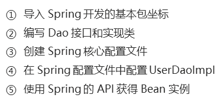

  * 导包

    ```xml
    <dependency>
      <groupId>org.springframework</groupId>
      <artifactId>spring-context</artifactId>
      <version>5.0.5.RELEASE</version>
    </dependency>
    ```

  * 配置文件

    ```xml
    <bean id="userDao" class="com.mine.dao.impl.UserDaoImpl"></bean>
    ```

  * 使用

    ```java
    public static void main(String[] args) {
        ApplicationContext app = new ClassPathXmlApplicationContext("applicationContext.xml");
        UserDao userDao = (UserDao) app.getBean("userDao");
        userDao.save();
    }
    ```

* `scope` 标签

  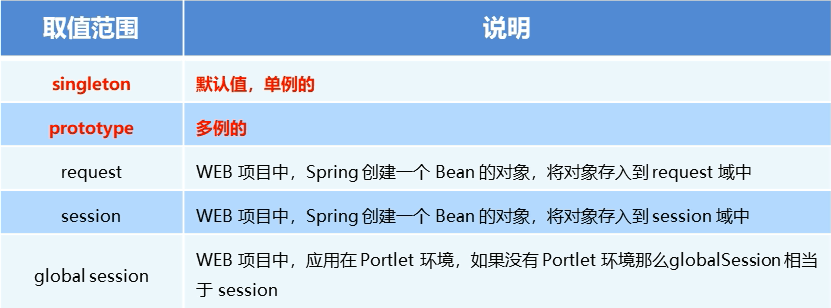

* Bean 声明周期

  * `init-method` 指定类中的初始化方法名称

  * `destroy-method` 指定类中销毁方法名称

  * 配置

    ```xml
    <bean id="userDao" class="com.mine.dao.impl.UserDaoImpl" init-method="init" destroy-method="destroy"></bean>
    ```

  * Dao的实现类中放入方法

    ```java
    public void init(){
        System.out.println("初始化方法.......");
    }
    
    public void destroy(){
        System.out.println("销毁方法.......");
    }
    ```

* 依赖注入
  * 普通数据类型
  * 引用数据类型
  * 集合数据类型

### 数据源配置

* 常见的数据源：**DBCP**， **C3P0**， **BoneCP**， **Druid**

  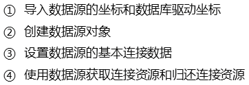

* Sping 容器产生数据源

  ```java
  @Test
  //Spring容器产生对象数据
  public void test4() throws Exception {
      ApplicationContext app = new ClassPathXmlApplicationContext("applicationContext.xml");
      DataSource dataSource = app.getBean(DataSource.class);
      Connection connection = dataSource.getConnection();
      System.out.println(connection);
  }
  ```

* `xml` 加载配置文件

  

```xml
xmlns:context="http://www.springframework.org/schema/context"
       xsi:schemaLocation=
               "http://www.springframework.org/schema/beans http://www.springframework.org/schema/beans/spring-beans.xsd
               http://www.springframework.org/schema/context http://www.springframework.org/schema/context/spring-context.xsd">
<!--加载外部jdbc.properties文件-->
    <context:property-placeholder location="classpath:jdbc.properties"/>
```

```xml
<bean id="dataSource" class="com.mchange.v2.c3p0.ComboPooledDataSource">
    <property name="driverClass" value="${jdbc.driver}"></property>
    <property name="jdbcUrl" value="${jdbc.url}"></property>
    <property name="user" value="${jdbc.username}"></property>
    <property name="password" value="${jdbc.password}"></property>
</bean>
```

```java
@Test
//Spring容器产生对象数据
public void test4() throws Exception {
    ApplicationContext app = new ClassPathXmlApplicationContext("applicationContext.xml");
    DataSource dataSource = app.getBean(DataSource.class);
    Connection connection = dataSource.getConnection();
    System.out.println(connection);
}
```

### 注解开发

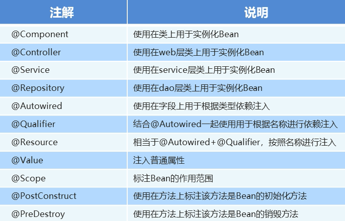

* 配置扫描

  ```xml
  <!--配置扫描-->
  <context:component-scan base-package="com.mine"/>
  ```

  ```java
  @Component("userService")
  public class UserServiceImpl implements UserService {
      @Autowired
      @Qualifier("userDao")
      private UserDao userDao;
      public void setUserDao(UserDao userDao){
          this.userDao = userDao;
      }
      @Override
      public void save() {
          //ApplicationContext app = new ClassPathXmlApplicationContext("applicationContext.xml");
          //UserDao userDao = (UserDao) app.getBean("userDao");
          userDao.save();
      }
  }
  ```

#### Spring 新注解

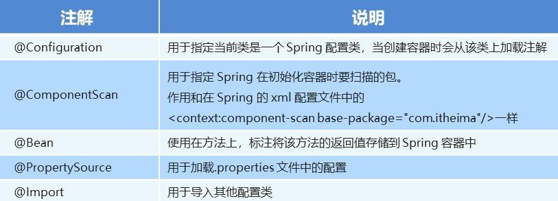

### Spring 集成Junit

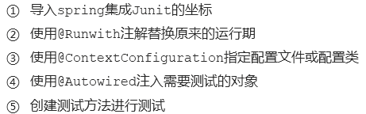

```java
@RunWith(SpringJUnit4ClassRunner.class)
//@ContextConfiguration("classpath:applicationContext.xml")
@ContextConfiguration(classes = {SpringConfiguration.class})
public class SpringJunitTest {

    @Autowired
    private UserService userService;

    @Autowired
    private DataSource dataSource;


    @Test
    public void test1() throws SQLException {
        userService.save();
        System.out.println(dataSource.getConnection());
    }

}
```

### 集成web环境

* `web.xml`配置

```xml
<web-app>
  <servlet>
    <servlet-name>UserServlet</servlet-name>
    <servlet-class>com.mine.web.UserServlet</servlet-class>
  </servlet>
  <servlet-mapping>
    <servlet-name>UserServlet</servlet-name>
    <url-pattern>/userServlet</url-pattern>
  </servlet-mapping>
</web-app>
```

* listener

  ```xml
  <!--全局初始化参数-->
    <context-param>
      <param-name>contextConfigLocation</param-name>
      <param-value>applicationContext.xml</param-value>
    </context-param>
  
  <!--配置监听器-->
  <listener>
    <listener-class>com.mine.listener.ContextLoaderListener</listener-class>
  </listener>
  ```

  ```java
  public class ContextLoaderListener implements ServletContextListener {
      @Override
      public void contextInitialized(ServletContextEvent servletContextEvent) {
  
          ServletContext servletContext = servletContextEvent.getServletContext();
  
          //读取web.xml中的全局参数
          String contextConfigLocation = servletContext.getInitParameter("contextConfigLocation");
  
          //ApplicationContext app = new ClassPathXmlApplicationContext("applicationContext.xml");
          ApplicationContext app = new ClassPathXmlApplicationContext(contextConfigLocation);
          //将Spring的应用上下文存储到ServletContext域中
          servletContext.setAttribute("app", app);
          System.out.println("容器创建完毕.......");
      } 
  }
  
  public class WebApplicationContextUtils {
      public static ApplicationContext getWebApplicationContext(ServletContext servletContext){
          return (ApplicationContext) servletContext.getAttribute("app");
      }
  }
  ```

  * Spring集成Web环境

  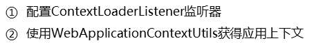

## Spring MVC

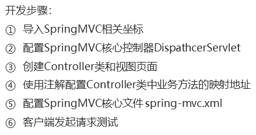

### MVC项目初始化

* web.xml设置及`${pagecontext.request.contextpath}`无法解析问题

  ```xml
  <?xml version="1.0" encoding="UTF-8"?>
  <web-app xmlns="http://xmlns.jcp.org/xml/ns/javaee"
           xmlns:xsi="http://www.w3.org/2001/XMLSchema-instance"
           xsi:schemaLocation="http://xmlns.jcp.org/xml/ns/javaee http://xmlns.jcp.org/xml/ns/javaee/web-app_4_0.xsd"
           version="4.0">
      <!--以上配置解决无法解析问题-->
      
      
          <!--SpringMVC 前端控制器-->
      <servlet>
          <servlet-name>dispatcherServlet</servlet-name>
          <servlet-class>org.springframework.web.servlet.DispatcherServlet</servlet-class>
          <init-param>
              <param-name>contextConfigLocation</param-name>
              <param-value>classpath:spring-mvc.xml</param-value>
          </init-param>
          <load-on-startup>1</load-on-startup>
      </servlet>
      <servlet-mapping>
          <servlet-name>dispatcherServlet</servlet-name>
          <url-pattern>/</url-pattern>
      </servlet-mapping>
  
  
  </web-app>
      
      
      
      
  ```

* spring-mvc.xml设置

  ```xml
  <?xml version="1.0" encoding="UTF-8"?>
  <beans xmlns="http://www.springframework.org/schema/beans"
         xmlns:xsi="http://www.w3.org/2001/XMLSchema-instance"
         xmlns:mvc="http://www.springframework.org/schema/mvc"
         xmlns:context="http://www.springframework.org/schema/context"
         xsi:schemaLocation="
         http://www.springframework.org/schema/beans http://www.springframework.org/schema/beans/spring-beans.xsd
         http://www.springframework.org/schema/mvc http://www.springframework.org/schema/mvc/spring-mvc.xsd
         http://www.springframework.org/schema/context http://www.springframework.org/schema/context/spring-context.xsd
  ">
  
      <mvc:annotation-driven/>
  
      <!--配置视图解析器-->
      <bean class="org.springframework.web.servlet.view.InternalResourceViewResolver">
          <property name="prefix" value="/"/>
          <property name="suffix" value=".jsp"/>
      </bean>
  
      <!--静态资源权限开放-->
      <mvc:default-servlet-handler/>
  
      <!--组件扫描-->
      <context:component-scan base-package="com.mine.controller"/>
  
      <!--配置拦截器-->
      <!--<mvc:interceptors>
          <mvc:interceptor>
              <mvc:mapping path="/**"/>
              <bean class="com.mine.interceptor.MyInterceptor"/>
          </mvc:interceptor>
          <mvc:interceptor>
              <mvc:mapping path="/**"/>
              <bean class="com.mine.interceptor.MyInterceptor"/>
          </mvc:interceptor>
      </mvc:interceptors>-->
  
  </beans>
  ```

* `.js`中El语句显示问题

  ```jsp
  <%@ page contentType="text/html;charset=UTF-8" language="java" isELIgnored="false" %>
  
  <html>
  <body>
  <h2>Hello World! ${name}</h2>
  </body>
  </html>
  ```


* 页面跳转

  * 直接返回字符串
  * 通过ModelAndVIew对象返回

  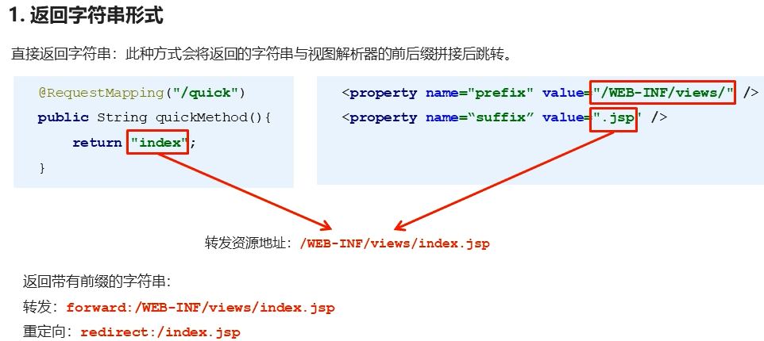

* 回写数据

  * 直接返回字符串
  * 返回对象或集合

* 获得请求参数
  * 基本类型参数
    * Controller中的业务方法的参数名称要与请求参数的name一致， 参数值会自动映射匹配。
  * POJO类型参数
  * 数组类型参数
  * 集合类型参数

* 文件上传

  ```xml
  <dependency>
    <groupId>commons-fileupload</groupId>
    <artifactId>commons-fileupload</artifactId>
    <version>1.3.1</version>
  </dependency>
  <dependency>
    <groupId>commons-io</groupId>
    <artifactId>commons-io</artifactId>
    <version>2.4</version>
  </dependency>
  ```

  ```java
  @RequestMapping(value = "/quick22")
  @ResponseBody//告知mvc框架不进行视图跳转
  public void save22(String username, MultipartFile uploadFile) throws IOException {
      System.out.println(username);
      String originalFilename = uploadFile.getOriginalFilename();
      System.out.println(uploadFile);
      uploadFile.transferTo(new File("D:\\00_Big_Data_learn\\01HeiMa\\3_DevFrame\\Code\\upload\\"+ originalFilename));
  }
  ```

* POST请求中文乱码问题

  * 在web.xml中增加一下参数

  ```xml
  <!--解决中文乱码问题的过滤器-->
  <filter>
      <filter-name>CharacterEncodingFilter</filter-name>
      <filter-class>org.springframework.web.filter.CharacterEncodingFilter</filter-class>
      <init-param>
          <param-name>encoding</param-name>
          <param-value>UTF-8</param-value>
      </init-param>
  </filter>
  <filter-mapping>
      <filter-name>CharacterEncodingFilter</filter-name>
      <url-pattern>/*</url-pattern>
  </filter-mapping>
  ```


### JDBCTemplate

* 开发步骤

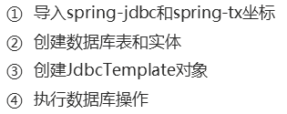

* xml配置

  ```xml
  <context:property-placeholder location="classpath:jdbc.properties"/>
  
  <bean id="dataSource" class="com.mchange.v2.c3p0.ComboPooledDataSource">
      <property name="driverClass" value="${jdbc.driver}"/>
      <property name="jdbcUrl" value="${jdbc.url}"/>
      <property name="user" value="${jdbc.username}"/>
      <property name="password" value="${jdbc.password}"/>
  </bean>
  
  <bean id="jdbcTemplate" class="org.springframework.jdbc.core.JdbcTemplate">
      <property name="dataSource" ref="dataSource"/>
  </bean>
  ```

  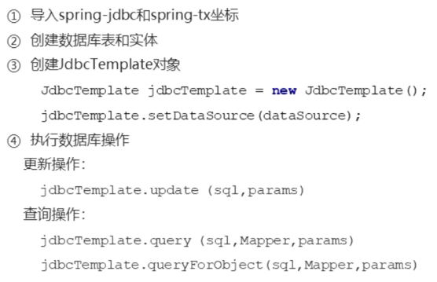

### 拦截器

* 自定义拦截器

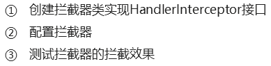

* 拦截器方法说明

  

* 拦截器spring-mvc配置

  ```xml
  <!--配置拦截器-->
  <mvc:interceptors>
      <mvc:interceptor>
          <mvc:mapping path="/**"/>
          <bean class="com.mine.interceptor.MyInterceptor"/>
      </mvc:interceptor>
      <mvc:interceptor>
          <mvc:mapping path="/**"/>
          <mvc:exclude-mapping path="/user/login"/>
          <bean class="com.mine.interceptor.MyInterceptor2"/>
      </mvc:interceptor>
  </mvc:interceptors>
  ```

### Spring MVC异常处理

* 简单异常处理器 SimpleMappingExceptionResolver

  ```xml
  <!--<bean class="org.springframework.web.servlet.handler.SimpleMappingExceptionResolver">
      <property name="defaultErrorView" value="error"/>
  </bean>-->
  
  <bean class="org.springframework.web.servlet.handler.SimpleMappingExceptionResolver">
      <property name="exceptionMappings">
          <map>
              <entry key="java.lang.ClassCastException" value="error"/><!--跳转到error.jsp页面-->
          </map>
      </property>
  </bean>
  ```

* 实现Spring的异常处理接口 HandlerExceptionResolver

  ```java
  public class MyExceptionResolver implements HandlerExceptionResolver {
      /**
       * 参数Exception异常对象
       * @param httpServletRequest
       * @param httpServletResponse
       * @param o
       * @param e
       * @return
       */
      @Override
      public ModelAndView resolveException(HttpServletRequest httpServletRequest, HttpServletResponse httpServletResponse, Object o, Exception e) {
          ModelAndView modelAndView = new ModelAndView();
          if (e instanceof MyException){
              modelAndView.addObject("info", "自定义异常");
          }else if (e instanceof ClassCastException){
              modelAndView.addObject("info", "类型转换异常");
          }
          modelAndView.setViewName("error");
          return modelAndView;
      }
  }
  ```

  * SpringMVC配置

    ```xml
    <!--自定义异常处理-->
    <bean class="com.mine.resolver.MyExceptionResolver"/>
    ```

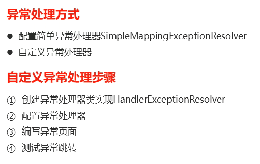

## AOP 

* (Aspect Oriented Programming  面向切面编程)
* 程序运行期间，在不修改源码的情况下对方法进行功能增强

* cglib的动态代理
* AOP的相关术语
  * Target （目标对象）：代理的目标对象
  * Proxy（代理）：一个类被AOP织入增强后，就产生一个代理类
  * Joinpoint（连接点）：所谓连接点是指那些被拦截到的点。在spring中，这些点指的是方法，因为spring只支持方法类型的连接点
  * Pointcut（切入点）：所谓切入点是指我们要对哪些Joinpoint进行拦截的定义
  * Advice（通知/增强）：所谓通知是指拦截到Jointpoint之后所要做的事情就是通知
  * Aspect（切面）：是切入点和通知（引介）的结合
  * Weaving（织入）：是指把增强应用到目标对象来创建新的代理

* AOP 开发

  * 依赖

    ```xml
    <dependency>
      <groupId>junit</groupId>
      <artifactId>junit</artifactId>
      <version>4.12</version>
      <scope>test</scope>
    </dependency>
    
    <dependency>
      <groupId>org.springframework</groupId>
      <artifactId>spring-context</artifactId>
      <version>5.0.5.RELEASE</version>
    </dependency>
    
    <dependency>
      <groupId>org.aspectj</groupId>
      <artifactId>aspectjweaver</artifactId>
      <version>1.8.3</version>
    </dependency>
    
    <dependency>
      <groupId>org.springframework</groupId>
      <artifactId>spring-test</artifactId>
      <version>5.0.5.RELEASE</version>
    </dependency>
    ```

  * applicationContext.xml配置

    ```xml
    <?xml version="1.0" encoding="UTF-8"?>
    <beans xmlns="http://www.springframework.org/schema/beans"
           xmlns:xsi="http://www.w3.org/2001/XMLSchema-instance"
           xmlns:context="http://www.springframework.org/schema/context"
           xmlns:aop="http://www.springframework.org/schema/aop"
           xsi:schemaLocation="http://www.springframework.org/schema/beans http://www.springframework.org/schema/beans/spring-beans.xsd
           http://www.springframework.org/schema/context http://www.springframework.org/schema/context/spring-context.xsd
           http://www.springframework.org/schema/aop http://www.springframework.org/schema/aop/spring-aop.xsd">
    
        <!--目标对象-->
        <bean id="target" class="com.mine.aop.Target"></bean>
        <!--切面-->
        <bean id="myAspect" class="com.mine.aop.MyAspect"></bean>
        <!--配置织入:告诉Spring框架 哪些方法(切点) 需要进行哪些增强(前置\后置)-->
        <aop:config>
            <aop:aspect ref="myAspect">
                <!--切面:切点+通知-->
                <aop:before method="before" pointcut="execution(public void com.mine.aop.Target.save())"/>
            </aop:aspect>
        </aop:config>
    </beans>
    ```

  * 切点表达式的抽取

    ```xml
    <aop:config>
        <aop:aspect ref="myAspect">
            <!--抽取切点表达式-->
            <aop:pointcut id="myPointcut" expression="execution(public void com.mine.aop.*.*(..))"/>
            <aop:around method="around" pointcut-ref="myPointcut"/>
        </aop:aspect>
    </aop:config>
    ```

  * 切点表达式的写法

    

* 通知的类型

  * 通知的匹配语法

    

### 基于注解的AOP开发

* 基于注解的AOP开发步骤

  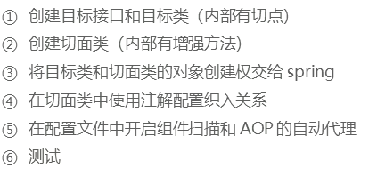

* 开启组件扫描和AOP自动代理

  ```xml
  <?xml version="1.0" encoding="UTF-8"?>
  <beans xmlns="http://www.springframework.org/schema/beans"
         xmlns:xsi="http://www.w3.org/2001/XMLSchema-instance"
         xmlns:context="http://www.springframework.org/schema/context"
         xmlns:aop="http://www.springframework.org/schema/aop"
         xsi:schemaLocation="http://www.springframework.org/schema/beans http://www.springframework.org/schema/beans/spring-beans.xsd
         http://www.springframework.org/schema/context http://www.springframework.org/schema/context/spring-context.xsd
         http://www.springframework.org/schema/aop http://www.springframework.org/schema/aop/spring-aop.xsd">
  
      <context:component-scan base-package="com.mine.anno"/>
  
      <!--aop自动代理-->
      <aop:aspectj-autoproxy/>
      
  </beans>
  ```

* 注解通知的类型

  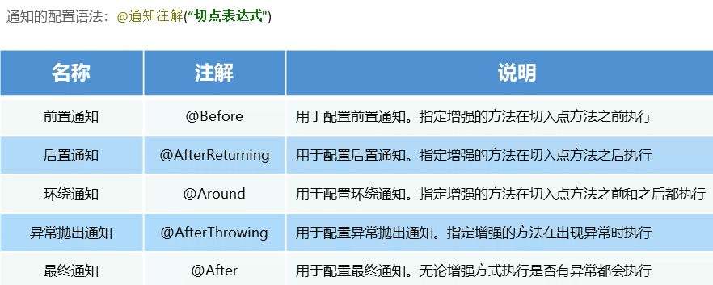

### 编程事务控制相关对象

* PlatformTransactionManager接口是spring的事务管理器

  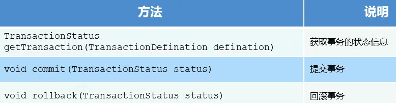

* TransactionDefinition事务的定义信息对象

  

  * 设置隔离级别解决事务并发产生的问题
    * ISOLATION_DEFAULT
    * ISOLATION_READ_UNCOMMITTED
    * ISOLATION_READ_COMMITTED
    * ISOLATION_READ_REPEATABLE_READ
    * ISOLATION_SERIALIZABLE
  * 事务传播行为

  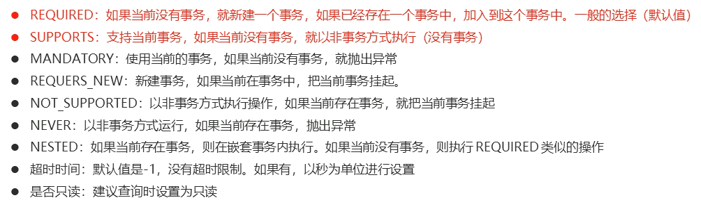

* TransactionStatus

  * 提供的是事务具体的运行状态

    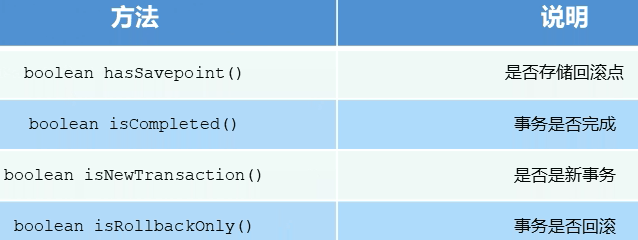


### 基于XML的声明式事务控制

* applicationContext.xml配置

  ```xml
  <!--目标对象  内部方法就是切点-->
  <bean id="accountService" class="com.itheima.service.impl.AccountServiceImpl">
      <property name="accountDao" ref="accountDao"/>
  </bean>
  
  <!--配置平台事务管理器-->
  <bean id="transactionManager" class="org.springframework.jdbc.datasource.DataSourceTransactionManager">
      <property name="dataSource" ref="dataSource"/>
  </bean>
  
  <!--通知  事务的增强-->
  <tx:advice id="txAdvice" transaction-manager="transactionManager">
      <!--设置事务的属性信息-->
      <tx:attributes>
          <tx:method name="transfer" isolation="REPEATABLE_READ" propagation="REQUIRED" read-only="false"/>
          <tx:method name="findAll" isolation="REPEATABLE_READ" propagation="REQUIRED" read-only="true"/>
          <tx:method name="update*" isolation="REPEATABLE_READ" propagation="REQUIRED" read-only="true"/>
          <tx:method name="*"/>
      </tx:attributes>
  </tx:advice>
  
  <!--配置事务的aop织入-->
  <aop:config>
      <aop:advisor advice-ref="txAdvice" pointcut="execution(* com.itheima.service.impl.*.*(..))"></aop:advisor>
  </aop:config>
  ```

* 配置参数说明

  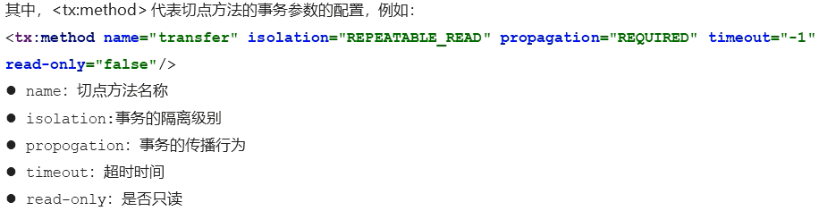

### 基于注解的声明式事务配置

* 使用注解注意事项   applicationContext.xml配置必须加以下配置

  ```xml
  <!--事务的注解驱动-->
  <tx:annotation-driven transaction-manager="transactionManager"/>
  ```


## SpringBoot

* 入门

* 初始化路径
  * https://start.spring.io
  * https://start.aliyun.com

* 简化Spring应用的初始搭建以及开发过程

* pom.xml配置

  ```xml
  <?xml version="1.0" encoding="UTF-8"?>
  <project xmlns="http://maven.apache.org/POM/4.0.0" xmlns:xsi="http://www.w3.org/2001/XMLSchema-instance"
           xsi:schemaLocation="http://maven.apache.org/POM/4.0.0 https://maven.apache.org/xsd/maven-4.0.0.xsd">
      <modelVersion>4.0.0</modelVersion>
      
      <parent>
          <groupId>org.springframework.boot</groupId>
          <artifactId>spring-boot-starter-parent</artifactId>
          <version>2.6.6</version>
          <relativePath/> <!-- lookup parent from repository -->
      </parent>
      
      <groupId>com.mine</groupId>
      <artifactId>springboot_01_01_quickstart</artifactId>
      <version>0.0.1-SNAPSHOT</version>
      <name>springboot_01_01_quickstart</name>
      <description>Demo project for Spring Boot</description>
      <properties>
          <java.version>1.8</java.version>
      </properties>
      <dependencies>
          <dependency>
              <groupId>org.springframework.boot</groupId>
              <artifactId>spring-boot-starter-web</artifactId>
          </dependency>
  
          <dependency>
              <groupId>org.springframework.boot</groupId>
              <artifactId>spring-boot-starter-test</artifactId>
              <scope>test</scope>
          </dependency>
      </dependencies>
  
      <build>
          <plugins>
              <plugin>
                  <groupId>org.springframework.boot</groupId>
                  <artifactId>spring-boot-maven-plugin</artifactId>
                  <version>${project.parent.version}</version>
              </plugin>
          </plugins>
      </build>
  
  </project>
  ```

* 引导类

  ```java
  import org.springframework.boot.SpringApplication;
  import org.springframework.boot.autoconfigure.SpringBootApplication;
  
  @SpringBootApplication
  public class Application {
      public static void main(String[] args) {
          SpringApplication.run(Application.class);
      }
  }
  ```

* controller

  ```java
  //Rest模式
  @RestController
  @RequestMapping("/books")
  public class BookController {
  
      @GetMapping
      public String getById(){
          System.out.println("springboot is running .....4");
          return "springBoot is running..4";
      }
  }
  ```

### YAML格式

* 数据前面要加空格与冒号隔开

```yaml
likes: 
  - game
  - music
  - sleep
    
likes2: [game, music, sleep]

users: 
  - name: zhangsan
    age: 28
    
  - name: lisi
    age: 29
    
users3: [{name:zhangsan, age: 28}, {name: lisi, age: 29}]

users4:
  -
    name: zhangsan
    age: 28

  -
    name: lisi
    age: 29
```

* 字面值表示方式

  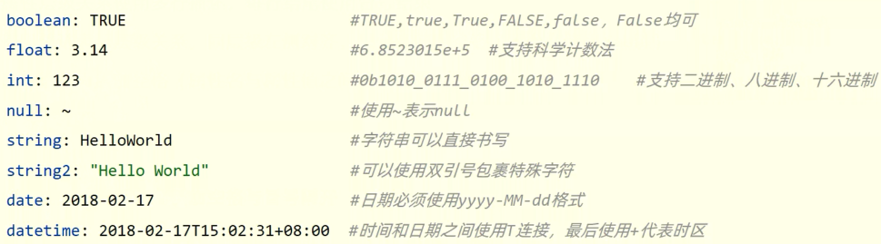

* yaml数据读取

  * 使用`@Value`读取单个数据, 属性名引用方式:`@{一级属性名.二级属性名}`

  * 重复字符串引用

    ```yaml
    baseDir: c:\win10
    
    #使用${属性名}引用数据
    tempDir: ${baseDir}\temp
    
    #使用引号包裹的字符串，其中的转义字符可以生效
    tempDir: "${baseDir}\temp"        #结果是c:\win10 emp
    ```

  * 使用自动装配将所有的数据封装到一个对象Environment中

    ```java
    @Autowired
    private Environment env;
    
    //使用
    System.out.println(env.getProperty("server.port"));
    ```

  * 封装局部数据

    * ```
      //定义数据模型封装Yaml文件中对应的数据
      //定义未spring管控的bean
      //指定加载的数据
      ```

### 整合MyBatis
 * 配置信息 
    ```yaml
    # 配置相关信息
    spring:
      datasource:
        driver-class-name: com.mysql.cj.jdbc.Driver
    # MySql必须指定时区
        url: jdbc:mysql://localhost:3306/test?serverTimeZone=UTC
        username: root
        password: 123456
    ```

* 基于Restful制作表现层接口

  * 新增: POST
  * 删除: DELETE
  * 修改: PUT
  * 查询: GET

* 接收参数

  * 实体数据: `@RequestBody`
  * 路径变量: `@PathVariable`

* 使用拦截器为Mybatis-plus开启分页功能(给sql语句增加limit)

  ```java
  @Configuration
  public class MPConfig {
      @Bean
      public MybatisPlusInterceptor mybatisPlusInterceptor(){
          MybatisPlusInterceptor interceptor = new MybatisPlusInterceptor();
        interceptor.addInnerInterceptor(new PaginationInnerInterceptor());
          return interceptor;
    }
  }
  ```
  
* 解决实体属性名与数据表列名不一致问题

  * 加注解

    ```java
    //@TableField(value = "phoneNum")
    private String phoneNum;
    ```

  * 加配置

    ```yaml
    mybatis-plus:
      global-config:
        db-config:
          table-prefix: tb_
          id-type: auto
        banner: off
      configuration:
        log-impl: org.apache.ibatis.logging.stdout.StdOutImpl
        #解决办法
        map-underscore-to-camel-case: true
    ```

* SSMP整合

  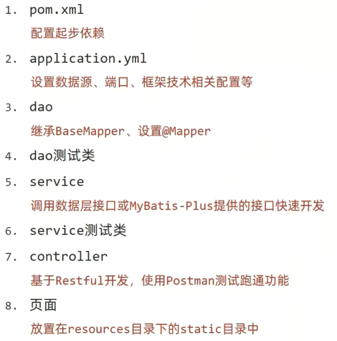

### 项目上线处理

#### Windows 端口被占问题

* 查询端口　  `netstat -ano`
* 查询指定端口  `netstat -ano |findstr "端口号"`
* 根据进程PID查询进程名称  `tasklist |findstr "进程PID号"`
* 根据PID杀死任务  `taskkill /F /PID "进程PID号"`
* 根据进程名称杀死任务　`taskkill -f -t -im "进程名称"`


* Windows上执行命令注册对应dll文件

  `regsvr32 xxxxx.dll`

#### Linux 上启动

* 后台启动

  `nohup java -jar springboot_08_ssmp-0.0.1-SNAPSHOT.jar > server.log 2>&1 &`

* 查看改进程

  `ps - ef | grep "java -jar"`

* 杀死进程

  `kill -9 进程号`

* 以临时自定义端口启动

  `java -jar springboot_08_ssmp-0.0.1-SNAPSHOT.jar --server.port=8080`

#### 配置文件

* 标红提醒

  ```xml
  <dependency>
      <groupId>org.springframework.boot</groupId>
      <artifactId>spring-boot-configuration-processor</artifactId>
  </dependency>
  ```

* 属性配置文件的加载优先顺序

  [Spring Boot Reference Documentation](https://docs.spring.io/spring-boot/docs/2.6.6/reference/htmlsingle/)

  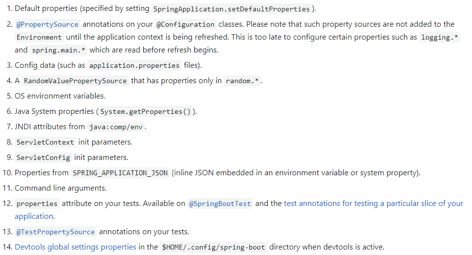

* 指定配置文件

  * 指定文件名

    `--spring.config.name=ebank`

  * 指定文件路径

    `--spring.config.location=classpath:/ebank.yml`

* 多环境开发配置文件

  ```yaml
  #应用环境
  #默认环境 可以加载公共配置
  spring:
    profiles:
      active: dev
      #包含以下两个配置
      #include: devMVC, devDB
      #根据组加载
      group:
        "dev": devMVC, devDB
        "pro": proMVC, proDB
  ---
  #设置环境
  #生产环境
  spring:
    config:
      activate:
        on-profile: pro
  server:
    port: 80
  
  ---
  #开发环境
  spring:
    config:
      activate:
        on-profile: dev
  server:
    port: 81
  
  ---
  #测试环境
  spring:
    config:
      activate:
        on-profile: test  
  server:
    port: 82
  
  ```

#### 日志处理

* 多环境开发控制pom.xml

  ```xml
  <profiles>
      <profile>
          <id>env_dev</id>
          <properties>
                  <profile.active>dev</profile.active>
          </properties>
          <activation>
              <activeByDefault>true</activeByDefault>
          </activation>
      </profile>
      <profile>
          <id>env_pro</id>
          <properties>
              <profile.active>pro</profile.active>
          </properties>
      </profile>
  </profiles>
  ```

  ```yaml
  spring:
    profiles:
      active: @profile.active@
      group:
        "dev": devMVC, devDB
        "pro": proMVC, proDB
  ```

  **注意：**基于SpringBoot读取Maven配置属性的前提下，如果在IDEA下测试工程师pom.xml每次更新需要点击compile手动编译

* 打印日志

  ```java
  private static final Logger LOGGER = LoggerFactory.getLogger(BrandController.class);
  LOGGER.debug();
  LOGGER.info();
  LOGGER.warn();
  LOGGER.error();
  ```

* application.yml设置

  ```yaml
  logging:
  #设置分啊u
    group: 
      ebank: com.mine.controller,com.mine.dao
      iservice: com.mine
  
    level:
      root: info
      #设置某个包的日志级别
      #com.mine.controller: debug
      #设置分组,对某个组设置日志级别
      ebank: warn
  ```

* 自定义日志类

  ```java
  import org.slf4j.Logger;
  import org.slf4j.LoggerFactory;
  
  
  public class BaseClass {
      private Class clazz;
      public static Logger log;
  
      public BaseClass(){
          clazz = this.getClass();
          log = LoggerFactory.getLogger(clazz);
      }
  }
  ```

* 通过注解
  * 导入  lombok
  * 添加注解   `@Slf4j`

* 日志输出格式控制

  * 设置日志输出格式

    ```yaml
    logging:
      pattern:
        #console: "%d - %m%n"
        console: "%d %clr(%5p) --- [%16t] %clr(%-40.40c){cyan} : %m %n"
    ```

  * %d: 日期

  * %m:  消息

  * %n:  换行

* 日志文件

  ```yaml
  logging:
    file:
      name: server.log
    logback:
      rollingpolicy:
        max-file-size: 10MB
        file-name-pattern: server.%d{yyyy-MM-dd}.%i.log
  ```

### 异常拦截

* 所有异常拦截  以指定格式输出

  ```java
  //spring MVC异常处理器
  //@ControllerAdvice
  @RestControllerAdvice
  public class ProjectExceptionAdvice {
  
      //拦截所有异常信息
      @ExceptionHandler
      public R doException(Exception ex){
          //记录日志
          ex.printStackTrace();
          return new R( "服务器故障,请稍后再试!");
      }
  
  }
  ```

### 热部署

* 添加依赖

  ```xml
  <dependency>
      <groupId>org.springframework.boot</groupId>
      <artifactId>spring-boot-devtools</artifactId>
  </dependency>
  ```

* 通过修改完通过Built构建项目

* 自定义不参与热部署目录范围

  ```yaml
  spring:
    devtools:
      restart:
        exclude: public/**, static/**
        #禁用热部署
        enabled: false
  ```

* 设置高优先级的禁用热部署
  ```java
  @SpringBootApplication
  public class SSMPApplication {
  
      public static void main(String[] args) {
          System.setProperty("spring.devtools.restart.exclude","false");
          SpringApplication.run(SSMPApplication.class, args);
          System.out.println("服务器已运行");
      }
  }
  ```

### 配置

#### `@ConfigurationProperties`

* 绑定前缀名命名规范: 仅能使用纯小写字母, 数字, 下划线作为合法的字符串

  ```java
  @Component
  @Data
  //加载配置文件中的对应内容
  @ConfigurationProperties(prefix = "servers")
  public class ServerConfig {
      private String ipAddress;
      private int port;
      private long timeout;
  }
  ```
* 配置信息
  ```yaml
  servers:
    ipAddress: 192.168.1.21
    port: 2345
    timeout: -1
  ```

**注意:** `@Value` 注解不支持松散绑定

* GDK8 提供新的常用计量单位

  ```java
  @DurationUnit(ChronoUnit.HOURS)
  private Duration serverTimeOut;
  @DataSizeUnit(DataUnit.MEGABYTES)
  private DataSize dataSize;
  ```

### 数据校验

* 引入依赖

  ```xml
  <!--导入JSR303规范-->
  <dependency>
      <groupId>javax.validation</groupId>
      <artifactId>validation-api</artifactId>
  </dependency>
  
  <!--使用hibernate框架提供的校验器做实现类-->
  <dependency>
      <groupId>org.hibernate.validator</groupId>
      <artifactId>hibernate-validator</artifactId>
  </dependency>
  ```

* 通过注解使用

  ```java
  @Validated
  public class ServerConfig {
      @Max(value = 8888, message = "最大值不能超过8888")
      @Max(value = 202, message = "最小值不能低于202")
      private int port;
  }
  ```

### 加载临时配置

* properties属性为测试类中加载临时属性配置

  ```java
  //@SpringBootTest(properties = {"test.prop=testValue1"})
  @SpringBootTest(args = {"--test.prop=testValue2"})
  public class PropertiesAndArgsTest {
  
      @Value("${test.prop}")
      private String msg;
  
      @Test
      void testProperties(){
          System.out.println(msg);
      }
  }
  ```

### Web环境测试

* Web环境测试

  ```java
  @SpringBootTest(webEnvironment = SpringBootTest.WebEnvironment.DEFINED_PORT)
  @AutoConfigureMockMvc
  public class WebTest {
      //测试响应
      @Test
      void testWeb(@Autowired MockMvc mvc) throws Exception {
          //创建虚拟请求
          RequestBuilder builder = MockMvcRequestBuilders.get("/books");
          ResultActions action = mvc.perform(builder);
  
          //设定预期值  与真实值进行比较  成功测试通过   失败测试失败
          //定义本次调用的预期值
          StatusResultMatchers status = MockMvcResultMatchers.status();
          //预计本次调用时成功的: 状态200
          ResultMatcher ok = status.isOk();
          //添加预计值到本次调用过程中进行匹配
          action.andExpect(ok);
      }
      //测试响应体
      @Test
      void testBody(@Autowired MockMvc mvc) throws Exception {
          //创建虚拟请求
          RequestBuilder builder = MockMvcRequestBuilders.get("/books");
          ResultActions action = mvc.perform(builder);
          
          StatusResultMatchers status = MockMvcResultMatchers.status();
          //预计本次调用时成功的: 状态200
          ResultMatcher ok = status.isOk();
          //添加预计值到本次调用过程中进行匹配
          action.andExpect(ok);
          
          //设定预期值  与真实值进行比较  成功测试通过   失败测试失败
          //定义本次调用的预期值
          HeaderResultMatchers header = MockMvcResultMatchers.header();
          //预计本次调用时成功的: 状态200
          ResultMatcher contentType = header.string("Content-Type", "application/json");
          //添加预计值到本次调用过程中进行匹配
          action.andExpect(contentType);
  
          ContentResultMatchers content = MockMvcResultMatchers.content();
          ResultMatcher result = content.json("{}");
          action.andExpect(result);
      }
  }
  ```

### 数据层事务回滚

* 为测试用例添加事务

  ```java
  @Transactional
  //如果需要提交事务
  @Rollback(false)
  public class DaoTest{
      
  }
  ```

* 测试用例随机值

  ```yaml
  testcase:
    book: 
      id: ${random.int}
      name: 书籍${random.int(5,10)}
      uuid: ${random.uuid}
  ```

### 内置数据源

* Springboot提供了3中内嵌的数据源对象

  * HikariCP    (默认使用)
  * Tomcat提供DataSource
  * Commons DBCP

  * 配置HikariCP案例

    ```yaml
    spring:
      datasource:
        url: jdbc:mysql://localhost:3306/mybatis?serverTimeZone=UTC
        hikari:
          driver-class-name: com.mysql.cj.jdbc.Driver
          username: root
          password: 123456
          maximum-pool-size: 50
    ```

  #### JDBCTemplate

  * 导入依赖

    ```xml
    <dependency>
        <groupId>org.springframework.boot</groupId>
        <artifactId>spring-boot-starter-jdbc</artifactId>
    </dependency>
    ```

  * 内置持久化解决方案-JdbcTemplate

    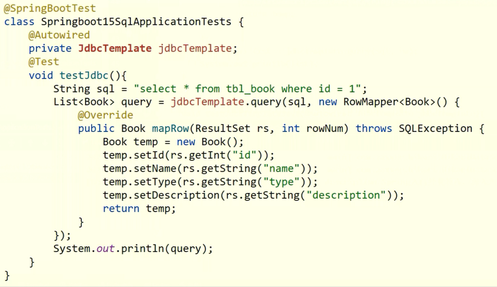

    * 使用

      ```java
      public User findByUsernameAndPassword(String username, String password) throws EmptyResultDataAccessException {
          User user = jdbcTemplate.queryForObject("select * from sys_user where username = ? and password = ?", new BeanPropertyRowMapper<User>(User.class), username, password);
          return user;
      }
      ```


### 内嵌数据库

#### H2

* 依赖

  ```xml
  <dependency>
      <groupId>com.h2database</groupId>
      <artifactId>h2</artifactId>
  </dependency>
  <dependency>
      <groupId>org.springframework.boot</groupId>
      <artifactId>spring-boot-starter-data-jpa</artifactId>
  </dependency>
  ```

* 配置

  ```yaml
  server:
    port: 80
  spring:
    h2:
      console:
        enabled: true
        path: /h2
    datasource:
      url: jdbc:h2:~/test
      hikari:
        driver-class-name: org.h2.Driver
        username: sa
        password: 123456
  ```

#### HSQL

#### Derby

### 非关系型数据库

#### redis

* 导入依赖坐标

  ```xml
  <dependency>
      <groupId>org.springframework.boot</groupId>
      <artifactId>spring-boot-starter-data-redis</artifactId>
  </dependency>
  <!--如果使用Jedis导入依赖-->
  <dependency>
      <groupId>redis.clients</groupId>
      <artifactId>jedis</artifactId>
  </dependency>
  ```

* 配置

  ```yaml
  spring:
    redis:
      host: localhost
      port: 6379
      #默认使用lettuce
      client-type: jedis
  # jedis存在线程安全性问题
  # lettuce线程安全
  ```

* 使用

  ```java
  //以对象形式操作
  //@Autowired
  //private RedisTemplate redisTemplate;
  //以字符串形式操作
  @Autowired
  private StringRedisTemplate stringRedisTemplate;
  
  @Test
  void set(){
      ValueOperations ops = redisTemplate.opsForValue();
      ops.set("age", 41);
  }
  
  @Test
  void get(){
      ValueOperations ops = redisTemplate.opsForValue();
      Object age = ops.get("age");
      System.out.println(age);
  }
  ```

### MongoDB

* 开源、高性能、无模式的文档型数据库
* 初始化
  * 指定数据存储目录  服务端启动`mongod --dbpath=..\data\db`
  * 客户端启动  `mongo --host=127.0.0.1 --port=27017`

* 基本操作

  

* 导入依赖坐标

  ```xml
  <dependency>
      <groupId>org.springframework.boot</groupId>
      <artifactId>spring-boot-starter-data-mongodb</artifactId>
  </dependency>
  ```

* 配置

  ```yaml
  spring:
    data:
      mongodb:
        uri: mongodb://localhost/minetest
  ```

* 使用

  ```java
  @Autowired
  private MongoTemplate mongoTemplate;
  
  @Test
  void contextLoads() {
  
      Book book = new Book();
      book.setId(2);
      book.setName("Java");
      book.setType("springboot");
      book.setDescription("Java Springboot");
  
      mongoTemplate.save(book);
  }
  
  @Test
  void find(){
      List<Book> all = mongoTemplate.findAll(Book.class);
      System.out.println(all);
  }
  ```

### Elasticsearch (ES)

* 分布式全文搜索引擎

* 倒排索引

* 创建文档

  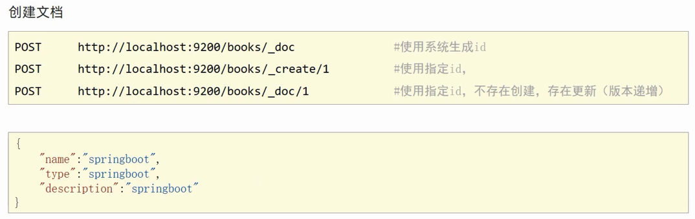

* 查询及删除文档

  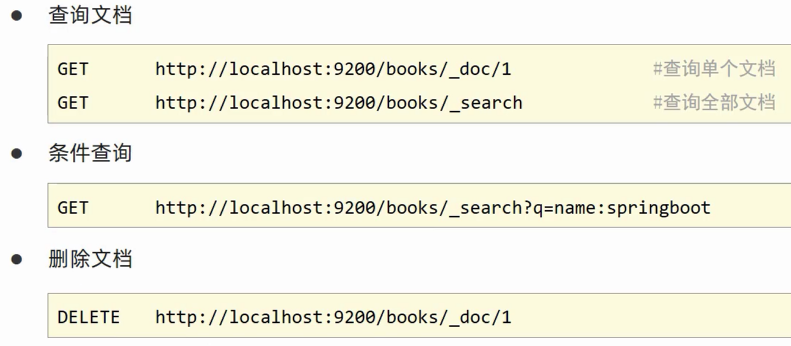

* 修改文档

  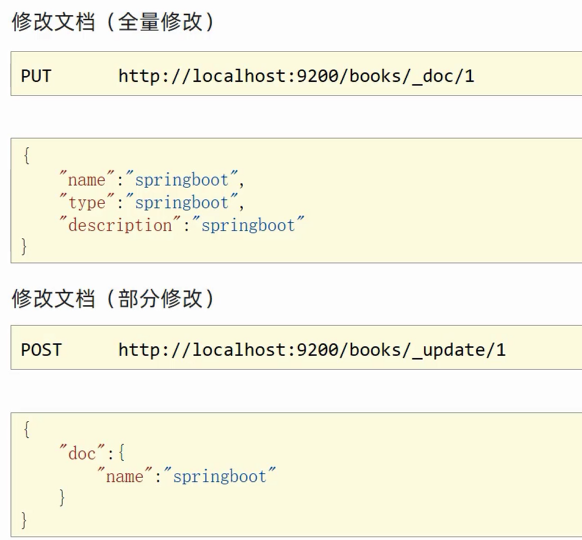

* iK分词器

  * [ik分词器下载](https://github.com/medcl/elasticsearch-analysis-ik/releases)

  * ik_smart: 智能切分，粗粒度

  * ik_max_word: 最细切分， 细粒度

  * mapping属性

    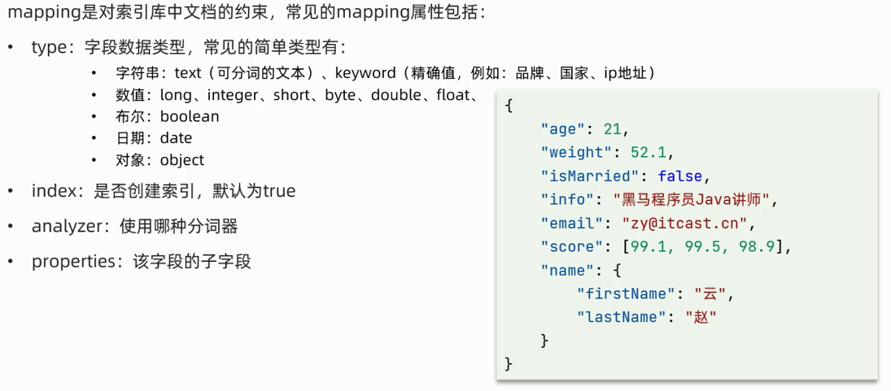

### 整合第三方技术

#### 缓存

* 引入依赖坐标

  ```xml
  <!--cache-->
  <dependency>
      <groupId>org.springframework.boot</groupId>
      <artifactId>spring-boot-starter-cache</artifactId>
  </dependency>
  ```

* 启动类上添加缓存注解

  ```java
  //开启缓存功能
  @EnableCaching
  public class Springboot16NosqlApplication {
      public static void main(String[] args) {
          SpringApplication.run(Springboot16NosqlApplication.class, args);
      }
  }
  ```

* 设置当前操作的结果数据进入缓存

  ```java
  @GetMapping("{id}")
  @Cacheable(value = "cacheSpace", key="#id")
  public Brand getById(@PathVariable Integer id){
      return brandService.getById(id);
  }
  ```

#### Ehcache

* 导入依赖坐标

  ```xml
  <dependency>
      <groupId>net.sf.ehcache</groupId>
      <artifactId>ehcache</artifactId>
  </dependency>
  ```

* 配置

  ```xml
  <?xml version="1.0" encoding="UTF-8"?>
  
  <ehcache xmlns:xsi="http://www.w3.org/2001/XMLSchema-instance"
           xsi:noNamespaceSchemaLocation="http://ehcache.org/ehcache.xsd"
           updateCheck="false">
      <diskStore path="D:\00_Big_Data_learn\01HeiMa\3_DevFrame\Code\Springboot\encache"/>
      <defaultCache
              maxEntriesLocalHeap="1000"
              eternal="false"
              diskPersistent="false"
              overflowToDisk="false"
              timeToIdleSeconds="60"
              timeToLiveSeconds="60"
              memoryStoreEvictionPolicy="LRU">
      </defaultCache>
  
      <cache
              name="smsCode"
              maxEntriesLocalHeap="1000"
              eternal="false"
              diskPersistent="false"
              overflowToDisk="false"
              timeToIdleSeconds="60"
              timeToLiveSeconds="60"
              memoryStoreEvictionPolicy="LRU"/>
  </ehcache>
  ```

* 使用

  ```yaml
  server:
    port: 80
  spring:
    h2:
      console:
        enabled: true
        path: /h2
    datasource:
      url: jdbc:h2:~/test
      hikari:
        driver-class-name: org.h2.Driver
        username: sa
        password: 123456
    cache:
      type: ehcache
      encache:
        config: encache.xml
  ```

#### Redis

* 导入依赖坐标

  ```xml
  <dependency>
      <groupId>org.springframework.boot</groupId>
      <artifactId>spring-boot-starter-data-redis</artifactId>
  </dependency>
  <!--cache-->
  <dependency>
      <groupId>org.springframework.boot</groupId>
      <artifactId>spring-boot-starter-cache</artifactId>
  </dependency>
  ```

* 配置

  ```yaml
  server:
    port: 80
  spring:
    h2:
      console:
        enabled: true
        path: /h2
    datasource:
      url: jdbc:h2:~/test
      hikari:
        driver-class-name: org.h2.Driver
        username: sa
        password: 123456
    cache:
      type: redis
      redis:
        time-to-live: 10s
        use-key-prefix: false
        key-prefix: sms_
        cache-null-values: false
    redis:
      host: localhost
      port: 6379
  ```

* 使用

  ```java
  //开启缓存功能
  @EnableCaching
  public class Springboot17NosqlApplication {
  
      public static void main(String[] args) {
          SpringApplication.run(Springboot17NosqlApplication.class, args);
      }
  
  }
  
  //从缓存中取数据
  @Cacheable(value = "smsCode", key = "#tele")
      public String get(String tele){
          return null;
      }
  ```

#### Xmemcached

* 导入依赖坐标

  ```xml
  <dependency>
      <groupId>com.googlecode.xmemcached</groupId>
      <artifactId>xmemcached</artifactId>
      <version>2.4.6</version>
  </dependency>
  ```
* 使用

  ```java
  @Configuration
  public class XMemcachedConfig {
      public MemcachedClient getMemcachedClient() throws IOException {
          MemcachedClientBuilder memcachedClientBuilder = new XMemcachedClientBuilder("localhost:11211");
          MemcachedClient memcachedClient = memcachedClientBuilder.build();
          return memcachedClient;
      }
  }
  ```

* 通过set 和 get存值和取值

#### jetCache远程缓存方案

* 导入依赖坐标

  ```xml
  <dependency>
      <groupId>com.alicp.jetcache</groupId>
      <artifactId>jetcache-starter-redis</artifactId>
      <version>2.6.0</version>
  </dependency>
  ```

* 配置pom.xml

  ```yaml
  jetcache:
  ## 统计缓存命中数据
    statIntervalMinutes: 1
    local:
      default:
        type: linkedhashmap
        keyConvertor: fastjson
    remote:
      default:
        type: redis
        host: localhost
        port: 6379
        keyConvertor: fastjson
        #Java对象要实现Serializable接口
        #例如： public class Book implements Serializable{  }
        valueEncode: java
        valueDecode: java
        poolConfig:
          maxTotal: 50
      sms:
        type: redis
          host: localhost
          port: 6379
          poolConfig:
            maxTotal: 50
  ```

* 使用

  ```java
  //jetcache启用缓存的主开关
  @EnableCreateCacheAnnotation
  @EnableMethodCache(basePackages = "com.mine")
  public class Springboot18Application {
      public static void main(String[] args) {
          SpringApplication.run(Springboot18Application.class, args);
      }
  }
  
  
  @CreateCache(area = "sms", name = "jetCache_", expire = 3600, timeUnit = TimeUnit.SECONDS, cacheType = CacheType.LOCAL)
  private Cache<String, String> jetCache;
  
  public String sendCodeToSMS1(String tele){
      String code = codeUtils.generator(tele);
      jetCache.put(tele, code);
      return code;
  }
  
  
  //方法上添加缓存注解
  @Cache(name="brand", key="#id", expire=3600)
  //执行更新操作对缓存更新
  @CacheUpdate(name="brand_", key="#book.id", value="#book")
  //执行删除操作删除Cache
  @CacheInvalidate(name="brand_", key="#id")
  //缓存自动刷新 10s
  @CacheRefresh(refresh = 10)
  ```

#### J2Cache

* 配置多级缓存

* 导入依赖坐标

  ```xml
  <dependency>
      <groupId>net.oschina.j2cache</groupId>
      <artifactId>j2cache-core</artifactId>
      <version>2.8.2-release</version>
  </dependency>
  
  <dependency>
      <groupId>net.oschina.j2cache</groupId>
      <artifactId>j2cache-spring-boot2-starter</artifactId>
      <version>2.8.0-release</version>
  </dependency>
  ```

* 配置

  ```properties
  # 1级缓存
  j2cache.L1.provider_class = ehcache
  ehcache.configXml = ehcache.xml
  
  # 2级缓存
  j2cache.L2.provider_class = net.oschina.j2cache.cache.support.redis.SpringRedisProvider
  j2cache.L2.config_section = redis 
  redis.hosts = localhost:6379
  
  j2cache.broadcast = net.oschina.j2cache.cache.support.redis.SpringRedisPubSubPolicy
  
  redis.mode = single
  redis.namespace = j2cache
  ```

* 使用

  ```java
  @Autowired
  private CacheChannel cacheChannel;
  
  public String sendCodeToSMS2(String tele){
      String code = codeUtils.generator(tele);
      cacheChannel.set("sms", tele, code);
      return code;
  }
  ```

### 定时任务
 * timer定时任务

    ```java
    public static void main(String[] args) {
        Timer timer = new Timer();
        TimerTask task = new TimerTask() {
            @Override
            public void run() {
                System.out.println("time task run........");
            }
        };
        timer.schedule(task, 0, 2000);
    }
    ```

* Quartz

  * 导入依赖坐标

    ```xml
    <dependency>
        <groupId>org.springframework.boot</groupId>
        <artifactId>spring-boot-starter-quartz</artifactId>
    </dependency>
    ```

  * 配置类（定义工作明细与触发器，并绑定对应关系）

    ```java
    @Configuration
    public class QuartzConfig {
    
        @Bean
        public JobDetail printJobDetail(){
            return JobBuilder.newJob(MyQuartz.class).storeDurably().build();
        }
    
        public Trigger printJobTrigger(){
            ScheduleBuilder schedBuilder = CronScheduleBuilder.cronSchedule("0/5 * * * * ?");
            return TriggerBuilder.newTrigger().forJob(printJobDetail()).withSchedule(schedBuilder).build();
        }
    }
    ```

  * 使用（定义具体执行任务）

    ```java
    public class MyQuartz extends QuartzJobBean {
        @Override
        protected void executeInternal(JobExecutionContext context) throws JobExecutionException {
            System.out.println("quartz task run .......");
        }
    }
    ```

  * 使用注解

    * 启动类上加注解 @EnableScheduling
    * 执行方法上加注解 @Schedule(cron = "0/1 * * * * ?")

  * 定时任务相关配置

    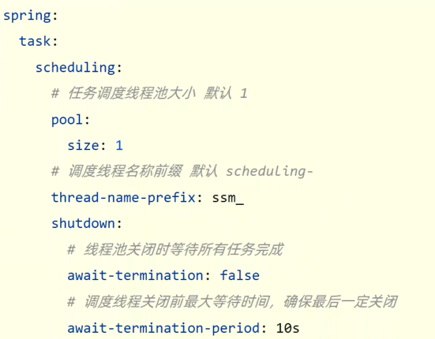

* Spring Task

### Springboot整合JavaMail

* 发送简单邮件

* 导入依赖坐标

  ```xml
  <dependency>
      <groupId>org.springframework.boot</groupId>
      <artifactId>spring-boot-starter-mail</artifactId>
  </dependency>
  ```

* 配置

  ```yaml
  spring:
    mail:
      username:
      password:
      host: smtp.qq.com
  ```

* 使用

  ```java
  @Service
  public class SendMailServiceImpl implements SendMailService {
  
      @Autowired
      private JavaMailSender javaMailSender;
      private String from = "";
      private String to = "";
      private String subject = "";
      private String context = "";
  
      @Override
      public void sendMail() {
          SimpleMailMessage message = new SimpleMailMessage();
          message.setFrom(from + "(小甜甜)");
          message.setTo(to);
          message.setSubject(subject);
          message.setText(context);
          javaMailSender.send(message);
      }
  }
  ```

* 发送多部邮件

  ```java
  @Service
  public class SendMailServiceImpl2 implements SendMailService {
  
      @Autowired
      private JavaMailSender javaMailSender;
      private String from = "";
      private String to = "";
      private String subject = "";
      private String context = "<a href=''>点击链接</a>";
  
      @Override
      public void sendMail() {
  
          try {
              MimeMessage message = javaMailSender.createMimeMessage();
              MimeMessageHelper helper = new MimeMessageHelper(message, true);
              helper.setFrom(from + "(小甜甜)");
              helper.setTo(to);
              helper.setSubject(subject);
              helper.setText(context, true);
  
              File file = new File("");
              helper.addAttachment(file.getName(), file);
  
              javaMailSender.send(message);
          } catch (Exception e) {
              e.printStackTrace();
          }
      }
  }
  ```

  

### 消息传递

  * 异步消息传递技术
    * JMS
      * P2P
      * 发布订阅模型
    * AMOP
      * 规范了网络交换的数据格式
    * MQTT
      * 主要用于物联网
    * Kafka
      * 高吞吐量的分布式发布订阅消息系统，提供实时消息功能

* ActiveMQ

  * 导入依赖坐标

    ```xml
    <dependency>
        <groupId>org.springframework.boot</groupId>
        <artifactId>spring-boot-starter-activemq</artifactId>
    </dependency>
    ```

  * 配置

    ```yaml
    spring:
      activemq:
        broker-url: tcp://localhost:61616
      jms:
        template:
          default-destination: mine
        #发布订阅
        #pub-sub-domain: true
    ```

  * 使用

    ```java
    @Service
    public class MessageServiceActivemqImpl implements MessageService {
    
        @Autowired
        private JmsMessagingTemplate messagingTemplate;
    
        @Override
        public void sendMessage(String id) {
            System.out.println("待发送短信的订单已纳入处理队列,id: " + id);
            messagingTemplate.convertAndSend("order.queue.id", id);
        }
    
        @Override
        public String doMessage() {
            String id = messagingTemplate.receiveAndConvert("order.queue.id", String.class);
            System.out.println("已完成短信发送业务,id: " + id);
            return id;
        }
    }
    ```

* RabbitMQ

  * 导入依赖坐标

    ```xml
    <dependency>
        <groupId>org.springframework.boot</groupId>
        <artifactId>spring-boot-starter-amqp</artifactId>
    </dependency>
    ```

  * 配置

    ```yaml
    spring:
      rabbitmq:
        host: localhost
        port: 5672
    ```

* RocketMQ

  * 导入依赖坐标

    ```xml
    <dependency>
        <groupId>org.apache.rocketmq</groupId>
        <artifactId>rocketmq-spring-boot-starter</artifactId>
        <version>2.2.2</version>
    </dependency>
    ```

  * 配置

    ```yaml
    rocketmq:
      name-server: localhost:9876
      producer:
        group: group_rocketmq
    ```

* Kafka

  * 导入依赖坐标

    ```xml
    <dependency>
        <groupId>org.springframework.kafka</groupId>
        <artifactId>spring-kafka</artifactId>
    </dependency>
    ```

  * 配置

    ```
    spring:
      kafka:
        bootstrap-servers: localhost:9092
        consumer:
          group-id: order
    ```

### 监控

* 监控服务状态是否宕机

* 监控服务的运行指标（内存、虚拟机、线程、请求等）

* 监控日志

* 管理服务

* SpringbootAdmin

  * 导入依赖坐标

    ```xml
    <!--服务器-->
    <dependency>
        <groupId>de.codecentric</groupId>
        <artifactId>spring-boot-admin-starter-server</artifactId>
        <version>2.6.5</version>
    </dependency>
    
    <!--客户端-->
    <dependency>
        <groupId>de.codecentric</groupId>
        <artifactId>spring-boot-admin-starter-client</artifactId>
        <version>2.6.5</version>
    </dependency>
    
    <!--两个都需要导入web的坐标-->
    ```

  * 配置（**注意：**服务器端开启 @EnableAdminServer）

    ```yaml
    #服务端配置
    server:
      port: 8080
    
    #客户端配置
    spring:
      boot:
        admin:
          client:
            url: http://localhost:8080
    
    server:
      port: 80
    
    management:
      endpoint:
        health:
          show-details: always
      endpoints:
        web:
          exposure:
            include: "*"
    ```

  * 添加信息

    ```java
    @Component
    public class InfoConfig implements InfoContributor {
        @Override
        public void contribute(Info.Builder builder) {
            builder.withDetail("runTime", System.currentTimeMillis());
            Map infoMap = new HashMap();
            infoMap.put("buildTime", "2022");
            builder.withDetails(infoMap);
        }
    }
    ```

## 微服务

* 发送远程调用

  ```java
  public RestTemplate restTemplate(){
      return new RestTemplate();
  }
  ```

### Eureka注册中心

  * 搭建EurekaServer
    * 引入eureka-server依赖
    * 添加@EnableEurekaServer注解
    * 在application.yml中配置eureka地址
  * 服务注册
    * 引入eureka-client依赖
    * 在application.yml中配置
  * 服务发现
    * 引入eureka-client依赖
    * 在application.yml中配置eureka地址
    * 给RestTemplate添加@LoadBalanced注解
    * 用服务提供者的服务名称远程调用

### Nacos注册中心

* 启动

  `startup.cmd -m standalone`

* 服务注册到nacos

  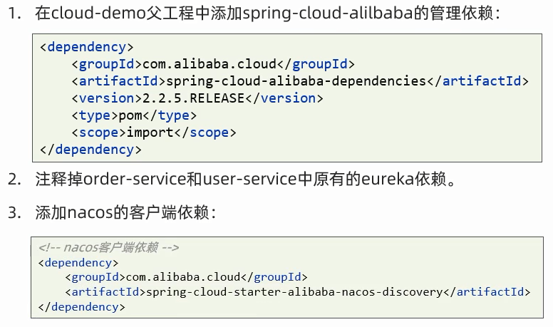