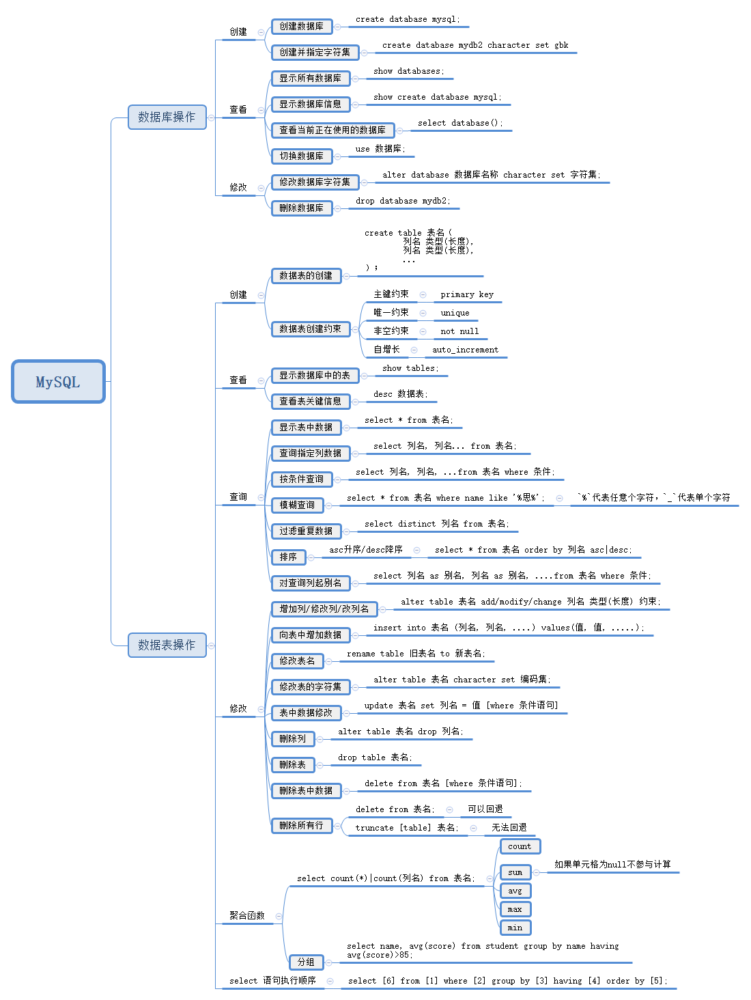

# MySQL简易教程

## MySQL安装

* 下载安装程序

  1. 更改安装路径
  2. 更改数据文件路径

* 环境变量设置向导
  1. 设置密码：123456

* 验证安装成功

  ```sql
  mysql -u root -p
  输入密码
  show databases;
  注意分号
  ```
  SQL语句中注意**分号** `;`

* 命令行访问MySQL

  ```sql
  mysql [-h 连接的主机ip -P端口号3309] -u用户名 -p密码
  ```


MySQL的客户端`SQLyog`安装

## SQL分类

* DDL（数据定义）Data Definition Language
* DML（数据操作）Data Manipulation Language
* DCL（数据控制）Data Control Language
* DQL（数据查询）Data Query Language

Windows 查看服务窗口

```powershell
services.msc
```
## 数据库操作

* 显示所有数据库

  ```sql
  show databases;
  ```

* 显示数据库编码（查看数据库的信息）

  ```sql
  show create database mysql;
  ```

* 创建数据库

  ```sql
  create database mydb1;
  ```

* 创建数据库并指定字符集

  ```sql
  create database mydb2 character set gbk;
  ```

* 删除数据库

  ```sql
  drop database mydb2;
  ```

* 修改数据库编码集

  ```sql
  alter database 数据库名称 character set 字符集 [collate 排序规则];
  alter database mydb2 character set utf8;
  ```

* 查询当前正在使用的数据库

  ```sql
  select database();
  ```

* 切换数据库

  ```sql
  use 数据库；
  ```

## 数据表的操作

### 数据表的创建


  ```sql 
  create table 表名（
    列名 类型（长度），
    列名 类型（长度）...
  ）；
  ```


#### 数据类型

**字符串型**	varchar：变长		char：定长

**大数据类型**	BLOB：保存字节数据		TEXT：保存字符数据

**数值型**	tinyint、smallint、int、bigint、FLOAT、DOUBLE

**逻辑性**	BIT

**日期型**	TimeStamp		DATE, TIME, DATETIME, TIMESTAMP


#### 数据表的创建


```sql
create table t_emp(
    name varchar(32),
    password varchar(32),
    sex char(1),
    brithday date
);
```

* 显示当前库中的表

```sql
show tables;
```

* 显示表的信息

```sql
show create table t_emp;
```

* 查看当前表的关键信息

```sql
desc t_emp;
```

#### 单表创建时的约束

**目的：** 为了保证存储在数据表中的数据完整性和有效性

**语法：** 列名 数据类型 约束条件

1. 主键约束 `primary key`（列中数据唯一且不为空）

2. 唯一约束 `unique`（列中的值不重复）

3. 非空约束 `not null`

4. 自增长 `auto_increment`

**案例**

```sql
create table t_emp2(
    id int primary key auto_increment,
    username varchar(32) unique not null,
    password varchar(32) not null,
    sex char(1),
    birthday date
);
```

#### 修改数据表的结构

  `alter table 表名 增\删\改 列名 类型（长度） 约束 `；

* 增加列

  ```sql
  alter table t_emp2 add salary double;
  ```

* 修改列

  `alter table 表名 modify 列名 类型（长度） 约束`；

  ```sql
  alter table t_emp2 modify username varchar(60) unique not null;
  ```

* 改列名

  ```sql
  alter table t_emp2 change username name varchar(60) unique not null;
  ```

* 删除列

  `alter table 表名 drop 列名；`

  ```sql
  alter table t-emp2 drop 列名；
  ```

* 修改表名

  `rename table 旧表名 to 新表名；`

  ```sql
  rename table t_emp2 to t_person;
  ```

* 修改表的字符集

  `alter table 表名 character set 编码集；`

* 数据表删除

  ```sql
  drop table 表名；
  ```

#### 向表中插入数据

  `insert into 表名（列名，列名，.....）values(值，值,.....);`

* 数据修改操作

  ```sql
  update 表名 set 列名=值，列名=值...[where条件语句]；
  ```

**注：** 如果不加条件会修改某一列所有值

  ```sql
  update t_person set salary = 8888 where id = 2;
  ```

* 显示表中数据内容

  ```sql
  select * from t_person;
  ```

#### 删除表中数据

**语法：** `delete from 表名 [where 条件语句]`

  ```sql
  delete from t_person where username = 'lisi';
  ```

* 删除**所有**行数据（逐行删除）[有条件删除，可以回退]

  ```sql
  delete from t_person;
  ```
* 删除所有数据（整个表全删）[所有内容全部删除，无法回退]
  ```sql
  truncate [table] 表名；
  ```

### 数据查询

* 查询数据表中所有数据

  ```sql
  select * from student;
  ```

* 查询指定列数据

**语法：**`select 列名，列名... from 表名；`

  ```sql
  select name,score
  from student;
  ```

* 按条件查询

**语法：**`select 列名，列名... from 表名 where 条件；`

```sql
select * from student where age >= 24;
```

#### 运算符

* 相等 `=`

* 不等于 `<>` , `!=`

* 逻辑运算 与 `and`, 或 `or`, 非`not`
```sql
score>= 80 and score <=100; 等价于 score between 80 and 100;

age = 18 or age = 23 or age =25; 等价于 age in (18, 23, 25);
```

#### 模糊查询

`%`代表任意个字符，`_`代表单个字符

```sql
select *
from student
where name like '%思%';
```

#### 过滤重复数据

```sql
select distinct age
from student;
```

#### 排序

**语法：**`select * from 表名 order by 列名 asc|desc;`

​	asc 是升序排序，desc是降序排序

```sql
--单条件排序
select * from student order by score asc; 
--两个条件排序
select * from student order by age asc, score asc; 
```

#### 对查询的列名起别名

**语法：** `select 列名 as 别名，列名 as 别名...from 表名 where 条件; `

​	as 可以省略

### 聚合函数

* count函数

**语法：** `select count(*)|count(列名) from 表名； `

**注：** count 在根据指定列统计时，如果列中有null不会被统计在其中

  ```sql
  select count(*) from student;
  select count(age) from student;
  ```

* sum函数

**语法：** `select sum(列名) from 表名；`

  ```sql
  select sum(age),sum(score) from student;
  --存在null时
  select sum(age),sum(score), sum(ifnull(age, 0) + score) from student;
  --保留2位小数
  select sum(age),sum(score), truncate(sum(ifnull(age, 0) + score), 2) from student;
  ```

**注：** 如果列中有null不会参与计算，解决办法ifnull(age,0)

* 函数

**语法：** `select avg(列名) from 表名；`

  ```sql
  select avg(age) from student;
  ```

* max, min函数

  ```sql
  select max(score), min(score) from student;
  ```

* 分组

**语法：** `group by 分组`

**注：** select 之后只能出现分组的列和聚合函数

  ```sql
  --每个学生的总分
  select name, sum(score) from student group by name;
  --每个学生的平均分
  select name, avg(score) from student group by name;
  --平均分大于85的同学
  select name, avg(score) from student group by name having avg(score)>85;
  --每门课男生和女生
  select course, sex, avg(score) from student group by course, sex;
  ```

#### select 语句执行顺序

1. from
2. where
3. group by
4. 聚合函数
5. having子句筛选分组
6. 计算所有表达式
7. order by 排序

  ```sql
  select [6] from [1] where [2] group by [3] having [4] order by [5];
  ```

**注：** 聚合函数只能放在select 或order by 的后面


## 总结
